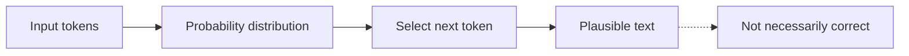
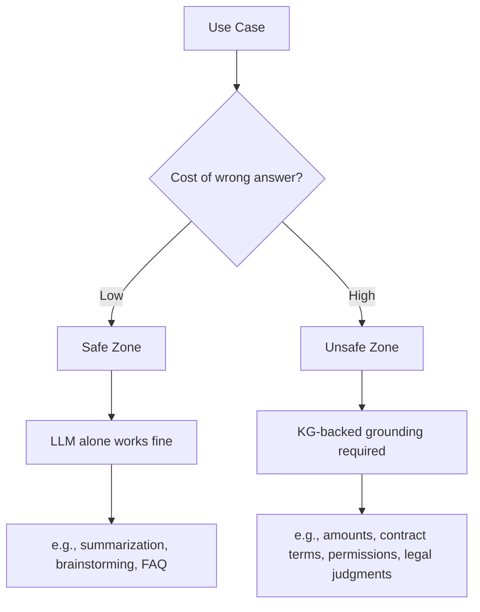

# Why LLMs Struggle in Production


> "LLMs are smart. But they're hard to use for real work. Understand why, and the solution becomes clear."

## Problem

You asked an LLM to summarize meeting minutes, and it included decisions that were never made. You asked it about internal policy, and it answered based on rules from six months ago. You asked it to confirm a contract amount, and it returned a plausible number that turned out to be wrong.

These aren't edge cases at a specific company. They stem from the structural nature of LLMs — an industry-wide challenge.

According to the MIT NANDA Report 2025, **95%** of generative AI pilot projects fail to deliver meaningful ROI. The primary cause is not a technology problem but a learning gap: **AI has no memory of context and starts from zero every time.**

LLMs have three structural limitations:

- **Hallucination**: confidently generating facts that don't exist
- **Knowledge cutoff**: no access to information after the training date
- **Context constraints**: no awareness of organization-specific information (policies, customer data, permissions)

## Solution

You don't need to abandon LLMs. The answer is combining them with "structured knowledge" that covers what LLMs aren't good at.

A knowledge graph (KG) is the mechanism that provides this complement. Information that must be accurate — amounts, contracts, permissions — comes directly from the KG, while the LLM handles only text generation. This division of responsibility is the design principle behind trustworthy AI systems.

The key skill is learning to judge where LLMs become dangerous. Not every business process needs a KG.

## How It Works

An LLM is fundamentally a probability machine that generates plausible text.



When an LLM answers "The contract amount is $100,000," it is because that string of characters has a high probability of following — not because it looked up the actual value.

This characteristic divides business use cases into two zones:



In the **Safe Zone** (low cost of error), LLMs work as-is: summarizing text, brainstorming ideas, answering general questions.

In the **Unsafe Zone** (high cost of error), relying on a probabilistic LLM alone is risky. Calculating amounts, verifying contract terms, evaluating permissions — a wrong answer here creates real business risk.

## This Course in 13 Sessions

Here is what each session builds toward, so you can orient yourself before diving in:

- **s01–s03** — Theory: why LLMs fail in production, what knowledge graphs are, and where RAG falls short
- **s04–s05** — Hands-on setup: running Neo4j locally and auto-building a KG from text
- **s06–s07** — Production techniques: schema injection, few-shot examples, and the five KG-native query types
- **s08** — Business context: industry case studies and how to build a stakeholder business case
- **s09** — Architecture: the formal-layer sandwich pattern for enterprise deployments
- **s10** — Agent integration: using KG as structured agent memory across sessions
- **s11** — Adoption strategy: a three-phase roadmap from local proof-of-concept to production
- **s12** — Measurement: the evaluation cycle that makes improvement systematic

s01–s05 are beginner sessions. No prior graph database experience is required. s06 onward is intermediate — each session builds directly on code and concepts from the previous ones.

---

## What You Will Learn in This Session

Here is what changes before and after this session.

**Before:**
- You feel frustrated with LLMs, but don't have the words to explain why
- You believe "adding RAG will fix it"
- You've heard of knowledge graphs but only the name

**After:**
- You can explain the three structural limitations of LLMs (hallucination, knowledge cutoff, context constraints)
- You can evaluate the risk in your own use cases using the Safe Zone / Unsafe Zone framework
- You understand the direction: not "fix the LLM" but "supply what the LLM is missing"

## Try It

Classify your own use cases into Safe or Unsafe Zone. If even one item below applies, that use case is likely in the Unsafe Zone.

```
[Unsafe Zone Diagnostic Checklist]

□ 1. Numerical accuracy
   If the AI's answer contains an incorrect amount or number,
   will it cause business loss or legal problems?

□ 2. Permission and authorization decisions
   Does the system include a Yes/No judgment like
   "does this person have permission to perform this action"?

□ 3. Legal or regulatory requirements
   Does the answer need to comply with laws,
   regulations, or compliance requirements?

□ 4. Time-sensitive critical information
   Does the use case involve important information that changes
   based on time — "current," "latest," "this month"?

□ 5. Multi-document reasoning
   Does getting the correct answer require combining
   information from three or more sources?

□ 6. Accurate handling of negation and restrictions
   Do you need to handle constraints precisely —
   "cannot," "prohibited," "not supported"?

□ 7. Accountability for reasoning
   Do humans need to verify or audit
   the rationale behind the AI's judgment?
```

**How to interpret your results:**
- 0 items: Safe Zone. A standalone LLM or simple RAG is sufficient.
- 1-2 items: Hybrid zone. Consider RAG with metadata filters.
- 3 or more: Unsafe Zone. A KG + LLM architecture is needed.

In the next session, you will learn what a KG actually is — with concrete code.
