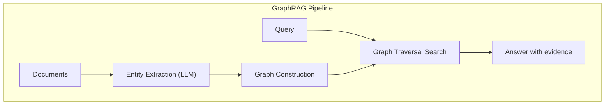

# Where RAG Fails and GraphRAG Begins


> "There are problems that no amount of RAG improvement can fix. That realization opens the door to GraphRAG."

## Problem

You've deployed RAG, but the answers still aren't what you expected. Common symptoms:

- "List all critical tickets related to the products Suzuki is assigned to" returns unrelated tickets mixed in
- "Can Standard Plan customers apply for a rate limit increase?" gets answered with Enterprise Plan information
- "Which plans do NOT support feature X?" returns plans that do support it

These are not implementation problems. They are structural limitations of RAG's vector search.

## Solution

Rather than trying to "improve" RAG, the first step is developing the judgment to know whether a given use case is one that GraphRAG can actually solve.

RAG's vector search is "semantic pattern matching" — it excels at finding similar text, but it is structurally weak at multi-document relational reasoning and precise handling of negation and constraints.

GraphRAG addresses these problems using KG graph traversal. Instead of "find similar documents," it "follows relationship paths" — a fundamentally different approach.

## How It Works

### Five Patterns Where RAG Fails

**Pattern 1: Chunk Boundary Problem**

When documents are split into chunks for indexing, critical information can end up straddling chunk boundaries.

```python
# Demo of the chunk boundary problem
text = """
Product A has a 2-year warranty from the purchase date. However, the following
conditions apply. Consumable parts (battery, filter, etc.) are excluded from
the warranty.
"""

# Split into 100-character chunks
chunk1 = "Product A has a 2-year warranty from the purchase date. However, the following conditions apply. Consumable"
chunk2 = "parts (battery, filter, etc.) are excluded from the warranty."

# Query: "Is the battery covered by the warranty?"
# -> chunk2 is likely to be retrieved
# -> but chunk2 alone loses its connection to the "2-year warranty" context
```

**Pattern 2: Hallucination Amplification**

When retrieved documents are incomplete, the LLM tries to "fill in the gaps" and generates information that doesn't exist. For example: the LLM answers "The Premium Plan costs $150/month," but no pricing information exists in the documents.

**Pattern 3: Cross-Document Reasoning Failure**

When reasoning requires combining information from three documents, vector search struggles.

```
# Document A: Product X supports up to 100 API requests per minute
# Document B: Enterprise Plan customers can apply for an API rate limit increase
# Document C: ABC Corp. currently has a Standard Plan contract
```

Correctly answering "Can ABC Corp. increase their API rate to 500 requests/minute?" requires reasoning across all three documents. With a KG, a single query handles it.

```cypher
// A single KG query answers this — OPTIONAL MATCH lets the CASE reach both branches
MATCH (company:Company {name: 'ABC Corp.'})-[:HAS_CONTRACT]->(plan:Plan)
OPTIONAL MATCH (plan)-[:ALLOWS]->(feature:Feature {name: 'rate_limit_increase'})
RETURN
    company.name,
    plan.name AS current_plan,
    CASE WHEN feature IS NOT NULL
         THEN 'No upgrade needed'
         ELSE 'Upgrade to Enterprise required'
    END AS answer
```

**Pattern 4: Time-Sensitive Information**

Queries containing relative time expressions like "current," "latest," or "this month" are error-prone because RAG indexes are static. KG supports a pattern where edges carry validity periods.

**Pattern 5: Impossibility of Negation Queries**

Cosine similarity cannot capture negation.

```python
# The negation similarity problem
doc_yes = "This service supports feature XX."
doc_no  = "This service does not support feature XX."

# The cosine similarity between these two vectors is very high (can exceed 0.9)
# RAG may retrieve the "does not support" document,
# while the LLM interprets it as "does support"
```

"Which plans do NOT support feature X?" is a negation query that vector similarity search cannot handle structurally — no matter how much you tune your RAG implementation.

### How GraphRAG Works

GraphRAG automatically builds a KG from documents and uses that KG to search.



By combining vector search (finding similar documents) with graph traversal (following relationship paths), GraphRAG handles cross-document reasoning and multi-hop reasoning where pure RAG fails.

## What You Will Learn in This Session

**Before:**
- You have deployed RAG but cannot explain precisely why it fails on certain queries
- You assume tuning chunk size or adding a re-ranker will fix accuracy problems
- You do not have a framework for deciding when RAG is enough and when KG is necessary

**After:**
- You can name and diagnose the 5 structural failure patterns of RAG
- You know which patterns can be partially improved (1-4) and which cannot (5)
- You can make an informed judgment about when to move from RAG to GraphRAG

## Try It

Diagnose your own RAG system against the five patterns.

```
[RAG Failure Pattern Diagnostic Checklist]

□ Pattern 1: Chunk boundary problem
  Symptom: Relevant content is retrieved, but important
           context (conditions, exceptions, caveats) is missing

□ Pattern 2: Hallucination amplification
  Symptom: When the answer isn't in the retrieved documents,
           the LLM fabricates plausible numbers or content

□ Pattern 3: Cross-document reasoning failure
  Symptom: Questions that require combining multiple documents
           are answered incorrectly (worked in PoC, breaks in production)

□ Pattern 4: Time-sensitive information problem
  Symptom: Queries about "current," "latest," or "this month"
           return outdated information

□ Pattern 5: Negation query impossibility
  Symptom: Questions like "things that can't do X,"
           "plans that don't support Y," or "users who are not Z"
           cannot be answered accurately
```

**How to read the results:**

- Patterns 1-4: Possible to partially improve with chunk design, metadata filters, or re-rankers
- Pattern 5: A fundamental limitation of vector search. Worth considering a move to GraphRAG.
- Multiple patterns: A KG + LLM architecture is the essential solution

In the next session, you will set up Neo4j and run your first KG-powered QA chain.
