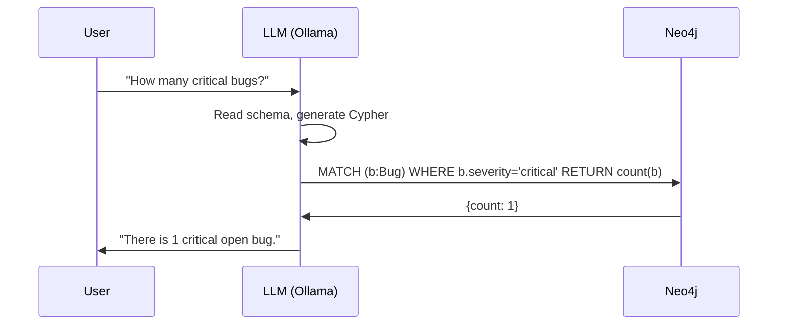

# s04: Set Up Neo4j and Run Your First GraphRAG

`[ s04 ] <- s03 Where RAG Fails and GraphRAG Begins | s05 Auto-Build a KG from Text with an LLM ->`

> "Don't get stuck on setup. Start with a single Docker Compose command."

## Problem

You understand the theory — LLMs hallucinate, KGs provide structured facts, GraphRAG combines both. But knowing the theory and actually running a working system are completely different things.

Most tutorials require cloud accounts, API keys, and paid services just to get started. This creates a barrier that stops most people before they ever write a single Cypher query.

You need a **fully local**, reproducible environment that runs without signing up for anything.

## Solution

Two containers. One command.

```bash
docker compose up -d
```

This starts:
- **Neo4j** — the graph database that stores your Knowledge Graph
- **Ollama** — the local LLM runtime (llama3.2, no API key required)

Everything runs on your machine. No cloud. No costs. No vendor lock-in.

## How It Works

### Step 1: docker-compose.yml

Create this file in your project directory:

```yaml
# docker-compose.yml
version: "3.9"
services:
  neo4j:
    image: neo4j:5.13-community
    container_name: kg-neo4j
    ports:
      - "7474:7474"
      - "7687:7687"
    environment:
      - NEO4J_AUTH=neo4j/${NEO4J_PASSWORD:?Set NEO4J_PASSWORD in .env}
    volumes:
      - neo4j_data:/data
    healthcheck:
      test: ["CMD", "wget", "-q", "--spider", "http://localhost:7474"]
      interval: 10s
      timeout: 5s
      retries: 5

  ollama:
    image: ollama/ollama:latest
    container_name: kg-ollama
    ports:
      - "11434:11434"
    volumes:
      - ollama_data:/root/.ollama

volumes:
  neo4j_data:
  ollama_data:
```

Create `.env` (never commit this file):
```bash
NEO4J_PASSWORD=your-strong-password-here
```

### Step 2: Start and pull the model

```bash
# Start containers
docker compose up -d

# Pull the LLM (first time only, ~2GB)
docker exec kg-ollama ollama pull llama3.2
docker exec kg-ollama ollama pull nomic-embed-text

# Verify Ollama is responding
curl http://localhost:11434/api/generate \
  -d '{"model":"llama3.2","prompt":"Hello","stream":false}'
```

Open `http://localhost:7474` to access Neo4j Browser.

### Step 3: Your first Cypher queries

Cypher is Neo4j's query language. The concepts map naturally from SQL.

```cypher
-- Create nodes
CREATE (e:Engineer {id: "ENG-001", name: "Alice", team: "Backend"})
CREATE (b:Bug {id: "BUG-001", title: "Login freezes", severity: "critical", status: "open"})

-- Create a relationship
MATCH (b:Bug {id: "BUG-001"}), (e:Engineer {id: "ENG-001"})
CREATE (b)-[:ASSIGNED_TO]->(e)

-- Query: which engineers own critical open bugs?
MATCH (b:Bug)-[:ASSIGNED_TO]->(e:Engineer)
WHERE b.severity = "critical" AND b.status = "open"
RETURN b.title, e.name
```

Key Cypher concepts:
- `()` = node: `(n:Label {property: value})`
- `[]` = relationship: `[r:RELATIONSHIP_TYPE]`
- `->` = direction
- `MATCH` ≈ SELECT, `CREATE` ≈ INSERT, `MERGE` ≈ UPSERT

### Step 4: Connect an LLM to your KG

```python
import os
from langchain_neo4j import GraphCypherQAChain, Neo4jGraph
from langchain_ollama import OllamaLLM

# Connect to Neo4j — it automatically reads the schema
graph = Neo4jGraph(
    url=os.getenv("NEO4J_URI", "bolt://localhost:7687"),
    username="neo4j",
    password=os.getenv("NEO4J_PASSWORD")
)

# Schema is automatically injected into the LLM prompt
print(graph.schema)
# Node properties: Engineer {id: STRING, name: STRING, team: STRING}
# Node properties: Bug {id: STRING, severity: STRING, status: STRING}
# Relationships: (:Bug)-[:ASSIGNED_TO]->(:Engineer)

llm = OllamaLLM(model="llama3.2", base_url="http://localhost:11434")

chain = GraphCypherQAChain.from_llm(
    llm=llm,
    graph=graph,
    verbose=True,
    allow_dangerous_requests=True,
)

result = chain.invoke({"query": "How many critical open bugs are there?"})
print(result["result"])
# → "There is 1 critical open bug."
```



This is GraphRAG in its simplest form: the LLM generates a precise query, the graph returns exact facts. No hallucination in the retrieval step.

## What You Will Learn in This Session

**Before:**
- You know KG theory but have never run a graph database
- Setting up new tech feels like a multi-day project
- You have not written Cypher

**After:**
- Neo4j + Ollama running locally in under 10 minutes
- You can write basic Cypher (CREATE, MATCH, MERGE, WHERE NOT)
- You have a working natural language → Cypher → answer pipeline

## Try It

Run through this checklist:

```bash
# 1. Neo4j health check
curl -s http://localhost:7474 | grep -q "neo4j" && echo "✓ Neo4j up" || echo "✗ Not running"

# 2. Ollama model check
curl -s http://localhost:11434/api/tags | grep -q "llama3.2" && echo "✓ Model ready" || echo "✗ Run: docker exec kg-ollama ollama pull llama3.2"
```

Paste this into Neo4j Browser (`http://localhost:7474`) to create sample data:

```cypher
CREATE (e:Engineer {id: "ENG-001", name: "Alice", team: "Backend"})
CREATE (e2:Engineer {id: "ENG-002", name: "Bob", team: "Frontend"})
CREATE (b:Bug {id: "BUG-001", title: "Login freezes", severity: "critical", status: "open"})
CREATE (b2:Bug {id: "BUG-002", title: "Search returns 0", severity: "high", status: "open"})
CREATE (b)-[:ASSIGNED_TO]->(e)
CREATE (b2)-[:ASSIGNED_TO]->(e2)
```

Then ask the LLM chain: `"Which engineer handles critical bugs?"`

Full working code: [hands-on-kg-builder](https://github.com/DevRev-JP/tech-blog/tree/main/experiments/hands-on-kg-builder)

In the next session, you will build a KG automatically from unstructured text — no manual CSV entry needed.
