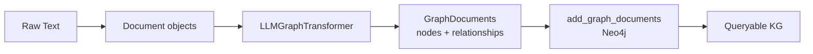

# Auto-Build a KG from Text with an LLM


> "Use LLMGraphTransformer to extract entities and relationships from unstructured text automatically."

## Problem

You have unstructured text — meeting notes, support tickets, documentation, emails. Manually converting this into structured graph nodes and relationships would take weeks. No one on a real team has that kind of time.

Most knowledge graph projects fail before they start because the data ingestion step is too painful. If loading data requires an army of data engineers writing custom parsers, you will never reach production.

You need a way to turn raw text into a graph automatically, with acceptable quality and minimal manual effort.

## Solution

LangChain's `LLMGraphTransformer` solves this directly. You give it plain text wrapped in `Document` objects, and it returns `GraphDocument` objects containing extracted nodes and relationships. One call to `add_graph_documents()` writes everything to Neo4j.

The key insight: **KG construction cost drops dramatically**. A graph that would take weeks to build manually can be bootstrapped in hours from your existing documents. Local 3B models work for prototyping; switch to a cloud model when you need higher extraction quality.

## How It Works

### The extraction pipeline



### Step 1: Install dependencies

```bash
pip install langchain langchain-experimental langchain-neo4j langchain-ollama
```

### Step 2: Use ChatOllama, not OllamaLLM

`LLMGraphTransformer` requires a chat model interface. `OllamaLLM` will fail silently or produce garbage output. Always use `ChatOllama`.

```python
from langchain_ollama import ChatOllama
from langchain_experimental.graph_transformers import LLMGraphTransformer
from langchain_neo4j import Neo4jGraph
from langchain_core.documents import Document
import os

# IMPORTANT: ChatOllama, not OllamaLLM
llm = ChatOllama(model="llama3.2", base_url="http://localhost:11434")

graph = Neo4jGraph(
    url=os.getenv("NEO4J_URI", "bolt://localhost:7687"),
    username="neo4j",
    password=os.getenv("NEO4J_PASSWORD")
)
```

### Step 3: Constrain extraction with allowed types

Without constraints, the LLM invents arbitrary node and relationship types on every run. Use `allowed_nodes` and `allowed_relationships` to lock down the schema.

```python
transformer = LLMGraphTransformer(
    llm=llm,
    allowed_nodes=["Engineer", "Bug", "Team", "Feature"],
    allowed_relationships=["ASSIGNED_TO", "BELONGS_TO", "DEPENDS_ON", "REPORTED_BY"],
)
```

### Step 4: Extract and write to Neo4j

```python
text = """
Alice is a backend engineer on the Platform team.
She was assigned Bug BUG-042, a critical login issue reported by customer Acme Corp.
The login feature depends on the Auth service.
"""

documents = [Document(page_content=text)]
graph_docs = transformer.convert_to_graph_documents(documents)

# Inspect what was extracted before writing
for doc in graph_docs:
    print("Nodes:", doc.nodes)
    print("Relationships:", doc.relationships)

# Write to Neo4j
graph.add_graph_documents(graph_docs, baseEntityLabel=True, include_source=True)
```

Sample output:
```
Nodes: [Node(id='Alice', type='Engineer'), Node(id='Platform', type='Team'),
        Node(id='BUG-042', type='Bug'), Node(id='Auth', type='Feature')]
Relationships: [Rel(source='Alice', type='BELONGS_TO', target='Platform'),
                Rel(source='BUG-042', type='ASSIGNED_TO', target='Alice')]
```

### Step 5: Batch processing from a folder

For larger document sets, load from files and process in one pass:

```python
from pathlib import Path

def load_documents(folder: str) -> list[Document]:
    """Load .txt files from a local folder. Only use with trusted, local paths."""
    docs = []
    for path in Path(folder).glob("*.txt"):
        docs.append(Document(
            page_content=path.read_text(),
            metadata={"source": path.name}
        ))
    return docs

docs = load_documents("./data/tickets")
graph_docs = transformer.convert_to_graph_documents(docs)
graph.add_graph_documents(graph_docs, baseEntityLabel=True, include_source=True)
print(f"Loaded {len(graph_docs)} documents into the graph")
```

### Model quality trade-offs

Local models work for prototyping, but they miss subtle relationships and sometimes merge entities incorrectly.

| Model | Extraction quality | Cost | Latency |
|---|---|---|---|
| llama3.2 (3B) local | Fair — misses subtle relations | Free | Fast |
| llama3.1 (8B) local | Good — reasonable for most cases | Free | Medium |
| gpt-4o (cloud) | Excellent — catches nuance | API cost | Fast |

With LangChain, switching models is a one-line change — the rest of the pipeline stays identical:

```python
# Switch from local to cloud — everything else stays the same
from langchain_openai import ChatOpenAI
llm = ChatOpenAI(model="gpt-4o")
```

### Verify the result

After writing, confirm the graph was built correctly:

```cypher
// Count extracted entities by type
MATCH (n) RETURN labels(n)[0] AS type, count(n) AS count ORDER BY count DESC

// Check relationships for a specific entity
MATCH (e:Engineer {id: "Alice"})-[r]->(n)
RETURN type(r), n.id, labels(n)[0]
```

## What You Will Learn in This Session

**Before:**
- Building a KG requires manual data entry or custom ETL pipelines
- You know Neo4j is the destination but don't know how to get raw text there
- You assume graph construction is a weeks-long data engineering project

**After:**
- You can extract nodes and relationships from any text document with 10 lines of Python
- You understand why `allowed_nodes` and `allowed_relationships` are essential for consistent schema
- You know the quality trade-off between local and cloud LLMs for extraction, and how to switch

## Try It

Run this complete script against your own text:

```python
import os
from langchain_ollama import ChatOllama
from langchain_experimental.graph_transformers import LLMGraphTransformer
from langchain_neo4j import Neo4jGraph
from langchain_core.documents import Document

llm = ChatOllama(model="llama3.2", base_url="http://localhost:11434")
graph = Neo4jGraph(
    url="bolt://localhost:7687",
    username="neo4j",
    password=os.getenv("NEO4J_PASSWORD")
)

transformer = LLMGraphTransformer(
    llm=llm,
    allowed_nodes=["Person", "Project", "Team", "Issue"],
    allowed_relationships=["WORKS_ON", "BELONGS_TO", "REPORTED", "ASSIGNED_TO"],
)

# Replace this with text from your own domain
sample = """
Bob is a senior engineer on the Data team.
He reported Issue ISS-101 about slow query performance in the Analytics project.
The Analytics project belongs to the Platform team.
"""

docs = [Document(page_content=sample)]
graph_docs = transformer.convert_to_graph_documents(docs)
graph.add_graph_documents(graph_docs, baseEntityLabel=True, include_source=True)

print("Graph built. Open Neo4j Browser at http://localhost:7474")
print("Run: MATCH (n) RETURN n LIMIT 50")
```

**Checklist:**
- [ ] Extraction runs without error
- [ ] Nodes appear in Neo4j Browser
- [ ] Relationships connect correctly
- [ ] Node types match your `allowed_nodes` list

In the next session, you will add schema injection and few-shot Cypher examples to bring Text-to-Cypher accuracy up to production quality.
