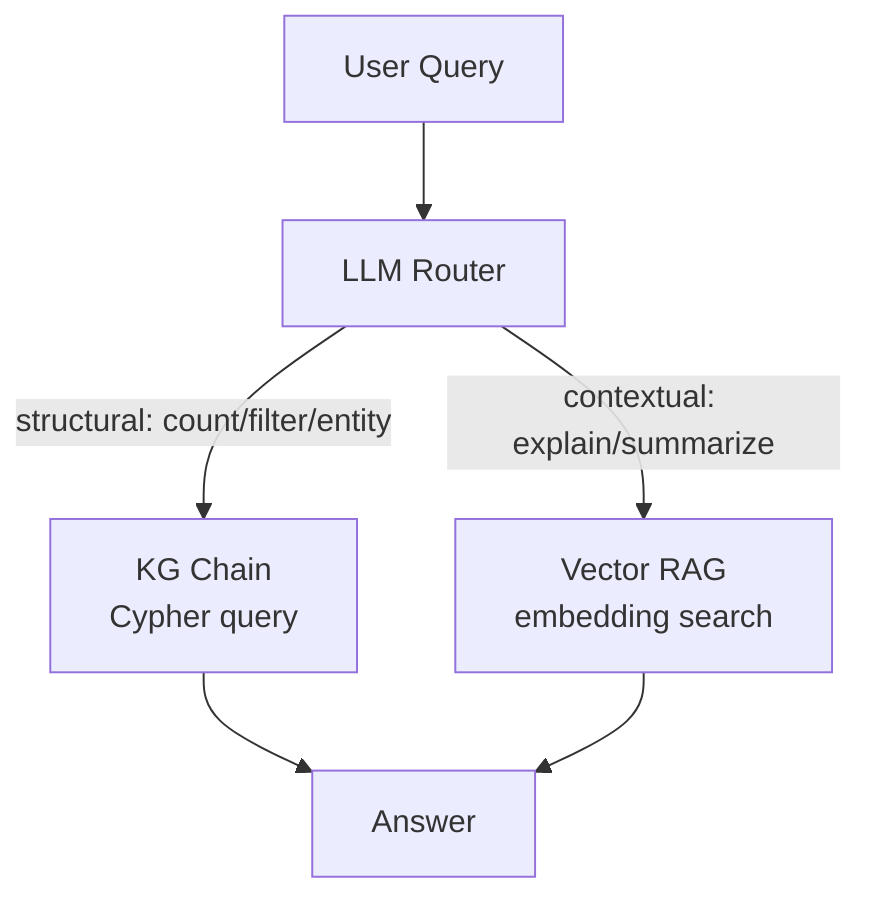
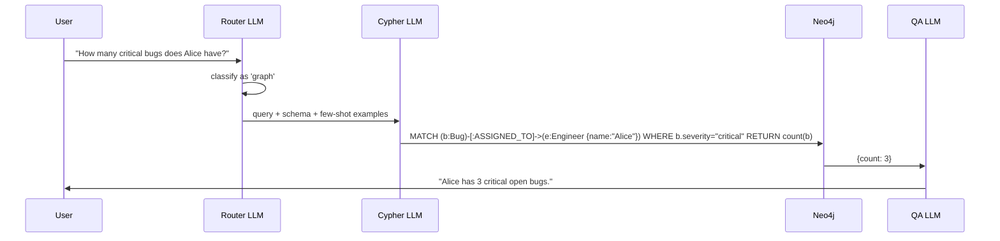

# Production-Grade GraphRAG Pipeline


> "Inject schema hints and few-shot examples to dramatically improve Text-to-Cypher accuracy."

## Problem

Your GraphRAG pipeline from s04 works — for simple questions. But in production, natural language queries are messy. Users ask "show me open tickets from last week assigned to people on the backend team." A naive LLM generates Cypher that references wrong property names, invents relationship types, or produces syntax errors.

The accuracy gap between prototype and production is real. A pipeline that answers 60% of queries correctly is not useful in a business context. You need a systematic way to improve Text-to-Cypher generation.

## Solution

Three techniques, applied in order, solve most accuracy problems:

1. **Schema injection** — automatically tell the LLM the exact node labels, property names, and relationship types in your graph
2. **Few-shot Cypher examples** — show the LLM 3-5 question/Cypher pairs so it learns your patterns
3. **Hybrid retrieval routing** — send structural queries to KG and contextual queries to vector RAG

Together these push Text-to-Cypher accuracy from ~60% to 85%+ on typical business queries.

## How It Works

### Technique 1: Schema injection

`Neo4jGraph` reads the live schema automatically. Pass it directly into your prompt:

```python
from langchain_neo4j import Neo4jGraph, GraphCypherQAChain
from langchain_ollama import ChatOllama
import os

graph = Neo4jGraph(
    url=os.getenv("NEO4J_URI", "bolt://localhost:7687"),
    username="neo4j",
    password=os.getenv("NEO4J_PASSWORD")
)

# This is your schema — automatically extracted from Neo4j
print(graph.schema)
# Node properties:
#   Engineer {id: STRING, name: STRING, team: STRING, sla_tier: STRING}
#   Bug {id: STRING, title: STRING, severity: STRING, status: STRING}
# Relationships:
#   (:Bug)-[:ASSIGNED_TO]->(:Engineer)
#   (:Engineer)-[:BELONGS_TO]->(:Team)
```

`GraphCypherQAChain` injects this schema into the Cypher generation prompt automatically. You don't need to do anything extra — just pass `graph=graph`.

### Technique 2: Few-shot Cypher examples

Build a small example set of question/Cypher pairs that cover your most common query patterns. These go into the chain prompt as context.

```python
from langchain_core.prompts import FewShotPromptTemplate, PromptTemplate

examples = [
    {
        "question": "How many critical open bugs are there?",
        "cypher": "MATCH (b:Bug) WHERE b.severity = 'critical' AND b.status = 'open' RETURN count(b) AS count"
    },
    {
        "question": "Which engineers are assigned to high priority bugs?",
        "cypher": "MATCH (b:Bug)-[:ASSIGNED_TO]->(e:Engineer) WHERE b.severity IN ['critical', 'high'] RETURN e.name, b.title"
    },
    {
        "question": "Show me all unassigned bugs",
        "cypher": "MATCH (b:Bug) WHERE NOT (b)-[:ASSIGNED_TO]->(:Engineer) RETURN b.id, b.title, b.severity"
    },
]

example_template = PromptTemplate(
    input_variables=["question", "cypher"],
    template="Question: {question}\nCypher: {cypher}"
)

cypher_prompt = FewShotPromptTemplate(
    examples=examples,
    example_prompt=example_template,
    prefix="Generate a Cypher query for Neo4j. Use the schema: {schema}\n\nExamples:",
    suffix="\nQuestion: {question}\nCypher:",
    input_variables=["schema", "question"]
)
```

### Technique 3: GraphCypherQAChain with a dedicated Cypher LLM

Use a separate, stronger LLM for Cypher generation. This matters when your main LLM is a small local model.

```python
from langchain_neo4j import GraphCypherQAChain
from langchain_ollama import ChatOllama

# Use a larger model specifically for Cypher generation
cypher_llm = ChatOllama(model="llama3.1", base_url="http://localhost:11434")
# Use a smaller/faster model for the final answer synthesis
qa_llm = ChatOllama(model="llama3.2", base_url="http://localhost:11434")

# ⚠️ Production warning: validate all user inputs before passing to the chain
chain = GraphCypherQAChain.from_llm(
    llm=qa_llm,
    cypher_llm=cypher_llm,
    graph=graph,
    cypher_prompt=cypher_prompt,
    verbose=True,
    allow_dangerous_requests=True,  # Required for LangChain ≥0.2; use with trusted inputs only
    validate_cypher=True,   # syntax-check before executing
    return_intermediate_steps=True,
)

result = chain.invoke({"query": "Which engineers are handling the most critical bugs?"})
print(result["result"])
# Access the generated Cypher for debugging
print(result["intermediate_steps"][0]["query"])
```

### Technique 4: Hybrid routing

Not every question needs the graph. "What is the general approach to bug triage?" is a contextual question best answered from documentation with vector search. "How many critical bugs does Alice have?" is a structural question that belongs in Cypher.

```python
from langchain_ollama import ChatOllama

router_llm = ChatOllama(model="llama3.2", base_url="http://localhost:11434")

ROUTING_PROMPT = """Classify this query as either 'graph' or 'vector'.
'graph': counting, filtering, specific entities, relationships, negation
'vector': general explanation, context, summaries, "how to" questions

Query: {query}
Answer with exactly one word: graph or vector"""

def route_query(query: str) -> str:
    response = router_llm.invoke(ROUTING_PROMPT.format(query=query))
    classification = response.content.strip().lower()
    return "graph" if "graph" in classification else "vector"

def hybrid_qa(query: str, graph_chain, vector_chain) -> str:
    route = route_query(query)
    if route == "graph":
        return graph_chain.invoke({"query": query})["result"]
    else:
        return vector_chain.invoke(query)
```



### Full pipeline



## What You Will Learn in This Session

**Before:**
- Your GraphRAG pipeline works on simple queries but fails on real user questions
- You don't know why the LLM generates incorrect Cypher
- You treat all queries the same way

**After:**
- You can inject schema automatically to eliminate property-name hallucinations
- You can build a few-shot example library to guide Cypher generation
- You can route queries to KG or vector RAG based on query type
- You have a `validate_cypher=True` safety net that prevents malformed queries from hitting the database

## Try It

Add few-shot examples to your s04 chain and measure the difference:

```python
# Baseline: no few-shot (from s04)
# ⚠️ Production warning: validate all user inputs before passing to the chain
baseline_chain = GraphCypherQAChain.from_llm(
    llm=cypher_llm, graph=graph, allow_dangerous_requests=True  # Required for LangChain ≥0.2; use with trusted inputs only
)

# Improved: with schema + few-shot
# ⚠️ Production warning: validate all user inputs before passing to the chain
improved_chain = GraphCypherQAChain.from_llm(
    llm=cypher_llm,
    cypher_llm=cypher_llm,
    graph=graph,
    cypher_prompt=cypher_prompt,
    validate_cypher=True,
    allow_dangerous_requests=True,  # Required for LangChain ≥0.2; use with trusted inputs only
)

test_queries = [
    "Show me all critical bugs that are not yet assigned",
    "Which team has the most open bugs?",
    "How many engineers are on the backend team?",
]

for q in test_queries:
    print(f"\nQuery: {q}")
    try:
        r = improved_chain.invoke({"query": q})
        print(f"Answer: {r['result']}")
        print(f"Cypher: {r['intermediate_steps'][0]['query']}")
    except Exception as e:
        print(f"Error: {e}")
```

Track how many queries produce valid Cypher before and after adding few-shot examples. You should see a measurable jump in first-pass accuracy.

In the next session, you will encounter the one query type that exposes RAG's fundamental limit — and understand why KG is the only solution.
