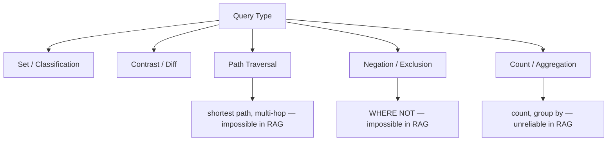
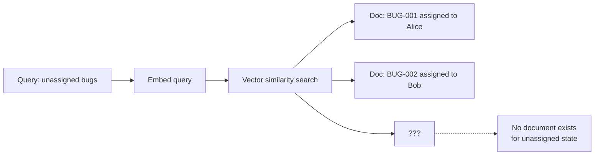
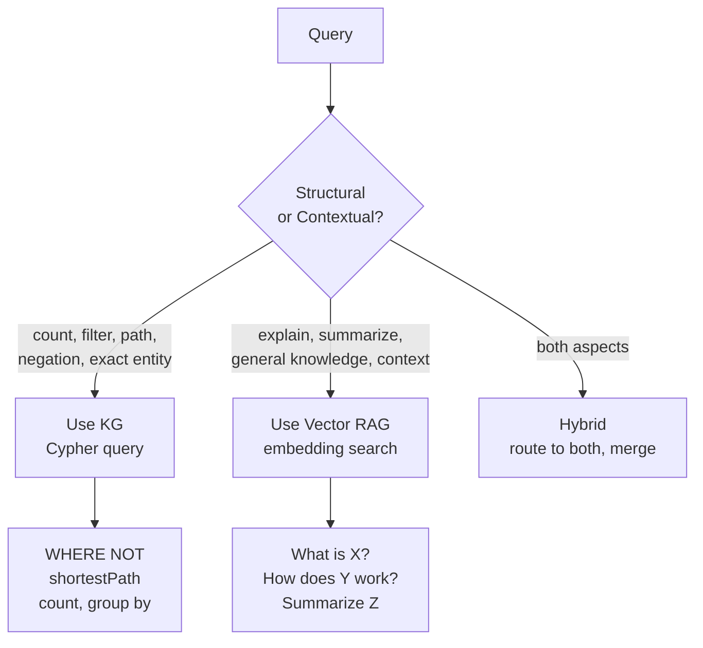

# The Pivot: KG Is More Than GraphRAG


> "Negation queries are fundamentally impossible in RAG. KG solves them structurally with WHERE NOT."

## Problem

You have been building GraphRAG — using a KG to make retrieval more precise. That is useful. But it frames KG as an upgrade to RAG, when KG is actually something broader.

There is a specific query type that makes the difference concrete: negation queries. "Show me bugs that have NOT been assigned." "Find customers who have NOT upgraded." "List engineers with NO critical bugs."

These questions are trivial in Cypher. They are **structurally impossible** in RAG.

RAG works by finding documents similar to your query. It can find things that match. It cannot find things by their absence — because absence leaves no text to embed and retrieve.

## Solution

Negation is not the only case where KG wins over RAG. There are five structural query types where KG consistently outperforms RAG. Understanding them shifts how you think about the technology.

The core insight: **RAG retrieves by similarity. KG traverses by structure.** These are different operations, and for certain query shapes, only one of them works.

## How It Works

### The five KG-native query types



**1. Set / Classification**
"Show all engineers on the backend team with severity=critical bugs."

```cypher
MATCH (e:Engineer)-[:BELONGS_TO]->(:Team {name: "Backend"})
MATCH (b:Bug)-[:ASSIGNED_TO]->(e)
WHERE b.severity = "critical"
RETURN e.name, collect(b.title)
```

RAG gives you a paragraph of text. Cypher gives you a structured table. For operational use, the table wins.

**2. Contrast / Diff**
"Compare bugs from Q1 versus Q2 by severity."

```cypher
MATCH (b:Bug)
RETURN b.quarter, b.severity, count(b) AS total
ORDER BY b.quarter, b.severity
```

RAG cannot aggregate across time ranges reliably. KG returns exact counts.

**3. Path Traversal**
"Find the shortest escalation path between Alice and the CTO."

```cypher
MATCH path = shortestPath(
    (a:Engineer {name: "Alice"})-[:REPORTS_TO*]->(c:Executive {title: "CTO"})
)
RETURN [n IN nodes(path) | n.name]
```

RAG has no concept of graph distance. Multi-hop reasoning in RAG is expensive and unreliable.

**4. Negation / Exclusion — the pivot point**

This is the decisive case. "Show me bugs that have NOT been assigned to any engineer."

```cypher
MATCH (b:Bug)
WHERE NOT (b)-[:ASSIGNED_TO]->(:Engineer)
RETURN b.id, b.title, b.severity
ORDER BY b.severity
```

RAG cannot answer this. A document about an unassigned bug does not say "this bug has no engineer." The absence of a relationship is invisible to embedding search. There is no vector representation of "not having a property."

**5. Count / Aggregation**
"How many open bugs does each team own?"

```cypher
MATCH (b:Bug)-[:ASSIGNED_TO]->(e:Engineer)-[:BELONGS_TO]->(t:Team)
WHERE b.status = "open"
RETURN t.name, count(b) AS open_bugs
ORDER BY open_bugs DESC
```

RAG might guess a number from document content. KG counts exactly.

### Why RAG cannot handle negation — the structural explanation



RAG retrieves documents that exist. The concept "does not have an assignment" produces no document to retrieve. The information simply does not exist in the vector index.

KG stores the relationship graph. The absence of an `ASSIGNED_TO` edge is a structural fact that `WHERE NOT` queries directly.

### The routing decision

Now you have the full picture. The question is: which tool for which query?



**Use KG when:**
- The query involves counting, filtering, or comparing exact values
- The query involves relationships between specific entities
- The query involves absence or exclusion
- You need a reproducible answer (same query, same data, same answer)

**Use RAG when:**
- The query is about understanding or explanation
- The answer lives in unstructured prose
- The exact wording of source material matters

**Use hybrid when:**
- "Who handles authentication, and what is the general security policy for that service?" — the first part is structural (KG), the second is contextual (RAG)

### Concrete hybrid implementation

```python
ROUTING_PROMPT = """
Classify the query as 'graph', 'vector', or 'hybrid'.

graph: counting, negation (not/no/without/missing), paths between entities,
       filtering by exact values, comparing counts or lists
vector: explanations, summaries, general "how does X work", documentation lookup
hybrid: requires both exact entity data AND contextual explanation

Query: {query}
Respond with one word only: graph, vector, or hybrid
"""

def route_and_answer(query: str, graph_chain, vector_chain, llm) -> str:
    route = llm.invoke(ROUTING_PROMPT.format(query=query)).content.strip().lower()

    if route == "graph":
        return graph_chain.invoke({"query": query})["result"]
    elif route == "vector":
        return vector_chain.invoke(query)
    else:  # hybrid
        graph_answer = graph_chain.invoke({"query": query})["result"]
        vector_answer = vector_chain.invoke(query)
        return f"Structural data: {graph_answer}\n\nContext: {vector_answer}"
```

## What You Will Learn in This Session

**Before:**
- You think of KG primarily as a way to improve RAG retrieval
- You believe RAG can answer any question if you add enough documents
- Negation queries seem like edge cases you can work around

**After:**
- You can name five query types where KG structurally outperforms RAG
- You understand why negation is fundamentally impossible in RAG (no document represents absence)
- You can route queries to KG vs RAG vs hybrid based on query shape
- `WHERE NOT` is now a tool in your vocabulary

## Try It

Run these queries against your Neo4j instance from s04/s05 and compare what RAG would return:

```cypher
-- Negation: bugs not yet assigned (RAG cannot answer this)
MATCH (b:Bug)
WHERE NOT (b)-[:ASSIGNED_TO]->(:Engineer)
RETURN b.id, b.title, b.severity

-- Aggregation: bug count per team
MATCH (b:Bug)-[:ASSIGNED_TO]->(e:Engineer)-[:BELONGS_TO]->(t:Team)
RETURN t.name, count(b) AS total, sum(CASE WHEN b.severity = "critical" THEN 1 ELSE 0 END) AS critical_count

-- Path traversal: connection between two engineers
MATCH path = shortestPath(
    (a:Engineer {name: "Alice"})-[*]-(b:Engineer {name: "Bob"})
)
RETURN [n IN nodes(path) | n.name] AS path_names, length(path) AS hops
```

For each query, ask yourself: "Could I get this answer from a vector search?" The negation query is the one where the answer is definitively no.

In the next session, you will see how companies across industries have deployed KG at scale — and what it actually took.
