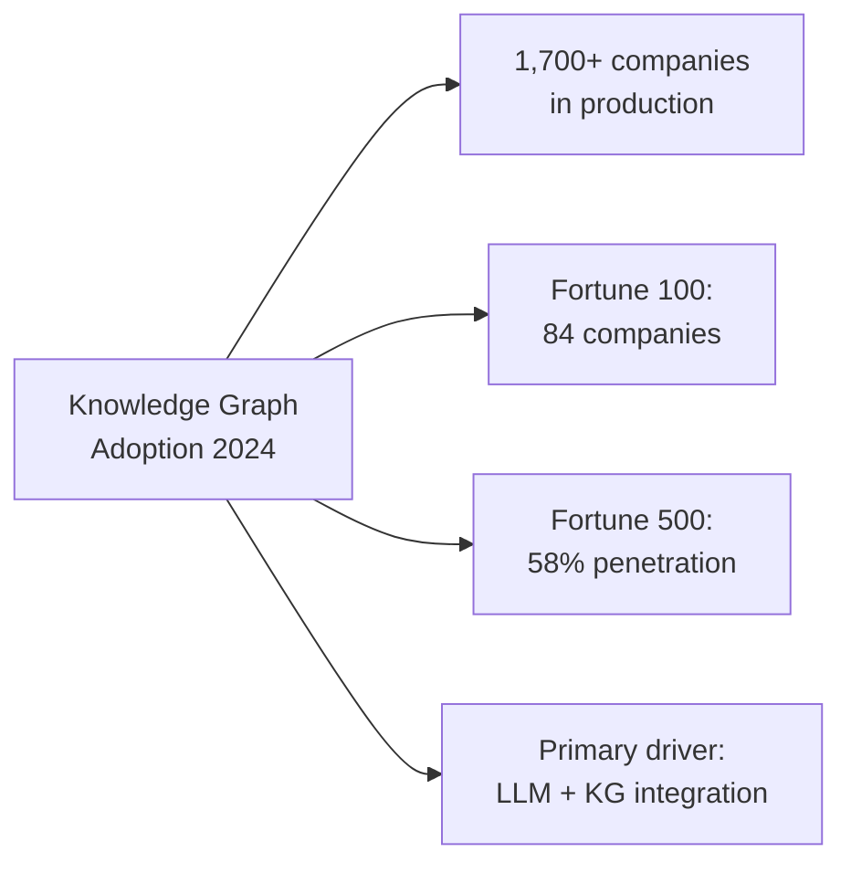
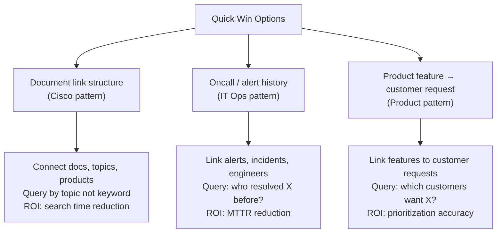

# s08: KG in the Wild: Industry Case Studies

`[ s08 ] <- s07 The Pivot: KG Is More Than GraphRAG | s09 Enterprise KG Architecture Design ->`

> "Reference real-world adoption data and patterns to build a business case for KG in your organization."

## Problem

You understand what KG can do technically. But when you bring this to a business decision-maker, the first question is: "Who else is doing this? Do we have proof it works?"

Most KG content is either academic theory or vendor marketing. What you need is concrete adoption data, specific industry patterns, and documented outcomes that let you build a credible business case.

## Solution

KG is not a niche research technology. According to Neo4j's 2024 industry data, over **1,700 companies** run KG in production. Among Fortune 100 companies, **84** use Neo4j. Among Fortune 500 companies, that figure reaches **58%**.

LLMs did not replace KG. They made KG more accessible. Natural language to Cypher bridges the expert gap — you no longer need a graph specialist to query the graph.

The reference data and patterns in this session give you the material to answer "who else is doing this" in any stakeholder conversation.

## How It Works

### Adoption data overview



The LLM wave accelerated KG adoption significantly. Before 2022, querying a graph required Cypher expertise. With `GraphCypherQAChain`, a non-technical user can ask questions in plain English. This removed the main adoption barrier.

### Finance: fraud detection at BNP Paribas

**Problem:** Fraud networks span multiple accounts, transactions, and entities. A transaction-level view misses coordinated fraud.

**KG approach:** Model accounts, transactions, devices, locations, and persons as a connected graph. Fraud patterns emerge as subgraph structures (rings, fan-outs, shared devices).

**Result:** 20% reduction in fraud losses. Graph traversal finds the connections that relational queries miss.

**The query pattern:**

```cypher
-- Find accounts within 2 hops of a flagged account
MATCH (flagged:Account {status: "flagged"})-[*1..2]-(suspect:Account)
WHERE suspect.status <> "flagged"
RETURN suspect.id, suspect.owner, count(*) AS connection_count
ORDER BY connection_count DESC
```

This is a path traversal query — one of the five KG-native query types from s07.

### Healthcare: drug discovery at BenchSci

**Problem:** Biomedical literature contains millions of papers about gene, protein, and compound interactions. Finding relevant combinations requires expert knowledge to navigate.

**KG approach:** Extract entities (genes, proteins, compounds, diseases) and relationships from literature. Researchers query the graph to find candidate drug targets across published evidence.

**Result:** Faster hypothesis generation for drug discovery. Connections that would take weeks of manual literature review surface in seconds.

**The query pattern:**

```cypher
-- Find compounds that interact with proteins linked to a target disease
MATCH (c:Compound)-[:INHIBITS]->(p:Protein)-[:ASSOCIATED_WITH]->(d:Disease {name: "Target"})
RETURN c.name, p.name, count(*) AS evidence_count
ORDER BY evidence_count DESC
LIMIT 20
```

### IT operations: document search at Cisco

**Problem:** Cisco's internal documentation ran to millions of pages. Engineers spent significant time searching for answers that existed somewhere in the documentation base.

**KG approach:** Build a KG of documents, topics, products, and relationships. Natural language queries route to the graph rather than free-text search.

**Result:** Cut **4 million hours per year** of document search time across the organization. This is the operational efficiency case for KG.

**The pattern:** Document link structure as a graph. `(Doc)-[:REFERENCES]->(Doc)`, `(Doc)-[:COVERS_TOPIC]->(Topic)`, `(Topic)-[:RELATED_TO]->(Topic)`. Users query topics, not keywords.

### Manufacturing: supply chain at BASF

**Problem:** Supply chain disruptions are invisible until they cascade. A supplier failure three tiers upstream causes production problems weeks later.

**KG approach:** Model the supply chain as a graph of suppliers, components, factories, and dependencies. When a node is disrupted, propagate impact analysis through the graph.

**Result:** Proactive visibility into upstream disruptions before they cause production impact.

**The query pattern:**

```cypher
-- Find all products affected if supplier X fails
MATCH (s:Supplier {id: "SUP-001"})-[:PROVIDES]->(c:Component)-[:USED_IN*1..3]->(p:Product)
RETURN DISTINCT p.name, p.production_line
```

Multi-hop path traversal — again, a KG-native query type.

### Japanese companies

**Fujitsu — causal KG:** Build a KG of cause-and-effect relationships for system failure analysis. When an incident occurs, the graph traces causes rather than just symptoms. Root cause analysis time drops from hours to minutes.

**Stockmark — patent KG:** Extract entities from patent documents. Map technology areas, companies, and inventor networks. Strategic technology intelligence from public data.

**NEC — data integration:** Connect heterogeneous enterprise systems through a shared KG. Customer data, contract data, and support history connect through common entity IDs. A query about a customer automatically pulls contract status and support history.

### The three quick-win starting points

After reviewing these cases, three starting points consistently deliver ROI within 3-6 months:



**Pattern 1: Document link structure**
Model your existing documentation as a graph. Connect documents to topics, topics to products, products to teams. Users ask "how does feature X work" and get a traversal-based answer, not a keyword match.

**Pattern 2: Oncall and alert history**
Every alert your system fires is a node. Connect alerts to services, incidents to engineers, incidents to resolutions. "Who last resolved this type of alert?" becomes a graph query, not a Slack search.

**Pattern 3: Product feature to customer request**
Connect feature requests to customer accounts, customer accounts to ARR tier. "Which features matter most to enterprise customers?" is a traversal query, not a spreadsheet analysis.

### Building your business case

Three numbers your stakeholders want:

1. **Current cost of the problem** — hours per week spent on manual search/analysis, multiplied by engineer hourly cost
2. **Reference outcome** — use the Cisco or BNP Paribas data points as comparable benchmarks
3. **Implementation estimate** — Phase 1 (local proof of concept) costs 2-3 person-weeks; you will build this in s11

```
Business case template:
- Problem: [X] engineers spend [Y] hours/week on [Z]
- Annual cost: [X * Y * 52 * hourly rate]
- KG approach: [which pattern from above]
- Reference: [Cisco saved 4M hours; BNP reduced fraud 20%]
- Phase 1 cost: 2-3 person-weeks
- Target ROI: [cost reduction if we recapture 50% of the time]
```

## What You Will Learn in This Session

**Before:**
- You can build a KG technically but cannot justify it to decision-makers
- You are not sure whether KG is mature enough for production use
- You don't know which industry patterns are relevant to your context

**After:**
- You have concrete adoption numbers (1,700+ companies, 84 Fortune 100)
- You can map your use case to one of five industry patterns with documented outcomes
- You can build a simple business case using the template above
- You know three quick-win starting points that consistently deliver early ROI

## Try It

Map your organization's situation to one of the three quick-win patterns:

```
Quick-win selection worksheet:

Pattern 1 (Document search):
- Do engineers spend >2 hours/week searching internal docs?
- Do you have >500 internal documents?
→ If yes: start here

Pattern 2 (Oncall/alert history):
- Does your team respond to recurring incidents?
- Is there a history of who resolved what, but it lives in Slack or tickets?
→ If yes: start here

Pattern 3 (Product feature mapping):
- Does your team need to prioritize features by customer segment?
- Is customer feedback scattered across tools (Jira, Salesforce, email)?
→ If yes: start here
```

Pick one pattern. In s11, you will build the Phase 1 proof of concept for it.

In the next session, you will design a production-grade architecture around the formal layer principle — how to keep LLM inference contained and deterministic processing deterministic.
