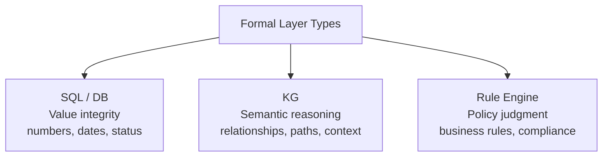
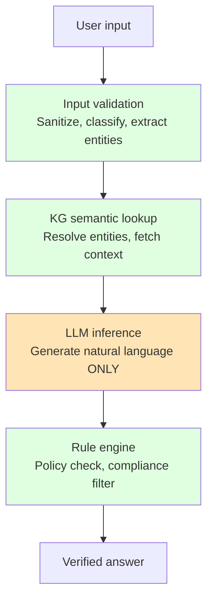
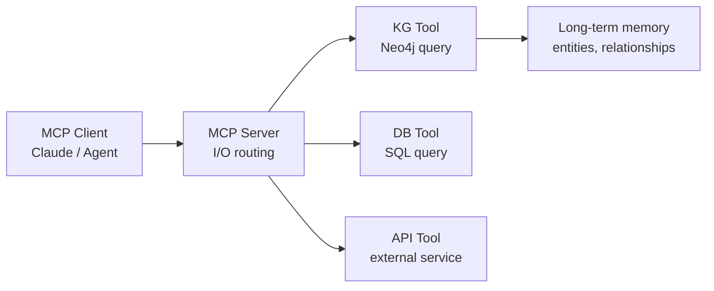
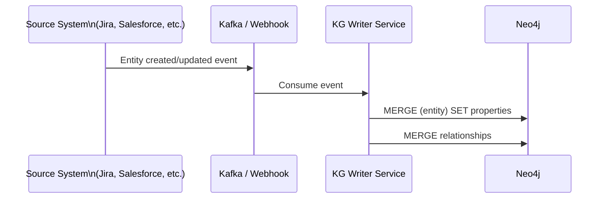

# s09: Enterprise KG Architecture Design

`[ s09 ] <- s08 KG in the Wild: Industry Case Studies | s10 Integrating KG with AI Agents ->`

> "Sandwich the LLM between formal layers to clearly separate deterministic processing from generative inference."

## Problem

Your prototype works on a single machine with a simple query chain. But enterprise requirements are different: multiple users, access control, audit logs, high availability, and the fundamental need to prevent the LLM from making things up about critical business data.

The problem is not just scaling — it is architecture. If the LLM has direct write access to production data, one bad generation can corrupt your knowledge graph. If all processing goes through the LLM, you lose the determinism that makes KG valuable.

You need a design principle that keeps the LLM in its lane.

## Solution

The **formal layer sandwich**: deterministic, rule-based processing wraps the LLM on both sides.

```
User → Input validation (formal) → KG semantic understanding (formal) → LLM inference → Rule engine (formal) → Verified answer
```

The LLM's role is limited to one thing: **natural language generation**. Everything that must be correct — entity resolution, relationship traversal, policy evaluation — happens in formal layers that cannot hallucinate.

## How It Works

### The three formal layer types



Each layer has a different job:

- **SQL/DB layer**: enforces value integrity. Amounts, timestamps, status codes come from here, not from the LLM.
- **KG layer**: handles semantic reasoning. Which entities are related? What is the context around this entity? What path connects A to B?
- **Rule engine layer**: evaluates policy. Is this action permitted? Does this output comply with business rules?

### The sandwich diagram



The LLM (orange) sits between two green deterministic layers. It never touches raw user input directly, and its output always passes through a rule engine before reaching the user.

### Implementation: input validation layer

```python
import re
from langchain_neo4j import Neo4jGraph

def validate_and_extract(raw_input: str) -> dict:
    """Sanitize input and extract structured hints before passing to LLM."""
    # Remove injection-style patterns
    cleaned = re.sub(r"(DROP|DELETE|CREATE|MERGE)\s", "", raw_input, flags=re.IGNORECASE)

    # Extract entity hints (engineer names, bug IDs, etc.)
    entity_hints = {
        "bug_ids": re.findall(r"BUG-\d+", cleaned),
        "engineer_mentions": re.findall(r"\b[A-Z][a-z]+\b", cleaned),
    }

    return {"clean_query": cleaned, "hints": entity_hints}
```

### Implementation: KG context lookup layer

```python
def fetch_kg_context(graph: Neo4jGraph, entity_hints: dict) -> str:
    """Get structured context from KG before invoking LLM."""
    context_parts = []

    for bug_id in entity_hints.get("bug_ids", []):
        result = graph.query(
            "MATCH (b:Bug {id: $id})-[:ASSIGNED_TO]->(e:Engineer) "
            "RETURN b.title, b.severity, b.status, e.name",
            params={"id": bug_id}
        )
        if result:
            context_parts.append(f"Bug {bug_id}: {result[0]}")

    return "\n".join(context_parts) if context_parts else "No matching entities found."
```

### Implementation: rule engine output filter

```python
BLOCKED_PATTERNS = [
    r"password", r"secret", r"internal only", r"confidential"
]

def apply_rules(llm_output: str, user_role: str) -> str:
    """Filter LLM output through policy rules before returning to user."""
    for pattern in BLOCKED_PATTERNS:
        if re.search(pattern, llm_output, flags=re.IGNORECASE):
            return "This information is restricted. Contact your administrator."

    # Role-based filtering
    if user_role == "read_only" and "assigned" in llm_output.lower():
        return llm_output  # OK to show
    return llm_output
```

### MCP + KG: handling long-term memory

Model Context Protocol (MCP) standardizes how AI tools exchange data. In a KG architecture:

- **MCP handles I/O**: tool calls, context passing, session management
- **KG handles long-term memory**: persisting knowledge across sessions, entity relationships, execution history



### Schema design: node vs property decision

A common design mistake is putting everything as a property when it should be a separate node, or creating unnecessary nodes for simple values.

| Make it a NODE when | Make it a PROPERTY when |
|---|---|
| It has its own relationships | It is a scalar value (string, number, date) |
| Multiple entities share it (team, status type) | It is unique per entity (name, id, timestamp) |
| You will query "all X of type Y" | It does not participate in traversals |
| It has metadata of its own | It is just descriptive |

```cypher
-- BAD: status as property when you need to find "all critical bugs"
CREATE (b:Bug {status: "critical"})

-- GOOD: status as node when multiple bugs share the same status
-- and you query by status frequently
CREATE (b:Bug)-[:HAS_STATUS]->(s:Status {name: "critical"})

-- RULE: if you MATCH on a value in WHERE clauses often, consider making it a node
-- if you just RETURN it, keep it a property
```

### Event-driven KG updates

In production, your KG must stay in sync with source systems. Use an event-driven pattern:



```python
def handle_bug_event(event: dict):
    """Process a bug creation/update event and write to KG."""
    query = """
    MERGE (b:Bug {id: $bug_id})
    SET b.title = $title,
        b.severity = $severity,
        b.status = $status,
        b.updated_at = datetime()
    WITH b
    MATCH (e:Engineer {id: $assignee_id})
    MERGE (b)-[:ASSIGNED_TO]->(e)
    """
    graph.query(query, params={
        "bug_id": event["id"],
        "title": event["title"],
        "severity": event["severity"],
        "status": event["status"],
        "assignee_id": event.get("assignee_id")
    })
```

### Production checklist

```
Infrastructure:
[ ] Neo4j cluster with at least 3 nodes (HA)
[ ] Automated daily backups with restore test
[ ] Read replicas for query load (write to primary, read from replica)
[ ] TLS on Bolt port (7687)

Security:
[ ] Separate Neo4j users per service (read-only for query layer, write for ingestion)
[ ] No LLM writes directly to Neo4j (write layer always formal)
[ ] Audit log for all WRITE operations

Operations:
[ ] Schema migration process documented
[ ] Monitoring on query latency (alert > 500ms)
[ ] Node/relationship count trends (detect unexpected growth)
```

## What You Will Learn in This Session

**Before:**
- Your LLM has unrestricted access to generate any query
- You have no layer between user input and the graph
- Schema design is ad hoc

**After:**
- You can implement the sandwich pattern with input validation, KG context, and output rules
- You know the node vs property decision criteria for schema design
- You have a production checklist covering HA, security, and operations
- You understand how MCP + KG separates I/O routing from long-term memory

## Try It

Apply the sandwich pattern to your s06 chain:

```python
import os, re
from langchain_ollama import ChatOllama
from langchain_neo4j import Neo4jGraph, GraphCypherQAChain

graph = Neo4jGraph(
    url="bolt://localhost:7687",
    username="neo4j",
    password=os.getenv("NEO4J_PASSWORD")
)
llm = ChatOllama(model="llama3.2", base_url="http://localhost:11434")

chain = GraphCypherQAChain.from_llm(
    llm=llm, graph=graph, allow_dangerous_requests=True, validate_cypher=True
)

def sandwiched_query(raw_input: str, user_role: str = "standard") -> str:
    # Layer 1: Input validation
    cleaned = re.sub(r"(DROP|DELETE)\s", "", raw_input, flags=re.IGNORECASE)

    # Layer 2: KG context (automatic via GraphCypherQAChain)
    result = chain.invoke({"query": cleaned})
    answer = result["result"]

    # Layer 3: Rule engine
    if "password" in answer.lower():
        return "Restricted information."
    return answer

print(sandwiched_query("How many critical bugs are unassigned?"))
print(sandwiched_query("DROP all data from the database"))  # sanitized before reaching chain
```

In the next session, you will connect AI agents to the KG — using the graph as structured agent memory.
