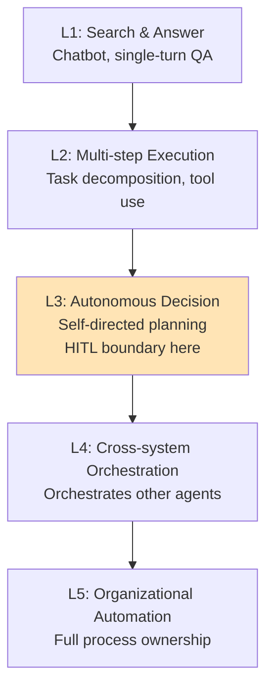
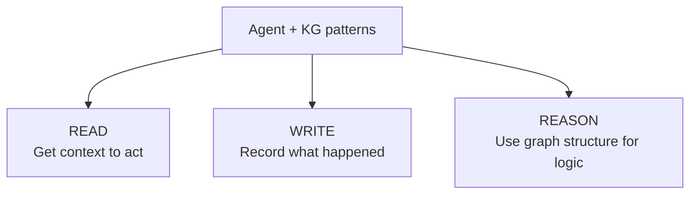
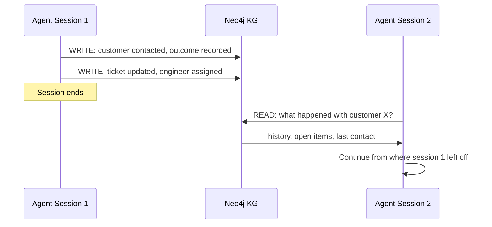
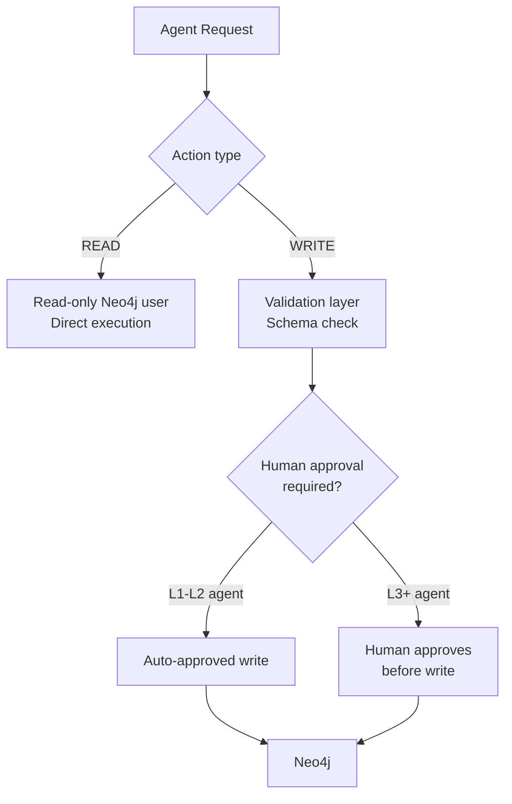

# Integrating KG with AI Agents


> "Use KG as structured agent memory to persist execution history, knowledge, and context across sessions."

## Problem

AI agents forget everything between sessions. Every time a support agent starts a new conversation, it has no memory of the customer's history. Every time a coding agent resumes a task, it cannot see what it previously attempted.

In-memory context solves this within a single session. It does not solve it across sessions. Redis gives you fast key-value memory but no structure. You cannot ask Redis "which customers have open tickets AND are on an enterprise plan AND have not been contacted this week."

That query is a graph traversal. You need structured, queryable, persistent memory.

## Solution

Use KG as structured agent memory. The graph persists everything the agent knows and has done, across sessions, in a form that can be queried with Cypher.

**KG as agent memory: Short-term vs Long-term**

| Memory type | Storage | Scope | Query capability |
|---|---|---|---|
| Short-term | Redis / in-memory | Single session | Key-value lookup only |
| Long-term | KG (Neo4j) | Cross-session | Full graph traversal |

KG gives you long-term memory that you can reason about, not just retrieve.

## How It Works

### Agent classification: L1 to L5

Before wiring KG into an agent, understand where your agent sits on the autonomy scale.



The **HITL (Human-in-the-Loop) boundary** sits between L2 and L3. L1-L2 agents can run freely. L3+ agents must have human approval gates for consequential actions, especially KG writes.

### Three KG usage patterns for agents



**Pattern 1: READ — fetch context to execute a task**

A support agent reads customer context from KG before responding:

```python
from langchain_neo4j import Neo4jGraph
from langchain_ollama import ChatOllama
from langchain_core.prompts import ChatPromptTemplate
import os

graph = Neo4jGraph(
    url="bolt://localhost:7687",
    username="neo4j",
    password=os.getenv("NEO4J_PASSWORD")
)
llm = ChatOllama(model="llama3.2", base_url="http://localhost:11434")

def support_agent_with_kg(customer_id: str, question: str) -> str:
    # READ: fetch structured context from KG
    # Note: Ticket-[:REPORTED_BY]->Customer, so we traverse in reverse from Customer
    context_result = graph.query("""
        MATCH (c:Customer {id: $cid})
        OPTIONAL MATCH (t:Ticket)-[:REPORTED_BY]->(c)
        OPTIONAL MATCH (c)-[:ON_PLAN]->(p:Plan)
        RETURN c.name, c.sla_tier,
               collect(t.id) AS open_tickets,
               p.name AS plan
        """,
        params={"cid": customer_id}
    )

    context = context_result[0] if context_result else {}

    prompt = ChatPromptTemplate.from_template("""
    Customer context from KG:
    - Name: {name}
    - Plan: {plan}
    - SLA tier: {sla_tier}
    - Open tickets: {open_tickets}

    Customer question: {question}

    Answer based on the context above. Do not invent information not in the context.
    """)

    chain = prompt | llm
    return chain.invoke({
        "name": context.get("c.name", "unknown"),
        "plan": context.get("plan", "unknown"),
        "sla_tier": context.get("c.sla_tier", "standard"),
        "open_tickets": context.get("open_tickets", []),
        "question": question
    }).content
```

**Pattern 2: WRITE — record agent actions as graph nodes**

Every meaningful action the agent takes becomes an `AgentAction` node:

```python
from datetime import datetime

def record_agent_action(
    graph: Neo4jGraph,
    agent_id: str,
    action_type: str,
    target_entity_id: str,
    result: str
) -> None:
    """Write agent actions to KG for audit, debugging, and future context.
    In production, sanitize or truncate the result field before writing,
    as it may contain LLM-generated content."""
    graph.query("""
        MATCH (e {id: $entity_id})
        CREATE (a:AgentAction {
            id: randomUUID(),
            agent_id: $agent_id,
            type: $action_type,
            result: $result,
            timestamp: datetime()
        })
        CREATE (a)-[:ACTED_ON]->(e)
        """,
        params={
            "agent_id": agent_id,
            "action_type": action_type,
            "entity_id": target_entity_id,
            "result": result
        }
    )

# Example: after the support agent responds
record_agent_action(
    graph=graph,
    agent_id="support-agent-01",
    action_type="RESPONDED_TO_TICKET",
    target_entity_id="TICKET-123",
    result="Provided refund instructions"
)
```

Now you can query: "What has this agent done in the last 7 days?" — a Cypher query, not a log file search.

**Pattern 3: REASON — use graph structure for agent logic**

Replace LLM reasoning with deterministic Cypher for policy-critical decisions:

```python
def should_escalate(ticket_id: str) -> bool:
    """
    Escalation logic as a Cypher query — not LLM reasoning.
    LLM reasoning can be inconsistent. Graph structure is deterministic.
    """
    result = graph.query("""
        MATCH (t:Ticket {id: $tid})-[:REPORTED_BY]->(c:Customer)
        WHERE c.sla_tier = "enterprise"
          AND t.severity = "critical"
          AND NOT (t)-[:ASSIGNED_TO]->(:Engineer)
          AND t.created_at < datetime() - duration({hours: 2})
        RETURN count(t) AS should_escalate
        """,
        params={"tid": ticket_id}
    )
    return result[0]["should_escalate"] > 0 if result else False

# If escalation is needed, agent routes without asking LLM
if should_escalate("TICKET-123"):
    assign_to_senior_engineer("TICKET-123")
```

This is the key principle: **use Cypher for logic that must be correct; use LLM only for language generation.**

### KG as cross-session agent memory



Without KG, Session 2 starts blind. With KG, it starts with full history.

### Safeguards for agent KG access



**Implementation:**

> **Warning: Production stub.** The `safe_write` function uses `input()` for the approval gate.
> `input()` blocks in non-interactive environments (Docker containers, CI/CD pipelines).
> Replace this with your workflow system (Slack approval, task queue, etc.) before deploying.

```python
READ_ONLY_GRAPH = Neo4jGraph(
    url="bolt://localhost:7687",
    username="neo4j_reader",   # read-only Neo4j user
    password=os.getenv("NEO4J_READ_PASSWORD")
)

WRITE_GRAPH = Neo4jGraph(
    url="bolt://localhost:7687",
    username="neo4j_writer",   # separate write user
    password=os.getenv("NEO4J_WRITE_PASSWORD")
)

def safe_write(query: str, params: dict, require_approval: bool = True) -> bool:
    """Gate KG writes through an approval step for L3+ agents."""
    if require_approval:
        # In production: send to human review queue, return after approval
        print(f"PENDING APPROVAL: {query}")
        print(f"Params: {params}")
        # Stub: replace with your workflow system (e.g., Slack approval, task queue)
        # input() will block in non-interactive environments (Docker, CI, etc.)
        approved = input("Approve write? (y/n): ").strip() == "y"
        if not approved:
            return False
    WRITE_GRAPH.query(query, params=params)
    return True
```

## What You Will Learn in This Session

**Before:**
- Your agents forget everything between sessions
- You store agent context in Redis or environment variables
- Escalation and routing logic lives inside LLM prompts (unreliable)

**After:**
- You can use KG as cross-session structured memory for agents
- You can implement READ, WRITE, and REASON patterns with concrete Python
- Escalation and routing logic is in Cypher (deterministic, auditable)
- You have a safeguard pattern separating read-only from write access

## Try It

Build a minimal agent that uses all three KG patterns:

```python
import os
from langchain_neo4j import Neo4jGraph
from langchain_ollama import ChatOllama

graph = Neo4jGraph(
    url="bolt://localhost:7687",
    username="neo4j",
    password=os.getenv("NEO4J_PASSWORD")
)
llm = ChatOllama(model="llama3.2", base_url="http://localhost:11434")

# Seed some data — these add new node types (Customer, Ticket) to the same Neo4j instance.
# They coexist with the Engineer/Bug nodes from s04 without conflict.
# Run: MATCH (n) RETURN labels(n)[0], count(n) to see all node types together.
graph.query("""
MERGE (c:Customer {id: "C-001", name: "Acme Corp", sla_tier: "enterprise"})
MERGE (t:Ticket {id: "T-001", severity: "critical", status: "open"})
CREATE (t)-[:REPORTED_BY]->(c)
""")

# Pattern 1: READ — traverse from Ticket to Customer using REPORTED_BY direction
context = graph.query("MATCH (t:Ticket)-[:REPORTED_BY]->(c:Customer {id: 'C-001'}) RETURN c.name, t.severity")
print("Context:", context)

# Pattern 3: REASON (escalation check)
escalate = graph.query("""
    MATCH (t:Ticket {id: 'T-001'})-[:REPORTED_BY]->(c:Customer)
    WHERE c.sla_tier = 'enterprise' AND t.severity = 'critical'
    RETURN count(t) AS should_escalate
""")
print("Escalate:", escalate[0]["should_escalate"] > 0)

# Pattern 2: WRITE (record the decision)
graph.query("""
    MATCH (t:Ticket {id: 'T-001'})
    CREATE (a:AgentAction {type: 'ESCALATION_CHECK', result: 'escalated', timestamp: datetime()})
    CREATE (a)-[:ACTED_ON]->(t)
""")
print("Action recorded in KG")
```

In the next session, you will map this to a realistic adoption roadmap with phases, costs, and risk controls.
