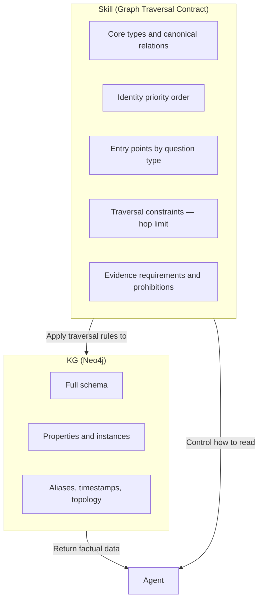
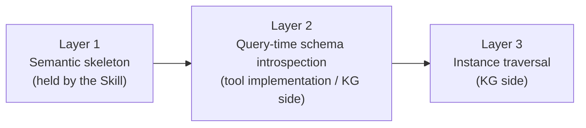

# How to Make Agents Read Your KG Correctly

> "To make agents traverse your KG accurately without hallucination, define a Graph Traversal Contract in the Skill — fixing entry points, relation directions, hop limits, and evidence requirements."

## What You Will Learn in This Session

In s10, you learned to use KG as structured agent memory. Agents can read (READ), write (WRITE), and reason (REASON) over the graph. But when you actually run it, a problem surfaces: the same question produces slightly different queries each time. Relation directions get reversed. Traversal expands into unintended areas. Answers get filled in without grounding.

The problem is not the KG itself. The problem is that the agent has no specification for how to read the graph. The fix is a **Graph Traversal Contract** — a declaration in the Skill that specifies how the agent must traverse the KG, making reads reproducible.

## Why Agents Cannot Read the KG Accurately

Even when the connection is working, Cypher generation is unstable without a traversal specification. The common failure patterns are:

| Problem | What happens |
|---------|-------------|
| Relation direction drift | The agent guesses the direction of `OWNS` or `DEPENDS_ON`, producing different queries each run |
| Entity resolution drift | Multiple candidates (`alias`, `display_name`, `slug`) cause the traversal start point to shift |
| Depth runaway | Unlimited hops, unrelated expansions, unintended joins |
| Groundless answers | When traversal returns nothing, the LLM fills in the gaps — no deterministic answer is possible |
| Schema drift | As labels and relations accumulate, interpretation cannot keep up |

KG is a truth source. The specification for how to traverse it belongs in a separate layer.

## What Is a Graph Traversal Contract

A Graph Traversal Contract declares traversal rules in the Skill. It does not describe what the KG knows. It controls **how to read** the KG.

The Skill and KG separation of responsibilities looks like this:



The typical agent flow with a Traversal Contract:

1. Read the Skill and load the Contract
2. Fetch schema from the KG if needed
3. Enumerate entity candidates and apply identity resolution rules
4. Execute traversal under constraints
5. Assemble the evidence subgraph
6. Generate natural language or structured output grounded in evidence

## The 5 Elements of a Contract

### 1. Core Types and Canonical Relations (with Direction)

The Skill contains only stable types and fixed relation directions. Instance knowledge and full property lists stay in the KG.

```
Entity types: Service, System, Team, Incident, Document

Canonical relations (direction fixed):
  Team    -[OWNS]->       Service
  Service -[DEPENDS_ON]-> System
  Incident -[IMPACTS]->  Service
  Document -[DESCRIBES]-> Service
```

Fixing the direction in the Skill eliminates the agent's ability to guess.

### 2. Identity Priority Order

When multiple identifiers refer to the same entity, declare which to use first.

```
Service:  service_id  >  canonical_name  >  alias
Team:     team_id     >  slug            >  display_name
Document: doc_id      >  title
```

This ensures the traversal start point resolves to the same entity every time.

### 3. Entry Points by Question Type

Fix which node type to start from based on the nature of the question.

```
Ownership or assignment questions  -> start from Team or Service
Dependency questions               -> start from Service
Incident or impact questions       -> start from Incident
Documentation questions            -> start from Document
```

Fixing entry points prevents the agent from misidentifying the traversal origin.

### 4. Traversal Constraints (Hop Limit)

Unlimited traversal causes unintended joins. Declare constraints in the Contract.

```
Maximum hops: 3
Expansion order:
  1-hop: canonical relations only (OWNS, DEPENDS_ON, IMPACTS, DESCRIBES)
  2-hop: dependency chain following
  3-hop: impact propagation checking
```

### 5. Evidence Requirements and Prohibitions

Require grounding for every answer. Prohibit inference without evidence.

```
Evidence requirements:
  Answers must include supporting node IDs, relation types, and the traversal path.
  If evidence is missing, return unknown.
  On multiple matches, return the candidate list — do not silently pick one.

Prohibited behaviors:
  - Inferring missing edges
  - Guessing relation directions
  - Synthesizing entities that do not exist
  - Asserting answers without traversal evidence
```

## Contract Example

A real Skill file looks like this:

```yaml
# graph-traversal-contract.md
# Place this file as a Skill or Project Rules file in your repository

## Graph Traversal Contract

### Core Types and Canonical Relations
Entity types: Service, System, Team, Incident, Document

Canonical relations (direction fixed — do not reverse):
  Team    -[OWNS]->       Service   # Team owns Service
  Service -[DEPENDS_ON]-> System    # Service depends on System
  Incident -[IMPACTS]->  Service   # Incident impacts Service
  Document -[DESCRIBES]-> Service  # Document describes Service

### Identity Priority Order
Service:  service_id  > canonical_name > alias
Team:     team_id     > slug           > display_name
Document: doc_id      > title

### Entry Points (question type -> traversal origin)
Ownership or assignment: Team or Service
Dependency:              Service
Incident or impact:      Incident
Documentation:           Document

### Traversal Constraints
Maximum hops: 3
1-hop uses canonical relations only. Expansion via guessed or derived relations is prohibited.

### Evidence Requirements
Answers must include node IDs, relation types, and the path taken.
If evidence is missing, return unknown. Return a candidate list on multiple matches.

### Prohibited Behaviors
- Inferring missing edges
- Guessing relation directions
- Synthesizing non-existent entities
- Asserting answers without traversal evidence
```

Version-controlling this file alongside your application code means that when the schema changes, only the canonical parts of the Contract need to be updated.

## Four Design Principles

### Principle 1: The Skill Holds Only the Thin Semantic Skeleton

What belongs in the Skill: canonical types, canonical relations, directions, identity priority, entry points, interpretation rules, evidence constraints.

What does not belong in the Skill: full property lists, instance knowledge, convenient derived relations, the full label design dumped wholesale.

Models cannot interpret a long schema consistently. A thick Skill becomes as hard to read as the schema itself.

### Principle 2: The Skill Is a Reasoning Controller, Not a Knowledge Store

The Skill controls how to read, not what is known. Storing facts is the KG's job. The Skill is the rulebook for reading the KG.

### Principle 3: Hold Only Stable Vocabulary

Anchor to concepts whose meaning is long-term stable: ownership, dependency, impact, containment, description. Do not include temporary labels or index-only property semantics. When the canonical parts of the schema do not change, the Contract requires no maintenance.

### Principle 4: Three Layers — the Skill Covers Only Layer 1



Runtime schema introspection (Layer 2) and actual data traversal (Layer 3) happen outside the Skill. The Skill holds only the semantic skeleton. This separation makes interpretation resilient to schema changes.

## What You Will Learn in This Session

**Before:**
- The agent can connect to the KG but Cypher generation drifts across runs
- Relation directions and traversal depth are guessed by the agent, mixing in hallucinations
- Every schema addition inflates the prompt and the problem compounds

**After:**
- Writing a Graph Traversal Contract in the Skill makes traversal reproducible
- Declaring directions, entry points, hop limits, and evidence requirements removes agent guessing
- Version-controlling the Contract in the repository allows "only update the canonical parts" when the schema changes

## Try It

Write a minimal Contract for your own KG project.

```yaml
# my-traversal-contract.md

## Core Types and Canonical Relations
Entity types: [3-5 primary types from your project]

Canonical relations:
  [Type A] -[RELATION_NAME]-> [Type B]  # always specify direction

## Identity Priority Order
[Type A]: [ID candidate 1] > [ID candidate 2] > [ID candidate 3]

## Entry Points
[Question category 1]: start from [type]
[Question category 2]: start from [type]

## Traversal Constraints
Maximum hops: 3

## Evidence Requirements
Return unknown when evidence is missing.
```

In the next session, you will learn how to introduce a KG with this Contract into your organization incrementally — covering phase-based adoption, use case selection, and cost management.
