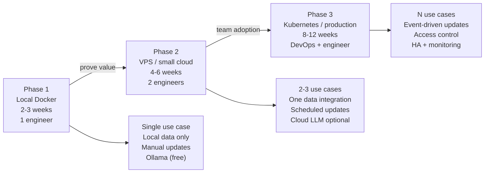

# KG Adoption Strategy: Start Small


> "Minimize adoption risk by migrating incrementally from local experiments (Phase 1) to production (Phase 3)."

## Problem

You want to introduce KG in your organization, but "build a full knowledge graph" is a project that costs 6-10 person-months according to realistic OSS estimates. That is too large to justify before proving value.

The typical failure pattern: design the perfect schema for everything, spend months building it, never get to users.

There are also four real challenges that stop most teams:

1. **Data integration**: your data lives in five different systems with inconsistent IDs
2. **Access control**: different users should see different subgraphs
3. **Continuous updates**: the graph goes stale the moment you stop updating it
4. **AI agent integration**: connecting agents to the graph without introducing write-access risks

## Solution

"Start small and grow" beats "design the perfect KG first." Every time.

The minimum viable setup is three components you already have from previous sessions:
- **Neo4j** running in Docker (s04)
- **Ollama** for local LLM (s04)
- **LangChain GraphCypherQAChain** for natural language queries (s04, s06)

From this starting point, migrate in three phases. Each phase delivers standalone value and can stop if the use case does not pan out.

## How It Works

### The three-phase roadmap



**Phase 1: Local Docker proof of concept**

Goal: prove the use case delivers value before committing team resources.

```yaml
# docker-compose.yml (from s04 — already done)
version: "3.9"
services:
  neo4j:
    image: neo4j:5.13-community
    ports: ["7474:7474", "7687:7687"]
    environment:
      - NEO4J_AUTH=neo4j/${NEO4J_PASSWORD}
    volumes:
      - neo4j_data:/data
  ollama:
    image: ollama/ollama:latest
    ports: ["11434:11434"]
    volumes:
      - ollama_data:/root/.ollama
volumes:
  neo4j_data:
  ollama_data:
```

Phase 1 deliverable: a working demo that answers 5 specific questions from real data. Show it to two internal stakeholders. If it does not convince them, stop here — the use case is wrong, not the technology.

**Phase 2: VPS / shared environment**

Goal: move from your laptop to a shared server so the team can use it.

```bash
# On a VPS (2 vCPU, 8GB RAM is sufficient for Phase 2)
git clone your-kg-repo
cp .env.example .env
# Set NEO4J_PASSWORD, OPENAI_API_KEY (optional)
docker compose up -d

# Set up a nightly data refresh cron
0 2 * * * /opt/kg/scripts/refresh_data.sh >> /var/log/kg-refresh.log 2>&1
```

Phase 2 deliverable: 3-5 team members using the system daily. Collect feedback. Identify which queries fail. Add those as few-shot examples (s06 technique).

**Phase 3: Production**

Goal: reliable, secure, monitored system that multiple teams depend on.

```yaml
# Kubernetes manifest (simplified)
apiVersion: apps/v1
kind: StatefulSet
metadata:
  name: neo4j
spec:
  replicas: 3   # HA cluster
  template:
    spec:
      containers:
      - name: neo4j
        image: neo4j:5.13-enterprise   # Enterprise for clustering
        resources:
          requests:
            memory: "4Gi"
            cpu: "2"
```

### Use case selection criteria

Not every problem benefits from KG. Select the first use case using these criteria:

```
Use case scoring matrix (score each 1-3):

1. Error cost
   1 = low (wrong answer is inconvenient)
   2 = medium (wrong answer costs time to fix)
   3 = high (wrong answer causes business or legal risk)
   Target: score 2. Score 3 needs more safeguards before KG is ready.

2. Data availability
   1 = data is scattered, unclear ownership
   2 = data exists but needs cleanup
   3 = data is clean and accessible
   Target: score 2 or 3.

3. Query pattern clarity
   1 = vague ("improve search")
   2 = 3-5 specific questions with known expected answers
   3 = full query catalog with test cases
   Target: score 2 or 3.

4. Stakeholder clarity
   1 = unclear who owns the outcome
   2 = one owner identified
   3 = owner + success criteria defined
   Target: score 2 or 3.
```

Pick the use case that scores highest on criteria 2-4 with error cost = 2.

### Neo4j Community vs Enterprise

```
Neo4j Community (free):
- Single instance only
- No clustering
- No role-based access control
- Sufficient for: Phase 1, Phase 2 with small team
- Decision: use unless you need HA or multi-user access control

Neo4j Enterprise (paid):
- Clustering (HA)
- Role-based access control
- Online backups
- Required for: Phase 3 production with multiple teams
```

### Switching from Ollama to cloud LLM

With LangChain, this is a one-line change. The entire rest of your pipeline stays the same.

```python
# Phase 1: Ollama (free, local)
from langchain_ollama import ChatOllama
llm = ChatOllama(model="llama3.2", base_url="http://localhost:11434")

# Phase 2/3: Switch to cloud (better quality, API cost)
from langchain_openai import ChatOpenAI
llm = ChatOpenAI(model="gpt-4o", api_key=os.getenv("OPENAI_API_KEY"))

# Nothing else changes. GraphCypherQAChain, LLMGraphTransformer — same code.
```

### The four real challenges and how phases address them

**Challenge 1: Data integration**

Phase 1: use a single data source with a manual export. Do not attempt integration in Phase 1.
Phase 2: write one integration script for one source system.
Phase 3: event-driven updates (s09 Kafka pattern) for all source systems.

**Challenge 2: Access control**

Phase 1: single user, no access control needed.
Phase 2: separate read-only and write Neo4j users (s09 pattern).
Phase 3: row-level access using node labels or the Neo4j Enterprise RBAC system.

```cypher
-- Phase 3: restrict user to only their team's data
GRANT MATCH {*} ON GRAPH kg TO read_only_user
DENY MATCH {*} ON GRAPH kg NODES Engineer WHERE team <> $user_team TO read_only_user
```

**Challenge 3: Continuous updates**

Phase 1: manual export + import once a week.
Phase 2: scheduled cron job with MERGE (idempotent writes).
Phase 3: event-driven with webhook or Kafka consumer.

```python
# Phase 2: idempotent nightly refresh
def refresh_engineers_from_hr_system():
    engineers = fetch_from_hr_api()
    for eng in engineers:
        graph.query("""
            MERGE (e:Engineer {id: $id})
            SET e.name = $name,
                e.team = $team,
                e.updated_at = datetime()
            """,
            params=eng
        )
```

**Challenge 4: AI agent integration**

Phase 1: no agents, just chain queries.
Phase 2: read-only agent (s10 READ pattern).
Phase 3: full L2 agent with WRITE and REASON patterns, HITL for L3+.

## What You Will Learn in This Session

**Before:**
- KG adoption looks like a large upfront investment with unclear ROI
- You are not sure where to start or how to evaluate use cases
- Switching from local to cloud feels like a rebuild

**After:**
- You have a three-phase roadmap with concrete deliverables per phase
- You can score use cases on four criteria to select the right first project
- You know the one-line LangChain change to switch from Ollama to cloud LLM
- You have specific answers to the four common adoption challenges

## Try It

Score your top two use case candidates:

```
Use case 1: _______________
  Error cost (1-3): ___
  Data availability (1-3): ___
  Query pattern clarity (1-3): ___
  Stakeholder clarity (1-3): ___
  Total: ___

Use case 2: _______________
  Error cost (1-3): ___
  Data availability (1-3): ___
  Query pattern clarity (1-3): ___
  Stakeholder clarity (1-3): ___
  Total: ___
```

For the higher-scoring use case, write out:

1. The 5 specific questions your KG needs to answer
2. The data source you will export for Phase 1 (one source, one CSV or JSON export)
3. The two stakeholders you will demo to at the end of Phase 1

Phase 1 timeline: 2-3 weeks for one engineer. If you have been following this course, you already have the Neo4j + Ollama environment from s04 and the extraction pipeline from s05. You are closer to Phase 1 than you think.

In the final session, you will learn how to measure whether your KG project is actually working — and how to improve it systematically.
