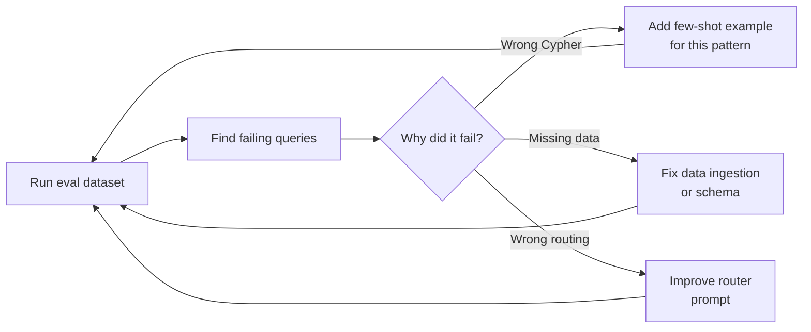

# Measuring and Improving Your KG Project


> "Establish a quantitative measurement cycle with evaluation datasets and automated scoring scripts."

## Problem

You have deployed a KG system. Users are querying it. But you do not know if it is actually better than what you had before. Responses feel more accurate, but "feels better" is not a metric your stakeholders will accept.

Without measurement, you cannot improve systematically. You cannot tell whether a schema change helped or hurt. You cannot demonstrate ROI to the team that funded the project.

## Solution

Build an evaluation dataset before you change anything. Write 20-30 question/answer pairs with known correct answers. Run your system against them. Score accuracy and latency. Run this on every schema change.

The key insight: **KG returns exact query results — faithfulness is 100% for the retrieval step.** The variability is in Text-to-Cypher generation. That is what you are measuring and improving.

## How It Works

### Step 1: Design KPIs before implementation

Define your metrics before you build, not after. The right metric depends on the use case.

| Use case | Primary KPI | Secondary KPI |
|---|---|---|
| Support KG | First Response Time (FRT) | CSAT score |
| Dependency KG | Impact analysis time | Coverage (% systems mapped) |
| Onboarding KG | Time-to-first-PR | Question escalation rate |
| Incident KG | MTTR | False positive alert rate |

For each use case, establish a baseline measurement before KG deployment. Without a baseline, you cannot claim improvement.

### Step 2: Build an evaluation dataset

```python
# eval_dataset.py
# Format: question, expected_answer, expected_cypher (optional)

EVAL_DATASET = [
    {
        "question": "How many critical open bugs are there?",
        "expected_answer": "3",   # exact count from your test data
        "category": "count"
    },
    {
        "question": "Which bugs are not assigned to any engineer?",
        "expected_contains": ["BUG-007", "BUG-012"],  # must appear in answer
        "category": "negation"
    },
    {
        "question": "Who owns the most critical bugs?",
        "expected_answer": "Alice",
        "category": "aggregation"
    },
    {
        "question": "Show engineers on the backend team",
        "expected_contains": ["Alice", "Bob"],
        "category": "filter"
    },
]
```

Cover each of the five KG-native query types from s07: set/classification, contrast, path traversal, negation, count/aggregation.

### Step 3: Automated evaluation script

```python
import time
import json
from langchain_neo4j import Neo4jGraph, GraphCypherQAChain
from langchain_ollama import ChatOllama
import os

def benchmark_qa(chain, dataset: list[dict]) -> dict:
    """Run evaluation dataset against the chain and return metrics."""
    results = []

    for item in dataset:
        start = time.time()
        try:
            response = chain.invoke({"query": item["question"]})
            answer = response["result"].lower()
            latency_ms = (time.time() - start) * 1000

            # Score the answer
            if "expected_answer" in item:
                correct = item["expected_answer"].lower() in answer
            elif "expected_contains" in item:
                correct = all(
                    entity.lower() in answer
                    for entity in item["expected_contains"]
                )
            else:
                correct = None  # manual review needed

            results.append({
                "question": item["question"],
                "category": item["category"],
                "correct": correct,
                "latency_ms": round(latency_ms, 1),
                "answer": response["result"]
            })

        except Exception as e:
            results.append({
                "question": item["question"],
                "category": item["category"],
                "correct": False,
                "latency_ms": None,
                "error": str(e)
            })

    # Calculate summary metrics
    scored = [r for r in results if r["correct"] is not None]
    accuracy = sum(r["correct"] for r in scored) / len(scored) if scored else 0
    latencies = [r["latency_ms"] for r in results if r["latency_ms"] is not None]
    avg_latency = sum(latencies) / len(latencies) if latencies else 0

    return {
        "accuracy": round(accuracy, 3),
        "avg_latency_ms": round(avg_latency, 1),
        "total": len(results),
        "scored": len(scored),
        "results": results
    }

# Run it
graph = Neo4jGraph(url="bolt://localhost:7687", username="neo4j", password=os.getenv("NEO4J_PASSWORD"))
llm = ChatOllama(model="llama3.2", base_url="http://localhost:11434")
# ⚠️ allow_dangerous_requests=True is required by LangChain ≥0.2.
# In production, ensure all user inputs are validated before reaching this chain.
chain = GraphCypherQAChain.from_llm(llm=llm, graph=graph, allow_dangerous_requests=True)

metrics = benchmark_qa(chain, EVAL_DATASET)
print(json.dumps(metrics, indent=2, ensure_ascii=False))
```

### Step 4: Latency benchmarks

Typical performance targets by architecture:

| Architecture | P50 latency | P95 latency | Notes |
|---|---|---|---|
| KG (Cypher only) | 10-50ms | 100ms | Direct query, no LLM |
| KG + LLM (GraphRAG) | 100-500ms | 1s | LLM adds text generation |
| GraphRAG (full) | 2-10s | 15s | Embedding search + LLM |
| RAG alone | 100-500ms | 1s | Comparable to GraphRAG |

If your GraphCypherQAChain is taking more than 3 seconds consistently, the problem is usually the Cypher generation step, not the graph query. Check:
1. Is the schema too large? Trim unused labels.
2. Are you running a 3B model for Cypher generation? Try `llama3.1` (8B).
3. Is `validate_cypher=True`? Each validation adds a round trip.

### Step 5: Faithfulness — what KG gives you for free

Faithfulness measures whether the system's answer is grounded in source data.

```
RAG faithfulness: 70-85%
(The LLM may rephrase, infer, or hallucinate from retrieved passages)

KG faithfulness (retrieval step): 100%
(Neo4j returns exactly what the Cypher query specifies — no more, no less)

Combined KG + LLM faithfulness: ~95%
(The remaining 5% is LLM paraphrasing the exact query result)
```

This is why KG matters for Unsafe Zone use cases (s01): if you need the answer to be exactly correct, you need 100% faithful retrieval. RAG cannot guarantee this.

### Step 6: Data quality monitoring

A KG is only as good as the data in it. Monitor these automatically:

```cypher
-- 1. Isolated nodes (no relationships — likely import errors)
MATCH (n)
WHERE NOT (n)--()
RETURN labels(n)[0] AS type, count(n) AS isolated_count
ORDER BY isolated_count DESC

-- 2. Missing required properties
MATCH (e:Engineer)
WHERE e.name IS NULL OR e.team IS NULL
RETURN count(e) AS engineers_missing_properties

-- 3. Duplicate detection (same name, different IDs)
MATCH (e1:Engineer), (e2:Engineer)
WHERE e1.name = e2.name AND e1.id < e2.id
RETURN e1.name, e1.id, e2.id

-- 4. Stale nodes (not updated in 30 days)
MATCH (n)
WHERE n.updated_at < datetime() - duration({days: 30})
RETURN labels(n)[0] AS type, count(n) AS stale_count
```

Run these as a weekly cron job and alert if isolated nodes exceed 5% of total nodes.

### The improvement cycle



Each iteration of this loop should add 2-5 percentage points of accuracy. After 3-4 iterations, you typically reach 85-90% on your evaluation dataset.

### Course conclusion

KG + LLM is not a build-once technology. The schema grows as your organization's understanding of its own data matures. Use cases accumulate as teams discover what the graph can answer. The measurement cycle is what makes this sustainable.

The pattern:
1. Start with one use case (s11)
2. Build with the sandwich architecture (s09)
3. Measure with an evaluation dataset (this session)
4. Add few-shot examples for failing patterns (s06)
5. Expand to the next use case

Every production KG started as a proof of concept on someone's laptop. The ones that survived did so because the team built a measurement habit from the beginning.

## What You Will Learn in This Session

**Before:**
- You deploy KG but cannot quantify whether it improved anything
- You make schema changes without knowing if they helped or hurt
- Data quality problems are invisible until a user reports a wrong answer

**After:**
- You have a working `benchmark_qa()` script you can run on every change
- You understand the KG faithfulness advantage (100% vs 70-85% for RAG)
- You can detect data quality issues automatically with Cypher health checks
- You have the complete improvement cycle: measure, find failures, add examples, repeat

## Try It

Set up a measurement baseline for your Phase 1 use case:

```python
# 1. Create a minimal eval dataset (10 questions is enough to start)
MY_EVAL_DATASET = [
    {"question": "...", "expected_answer": "...", "category": "count"},
    # Add 9 more covering your specific query patterns
]

# 2. Run the benchmark
metrics = benchmark_qa(chain, MY_EVAL_DATASET)
print(f"Baseline accuracy: {metrics['accuracy'] * 100:.0f}%")
print(f"Baseline latency: {metrics['avg_latency_ms']:.0f}ms")

# 3. Save baseline to file
import json
with open("eval_baseline.json", "w") as f:
    json.dump(metrics, f, indent=2)
print("Baseline saved. Run again after next schema change to measure delta.")
```

Run this weekly. Track accuracy and latency over time. If accuracy drops after a schema change, you will catch it in the next run — before users do.

You now have everything to take KG from zero to production: the theory (s01-s03), the hands-on setup (s04-s05), the production techniques (s06-s07), the business context (s08), the architecture (s09), the agent integration (s10), the adoption strategy (s11), and the measurement cycle (s12).

The rest is practice.
