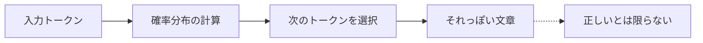
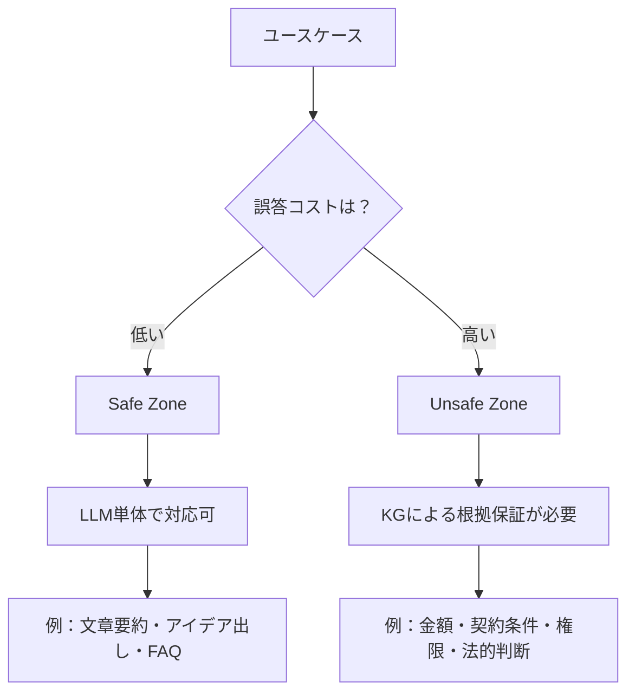

# LLMはなぜ「業務で使いにくい」のか


> "LLMは賢い。でも業務では使いにくい。その理由を知れば、解決策が見えてくる。"

## 問題

会議の議事録をLLMに要約させたら、存在しない決定事項が書かれていた。社内規程を質問したら半年前のルールで答えられた。契約金額の確認を依頼したら、もっともらしい数字が返ってきたが実際とは違った。

こうした経験は、特定の会社の失敗ではありません。LLMの構造的な性質から来る、業界全体の問題です。

MITの報告書（MIT NANDA Report 2025）によれば、生成AIパイロット案件の **95%** が実質的なROIをもたらしていません。失敗の主因は技術の問題ではなく、「**AIが文脈を記憶せず、毎回ゼロから始まる**」という学習のギャップです。

LLMには3つの構造的限界があります。

- **ハルシネーション**：存在しない事実を自信満々に生成する
- **知識更新の遅れ**：学習時点以降の情報を持てない
- **コンテキスト制約**：社内固有の情報（規程・顧客データ・権限）を持っていない

## 解決策

LLMを捨てる必要はありません。LLMが苦手な領域を「構造化された知識」で補完する、という組み合わせが答えです。

ナレッジグラフ（KG）は、この補完を担う仕組みです。金額・契約・権限など「間違えてはいけない情報」はKGから直接取得し、LLMには文章生成だけを担当させる。この役割分担が、信頼できるAIシステムの設計原則です。

重要なのは「どこでLLMが危険か」を判断できるようになることです。すべての業務にKGが必要なわけではありません。

## 仕組み

LLMは本質的に「もっともらしいテキストを生成する確率機械」です。



LLMが「契約金額は100万円です」と答えるとき、それは「そのような文字列が続く確率が高い」から生成されたものです。実際の値を参照しているわけではありません。

この性質から、業務ユースケースは2つのゾーンに分かれます。



**Safe Zone**（誤答コストが低い）では、LLMはそのまま使えます。文章の要約、アイデアのブレスト、一般的な質問への回答など。

**Unsafe Zone**（誤答コストが高い）では、確率的なLLMだけに頼るのは危険です。金額の計算、契約条件の確認、権限の判定。誤答が起きれば、ビジネス上のリスクになります。

## このコースの全体像（12セッション）

各セッションが何に向かって積み上げるのかを先に把握しておくと、学習が進めやすい。

- **s01〜s03** — 理論：LLMが本番で失敗する理由、ナレッジグラフとは何か、RAGの限界
- **s04〜s05** — 実践入門：Neo4jをローカルで動かし、テキストからKGを自動構築する
- **s06〜s07** — 本番テクニック：スキーマ注入・Few-shotの例・KGネイティブな5つのクエリタイプ
- **s08** — ビジネスコンテキスト：業界事例とステークホルダー向けビジネスケースの作り方
- **s09** — アーキテクチャ：エンタープライズ展開のためのフォーマルレイヤー・サンドイッチパターン
- **s10** — エージェント統合：KGをセッションをまたいだ構造化メモリとして使う
- **s11** — 採用戦略：ローカル概念実証から本番への3フェーズロードマップ
- **s12** — 測定：改善を体系化する評価サイクル

s01〜s05はbeginnerセッション。グラフDBの経験は不要だ。s06以降はintermediate。各セッションは前のセッションのコードと概念を直接の前提として積み上げる。

---

## このセッションで学ぶこと

このセッションを終える前と後で、何が変わるのかを整理します。

**始める前の状態：**
- LLMへの不満はある。でも「なぜ使いにくいか」の言葉を持っていない
- 「RAGを入れれば解決する」と思っている
- ナレッジグラフは名前だけ聞いたことがある

**このセッション後の状態：**
- LLMの3つの構造的限界（ハルシネーション・知識更新・コンテキスト制約）を説明できる
- Safe Zone / Unsafe Zone の概念で、自分の業務リスクを評価できる
- 「LLMを改善する」ではなく「LLMに足りないものを補う」という方向性を理解している

## 試してみる

自分のユースケースをSafe/Unsafe Zoneで分類してみましょう。以下のチェックリストで「はい」が1つでもあれば、そのユースケースはUnsafe Zoneの可能性があります。

```
【Unsafe Zone 判定チェックリスト】

□ 1. 金額・数値の正確性
   AIの回答に含まれる金額・数値が間違っていた場合、
   ビジネス上の損失や法的問題が発生しますか？

□ 2. 権限・認可の判定
   「この人はこの操作をする権限があるか」という
   Yes/No判定がシステムに含まれていますか？

□ 3. 法的・規制上の要件
   回答が法律・規制・コンプライアンス要件に
   基づく必要がありますか？

□ 4. 時刻依存の重要情報
   「現在」「最新」「今月」など、時刻によって
   答えが変わる重要情報を扱いますか？

□ 5. 複数文書にまたがる推論
   正しい回答を得るために、3つ以上の情報源を
   組み合わせた推論が必要ですか？

□ 6. 否定・禁止・制限の正確な取り扱い
   「〜できない」「〜は禁止」「〜に対応していない」
   という否定的な制約情報を正確に扱う必要がありますか？

□ 7. 回答の根拠の説明責任
   「なぜそう判断したか」の根拠を人間が
   確認・監査できる必要がありますか？
```

**判定の目安：**
- 0個 → Safe Zone。LLM単体またはシンプルなRAGで十分
- 1〜2個 → ハイブリッドゾーン。RAG + メタデータフィルタを検討
- 3個以上 → Unsafe Zone。KG + LLM のアーキテクチャが必要

次のセッションでは、KGとは何かを具体的なコードで学びます。
