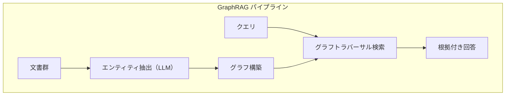

# RAGが解けない問題とGraphRAGの登場


> "RAGをいくら改善しても解決できない問題がある。その事実がGraphRAGへの扉を開く。"

## 問題

RAGを導入したのに、期待通りの回答が返ってこない。よくある症状です。

- 「Aさんが担当する製品に関連するクリティカルチケットを一覧して」と聞いたら、関係ないチケットが混ざる
- 「スタンダードプランの顧客はレート制限緩和を申請できますか？」と聞いたら、エンタープライズプランの情報で答えられた
- 「〇〇機能に対応していないプランはどれですか？」と聞いたら、対応しているプランが返ってきた

これらは実装の問題ではありません。RAGのベクトル検索という仕組みの、構造的な限界です。

## 解決策

RAGを「改善」しようとするのではなく、そのユースケースがGraphRAGで解決できる問題かを判断する視点を持つことが先決です。

RAGのベクトル検索は「意味のパターンマッチング」です。「似た文章を持ってくる」ことは得意ですが、複数の文書にまたがる関係性の推論、否定や制約の正確な取り扱いは構造的に苦手です。

GraphRAGは、KGのグラフトラバーサルを使ってこれらの問題を解決します。「似た文書を探す」のではなく「関係のパスをたどる」という根本的に異なるアプローチです。

## 仕組み

### RAGが失敗する5つのパターン

**パターン1：チャンク境界問題**

文書をチャンク（断片）に分割してインデックスすると、重要な情報がチャンクの境界をまたいでしまうことがあります。

```python
# チャンク境界問題のデモ
text = """
製品Aの保証期間は購入日から2年間です。ただし、以下の条件が
適用されます。消耗品（バッテリー・フィルター等）は保証対象外
となります。
"""

# chunk_size=100文字でチャンク分割した場合
chunk1 = "製品Aの保証期間は購入日から2年間です。ただし、以下の条件が適用されます。消耗品（バッテリー・"
chunk2 = "フィルター等）は保証対象外となります。"

# 「バッテリーは保証されますか？」というクエリ
# → chunk2がヒットする可能性が高い
# → しかしchunk2だけでは「2年間の保証期間」との関係が断絶
```

**パターン2：ハルシネーション増幅**

取得した文書が不完全だったとき、LLMは「補完」しようとして存在しない情報を生成します。「プレミアムプランは月額15,000円です」という回答が返ってきたが、価格情報はドキュメントに存在しなかった、というケースです。

**パターン3：クロスドキュメント推論の失敗**

3つの文書にまたがる推論が必要な場合、ベクトル検索では困難です。

```
# 文書A: 製品XはAPIレート制限として1分間に100リクエストまで対応
# 文書B: エンタープライズプランではAPIレート制限の緩和オプションが利用可能
# 文書C: 株式会社ABCは現在スタンダードプランを契約中
```

「株式会社ABCがAPIレートを500リクエスト/分に増やすことはできますか？」に正しく答えるには、3文書を横断した推論が必要です。KGならひとつのクエリで解決できます。

```cypher
// KGなら一つのクエリで答えられる — OPTIONAL MATCHでCASEの両ブランチに到達できる
MATCH (company:Company {name: '株式会社ABC'})-[:HAS_CONTRACT]->(plan:Plan)
OPTIONAL MATCH (plan)-[:ALLOWS]->(feature:Feature {name: 'rate_limit_increase'})
RETURN
    company.name,
    plan.name AS current_plan,
    CASE WHEN feature IS NOT NULL
         THEN 'アップグレード不要'
         ELSE 'エンタープライズへのアップグレードが必要'
    END AS answer
```

**パターン4：時刻依存情報の問題**

「現在」「最新」「今月」といった相対的な時間表現を含むクエリは、RAGのインデックスが静的なため誤りやすいです。KGではエッジに有効期間を持たせるパターンが使えます。

**パターン5：否定クエリの不可能性**

コサイン類似度は「否定」を捉えられません。

```python
# 否定形の類似度問題
doc_yes = "本サービスはXX機能に対応しています。"
doc_no  = "本サービスはXX機能に対応していません。"

# この2つのベクトルのコサイン類似度は非常に高い（0.9以上になることも）
# RAGは「対応していない」情報を取得しつつも、
# LLMが「対応している」と解釈するミスが起きうる
```

「〇〇機能に対応していないプランはどれか」という否定クエリは、ベクトル類似度検索という原理上、RAGでは構造的に扱えません。これはRAGをいくら改善しても解決しない問題です。

### GraphRAGのメカニズム

GraphRAGは文書からKGを自動構築し、そのKGを使って検索します。



ベクトル検索（類似文書を探す）とグラフトラバーサル（関係のパスをたどる）を組み合わせることで、純粋RAGが失敗するクロスドキュメント推論やマルチホップ推論に対応できます。

## このセッションで変わること

**始める前の状態：**
- RAGをデプロイしたが、なぜ特定のクエリで失敗するのかを正確に説明できない
- チャンクサイズの調整やRerankerの追加で精度問題は解決できると思っている
- RAGで十分な場合とKGが必要な場合を判断するフレームワークを持っていない

**このセッション後の状態：**
- RAGの5つの構造的失敗パターンを名前を挙げて診断できる
- 部分的に改善できるパターン（1〜4）と改善できないパターン（5）を区別できる
- RAGからGraphRAGへの移行判断を根拠を持って行えるようになった

## 試してみる

自分のRAGシステムを5つのパターンで診断してみましょう。

```
【RAG失敗パターン 診断チェックリスト】

□ パターン1：チャンク境界問題
  症状：関連する情報が取得されるが、
        重要な文脈（条件・例外・補足）が欠落している

□ パターン2：ハルシネーション増幅
  症状：取得文書に答えがないとき、
        LLMがそれらしい数値や内容を作り上げる

□ パターン3：クロスドキュメント推論の失敗
  症状：複数の文書を組み合わせて初めて答えられる問いに
        正しく回答できない（PoCでは動いたが本番でおかしい）

□ パターン4：時刻依存情報の問題
  症状：「現在」「最新」「今月」などの質問で
        古い情報が返ってくる

□ パターン5：否定クエリの不可能性
  症状：「〜できないもの」「〜に対応していないプラン」
        「〜ではないユーザー」という問いに正確に答えられない
```

**診断結果の読み方：**

- パターン1〜4 → チャンク設計の改善、メタデータフィルタ、Rerankerで部分的に改善できる可能性がある
- パターン5 → ベクトル検索の原理的限界。GraphRAGへの移行を検討する価値がある
- 複数パターンが当てはまる → KG + LLM のアーキテクチャが本質的な解決策

次のセッションでは、実際にNeo4jをセットアップして、初めてのKG連携QAチェーンを動かします。
