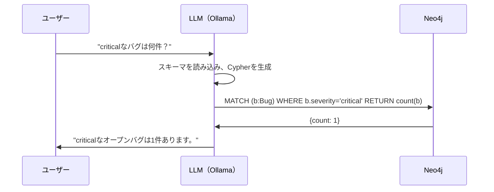

# Neo4jをセットアップしてGraphRAGを動かす


> "環境構築で詰まらない。Docker Composeで1コマンドから始める。"

## 問題

理論は理解した。LLMはハルシネーションを起こす、KGは構造化された事実を提供する、GraphRAGはその両者を組み合わせる。でも理論を知ることと、実際に動くシステムを作ることはまったく別の話だ。

多くのチュートリアルは「クラウドアカウントの作成」「APIキーの取得」「有料サービスの契約」から始まる。この壁が、最初のCypherクエリを書く前に多くの人を止めてしまう。

**ローカルで完結する**、再現性のある環境が必要だ。何も登録せずに始められる環境が。

## 解決策

コンテナ2つ、コマンド1つ。

```bash
docker compose up -d
```

このコマンド1つで起動するもの：
- **Neo4j** — ナレッジグラフを保存するグラフデータベース
- **Ollama** — ローカルLLMランタイム（llama3.2がAPIキーなしで動く）

すべてが手元のマシンで完結する。クラウド不要。コスト不要。ベンダーロックインなし。

## 仕組み

### ステップ1：docker-compose.yml

プロジェクトディレクトリにこのファイルを作成する。

```yaml
# docker-compose.yml
version: "3.9"
services:
  neo4j:
    image: neo4j:5.13-community
    container_name: kg-neo4j
    ports:
      - "7474:7474"
      - "7687:7687"
    environment:
      - NEO4J_AUTH=neo4j/${NEO4J_PASSWORD:?NEO4J_PASSWORDを.envで設定してください}
    volumes:
      - neo4j_data:/data
    healthcheck:
      test: ["CMD", "wget", "-q", "--spider", "http://localhost:7474"]
      interval: 10s
      timeout: 5s
      retries: 5

  ollama:
    image: ollama/ollama:latest
    container_name: kg-ollama
    ports:
      - "11434:11434"
    volumes:
      - ollama_data:/root/.ollama

volumes:
  neo4j_data:
  ollama_data:
```

`.env` ファイルを作成する（Gitにコミットしないこと）：
```bash
NEO4J_PASSWORD=your-strong-password-here
```

### ステップ2：コンテナ起動とモデルのダウンロード

```bash
# コンテナ起動
docker compose up -d

# LLMモデルのダウンロード（初回のみ、約2GB）
docker exec kg-ollama ollama pull llama3.2
docker exec kg-ollama ollama pull nomic-embed-text

# Ollamaの動作確認
curl http://localhost:11434/api/generate \
  -d '{"model":"llama3.2","prompt":"Hello","stream":false}'
```

ブラウザで `http://localhost:7474` を開くとNeo4j Browserにアクセスできる。

### ステップ3：最初のCypherクエリ

CypherはNeo4jのクエリ言語。SQLを知っていれば概念はそのまま使える。

```cypher
-- ノードの作成
CREATE (e:Engineer {id: "ENG-001", name: "山田太郎", team: "Backend"})
CREATE (b:Bug {id: "BUG-001", title: "ログイン画面がフリーズ", severity: "critical", status: "open"})

-- 関係の作成
MATCH (b:Bug {id: "BUG-001"}), (e:Engineer {id: "ENG-001"})
CREATE (b)-[:ASSIGNED_TO]->(e)

-- クエリ：criticalなオープンバグを担当しているエンジニアは？
MATCH (b:Bug)-[:ASSIGNED_TO]->(e:Engineer)
WHERE b.severity = "critical" AND b.status = "open"
RETURN b.title, e.name
```

Cypherの基本概念：
- `()` = ノード：`(n:ラベル {プロパティ: 値})`
- `[]` = リレーション：`[r:リレーション種別]`
- `->` = 方向
- `MATCH` ≈ SELECT、`CREATE` ≈ INSERT、`MERGE` ≈ UPSERT

### ステップ4：LLMをKGに接続する

```python
import os
from langchain_neo4j import GraphCypherQAChain, Neo4jGraph
from langchain_ollama import OllamaLLM

# Neo4jに接続（スキーマを自動取得してLLMのプロンプトに含める）
graph = Neo4jGraph(
    url=os.getenv("NEO4J_URI", "bolt://localhost:7687"),
    username="neo4j",
    password=os.getenv("NEO4J_PASSWORD")
)

# スキーマの確認（LLMへのコンテキストとして使われる）
print(graph.schema)
# Node properties: Engineer {id: STRING, name: STRING, team: STRING}
# Node properties: Bug {id: STRING, severity: STRING, status: STRING}
# Relationships: (:Bug)-[:ASSIGNED_TO]->(:Engineer)

llm = OllamaLLM(model="llama3.2", base_url="http://localhost:11434")

chain = GraphCypherQAChain.from_llm(
    llm=llm,
    graph=graph,
    verbose=True,
    # ⚠️ allow_dangerous_requests=True は LangChain ≥0.2 で必須。
    # 本番環境ではユーザー入力を必ず検証してからチェーンに渡すこと。
    allow_dangerous_requests=True,
)

result = chain.invoke({"query": "criticalなオープンバグは何件ありますか？"})
print(result["result"])
# → "criticalなオープンバグは1件あります。"
```



これがGraphRAGの最小形態。LLMが精確なクエリを生成し、グラフが正確な事実を返す。事実取得のステップでハルシネーションは起きない。

## このセッションで変わること

**Before：**
- KGの理論は分かるが、グラフDBを動かしたことがない
- 新しい技術のセットアップは数日がかりだと思っている
- Cypherを書いたことがない

**After：**
- Neo4j + Ollamaが10分以内にローカルで動く
- 基本的なCypherを書ける（CREATE、MATCH、MERGE、WHERE NOT）
- 自然言語 → Cypher → 回答のパイプラインが手元で動く

## 試してみる

チェックリストを順番に実行する：

```bash
# 1. Neo4j起動確認
curl -s http://localhost:7474 | grep -q "neo4j" && echo "✓ Neo4j起動中" || echo "✗ 起動していない"

# 2. Ollamaモデル確認
curl -s http://localhost:11434/api/tags | grep -q "llama3.2" && echo "✓ モデル準備完了" || echo "✗ 実行: docker exec kg-ollama ollama pull llama3.2"
```

Neo4j Browser（`http://localhost:7474`）でサンプルデータを作成：

```cypher
CREATE (e:Engineer {id: "ENG-001", name: "山田太郎", team: "Backend"})
CREATE (e2:Engineer {id: "ENG-002", name: "鈴木花子", team: "Frontend"})
CREATE (b:Bug {id: "BUG-001", title: "ログイン画面がフリーズ", severity: "critical", status: "open"})
CREATE (b2:Bug {id: "BUG-002", title: "検索結果が0件", severity: "high", status: "open"})
CREATE (b)-[:ASSIGNED_TO]->(e)
CREATE (b2)-[:ASSIGNED_TO]->(e2)
```

LLMチェーンに質問してみる：`"criticalなバグを担当しているのは誰ですか？"`

動作するコード全体：[shareAI-lab/learn-kg](https://github.com/shareAI-lab/learn-kg)

次のセッションでは、非構造化テキストからKGを自動構築する。手動のCSV入力は不要になる。
