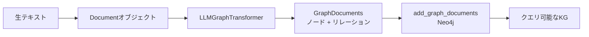

# LLMでKGを自動構築する


> "LLMGraphTransformerで非構造化テキストから自動抽出し、KG構築コストを劇的に下げる"

## 問題

会議の議事録、サポートチケット、ドキュメント、メール。これらの非構造化テキストをノードとリレーションに手動で変換するには、数週間かかる。実際のチームにそんな時間はない。

KGプロジェクトの多くはデータ投入フェーズで止まる。カスタムパーサーを書き続けるだけで本番稼働にたどり着けないのが典型的な失敗パターンだ。

テキストから自動でグラフを構築する方法が必要だ。許容できる品質で、最小限の手作業で。

## 解決策

LangChainの `LLMGraphTransformer` がこの問題を直接解決する。`Document` オブジェクトとしてテキストを渡すと、ノードとリレーションを含む `GraphDocument` オブジェクトが返ってくる。`add_graph_documents()` を1回呼ぶだけでNeo4jに書き込まれる。

重要な点は、**KG構築コストが劇的に下がる**ことだ。手動なら数週間かかるグラフが、既存ドキュメントから数時間で立ち上がる。ローカルの3Bモデルでプロトタイプを作り、品質が必要になったらクラウドモデルに切り替えればいい。

## 仕組み

### 抽出パイプライン



### ステップ1：依存関係のインストール

```bash
pip install langchain langchain-experimental langchain-neo4j langchain-ollama
```

### ステップ2：OllamaLLMではなくChatOllamaを使う

`LLMGraphTransformer` はチャットモデルインターフェースを必要とする。`OllamaLLM` では動かないか、壊れた出力が返ってくる。必ず `ChatOllama` を使うこと。

```python
from langchain_ollama import ChatOllama
from langchain_experimental.graph_transformers import LLMGraphTransformer
from langchain_neo4j import Neo4jGraph
from langchain_core.documents import Document
import os

# 重要：OllamaLLMではなくChatOllama
llm = ChatOllama(model="llama3.2", base_url="http://localhost:11434")

graph = Neo4jGraph(
    url=os.getenv("NEO4J_URI", "bolt://localhost:7687"),
    username="neo4j",
    password=os.getenv("NEO4J_PASSWORD")
)
```

### ステップ3：allowed_typesでスキーマを固定する

制約なしで実行すると、LLMは毎回任意のノード型とリレーション型を発明する。`allowed_nodes` と `allowed_relationships` でスキーマを固定する。

```python
transformer = LLMGraphTransformer(
    llm=llm,
    allowed_nodes=["Engineer", "Bug", "Team", "Feature"],
    allowed_relationships=["ASSIGNED_TO", "BELONGS_TO", "DEPENDS_ON", "REPORTED_BY"],
)
```

### ステップ4：抽出してNeo4jに書き込む

```python
text = """
山田太郎はPlatformチームのバックエンドエンジニアです。
彼はBUG-042というcriticalなログイン問題を担当しています。
このバグは顧客のAcme Corpから報告されました。
ログイン機能はAuthサービスに依存しています。
"""

documents = [Document(page_content=text)]
graph_docs = transformer.convert_to_graph_documents(documents)

# 書き込む前に中身を確認する
for doc in graph_docs:
    print("ノード:", doc.nodes)
    print("リレーション:", doc.relationships)

# Neo4jに書き込む
graph.add_graph_documents(graph_docs, baseEntityLabel=True, include_source=True)
```

出力例：
```
ノード: [Node(id='山田太郎', type='Engineer'), Node(id='Platform', type='Team'),
         Node(id='BUG-042', type='Bug'), Node(id='Auth', type='Feature')]
リレーション: [Rel(source='山田太郎', type='BELONGS_TO', target='Platform'),
               Rel(source='BUG-042', type='ASSIGNED_TO', target='山田太郎')]
```

### ステップ5：フォルダからのバッチ処理

大量のドキュメントを扱う場合は、ファイルから読み込んで一括処理する：

```python
from pathlib import Path

def load_documents(folder: str) -> list[Document]:
    docs = []
    for path in Path(folder).glob("*.txt"):
        docs.append(Document(
            page_content=path.read_text(encoding="utf-8"),
            metadata={"source": path.name}
        ))
    return docs

docs = load_documents("./data/tickets")
graph_docs = transformer.convert_to_graph_documents(docs)
graph.add_graph_documents(graph_docs, baseEntityLabel=True, include_source=True)
print(f"{len(graph_docs)}件のドキュメントをグラフに投入しました")
```

### モデルの品質トレードオフ

ローカルモデルはプロトタイピングには使えるが、微妙なリレーションを見落としたり、エンティティを誤ってマージしたりすることがある。

| モデル | 抽出品質 | コスト | 速度 |
|---|---|---|---|
| llama3.2（3B）ローカル | 普通。微妙な関係を見落とす | 無料 | 速い |
| llama3.1（8B）ローカル | 良好。多くのケースで実用的 | 無料 | 中程度 |
| gpt-4o（クラウド） | 優秀。ニュアンスを捉える | API費用 | 速い |

LangChainならモデルの切り替えは1行の変更で済む。残りのパイプラインはそのまま：

```python
# ローカルからクラウドへの切り替え。他は何も変わらない
from langchain_openai import ChatOpenAI
llm = ChatOpenAI(model="gpt-4o")
```

### 結果の確認

書き込んだ後、正しく構築されたか確認する：

```cypher
-- エンティティ種別ごとの件数確認
MATCH (n) RETURN labels(n)[0] AS type, count(n) AS count ORDER BY count DESC

-- 特定エンティティのリレーション確認
MATCH (e:Engineer {id: "山田太郎"})-[r]->(n)
RETURN type(r), n.id, labels(n)[0]
```

## このセッションで変わること

**Before：**
- KGの構築には手動のデータ入力かカスタムETLパイプラインが必要だと思っている
- Neo4jが目的地だが、生テキストをそこに運ぶ方法を知らない
- グラフ構築は数週間のデータエンジニアリング作業だと思っている

**After：**
- Pythonコード10行で任意のテキストからノードとリレーションを抽出できる
- `allowed_nodes` と `allowed_relationships` でスキーマを固定する理由を理解している
- ローカルモデルとクラウドモデルの品質トレードオフと切り替え方法を知っている

## 試してみる

自分のテキストに対してこのスクリプトを実行してみよう：

```python
import os
from langchain_ollama import ChatOllama
from langchain_experimental.graph_transformers import LLMGraphTransformer
from langchain_neo4j import Neo4jGraph
from langchain_core.documents import Document

llm = ChatOllama(model="llama3.2", base_url="http://localhost:11434")
graph = Neo4jGraph(
    url="bolt://localhost:7687",
    username="neo4j",
    password=os.getenv("NEO4J_PASSWORD")
)

transformer = LLMGraphTransformer(
    llm=llm,
    allowed_nodes=["Person", "Project", "Team", "Issue"],
    allowed_relationships=["WORKS_ON", "BELONGS_TO", "REPORTED", "ASSIGNED_TO"],
)

# 自分のドメインのテキストに置き換えてください
sample = """
鈴木花子はDataチームのシニアエンジニアです。
彼女はAnalyticsプロジェクトのクエリが遅いという問題ISS-101を報告しました。
AnalyticsプロジェクトはPlatformチームが管理しています。
"""

docs = [Document(page_content=sample)]
graph_docs = transformer.convert_to_graph_documents(docs)
graph.add_graph_documents(graph_docs, baseEntityLabel=True, include_source=True)

print("グラフを構築しました。http://localhost:7474 で確認できます")
print("実行: MATCH (n) RETURN n LIMIT 50")
```

**チェックリスト：**
- [ ] エラーなしで抽出が実行できた
- [ ] Neo4j Browserでノードが表示された
- [ ] リレーションが正しく接続されている
- [ ] ノード型が `allowed_nodes` リストと一致している

次のセッションでは、スキーマ注入とFew-shot Cypherの例を追加して、Text-to-Cypherの生成精度を本番品質に引き上げる。
