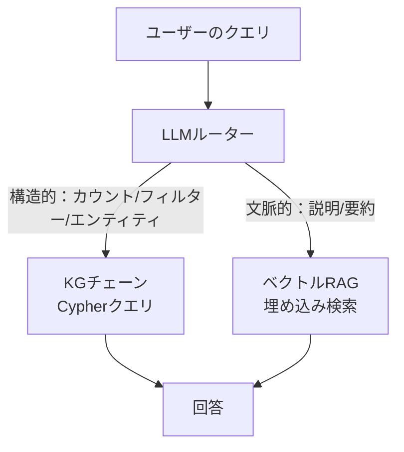
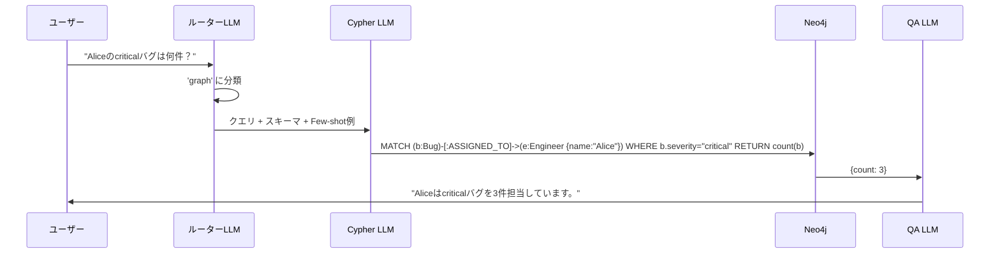

# s06: GraphRAGパイプラインを本番品質に仕上げる

`[ s06 ] ← s05 LLMでKGを自動構築する | s07 転換点：KGはGraphRAGだけではない →`

> "スキーマ情報とFew-shot例の注入でText-to-Cypherの生成精度を改善できる"

## 問題

s04のGraphRAGパイプラインは「動く」。ただし、単純な質問に対してのみ。本番環境でのユーザーの質問はそうじゃない。「先週の未解決チケットで、バックエンドチームに割り当てられているものを見せて」という質問に対し、LLMが存在しないプロパティ名でCypherを生成したり、リレーション型を発明したり、構文エラーを出したりする。

プロトタイプと本番の精度ギャップは現実のものだ。60%の質問に正確に答えられるパイプラインはビジネスでは使えない。Text-to-Cypherの生成精度を体系的に改善する方法が必要だ。

## 解決策

精度問題の大半は3つのテクニックで解決できる：

1. **スキーマ注入** — グラフ内の正確なノードラベル、プロパティ名、リレーション型をLLMに自動で伝える
2. **Few-shot Cypherの例** — 質問とCypherのペアを3〜5件見せてパターンを学習させる
3. **ハイブリッド検索ルーティング** — 構造的なクエリはKGへ、文脈的なクエリはベクトルRAGへ振り分ける

この3つを順番に適用すると、典型的なビジネスクエリでのText-to-Cypher精度が約60%から85%以上に向上する。

## 仕組み

### テクニック1：スキーマ注入

`Neo4jGraph` はライブスキーマを自動で読み取る。これをプロンプトに直接渡す：

```python
from langchain_neo4j import Neo4jGraph, GraphCypherQAChain
from langchain_ollama import ChatOllama
import os

graph = Neo4jGraph(
    url=os.getenv("NEO4J_URI", "bolt://localhost:7687"),
    username="neo4j",
    password=os.getenv("NEO4J_PASSWORD")
)

# Neo4jから自動取得したスキーマ
print(graph.schema)
# Node properties:
#   Engineer {id: STRING, name: STRING, team: STRING, sla_tier: STRING}
#   Bug {id: STRING, title: STRING, severity: STRING, status: STRING}
# Relationships:
#   (:Bug)-[:ASSIGNED_TO]->(:Engineer)
#   (:Engineer)-[:BELONGS_TO]->(:Team)
```

`GraphCypherQAChain` はこのスキーマをCypher生成プロンプトに自動で注入する。追加の作業は不要で、`graph=graph` を渡すだけでいい。

### テクニック2：Few-shot Cypherの例

よく使うクエリパターンをカバーする質問とCypherのペアセットを作る。これをチェーンプロンプトのコンテキストとして渡す：

```python
from langchain_core.prompts import FewShotPromptTemplate, PromptTemplate

examples = [
    {
        "question": "criticalなオープンバグは何件ありますか？",
        "cypher": "MATCH (b:Bug) WHERE b.severity = 'critical' AND b.status = 'open' RETURN count(b) AS count"
    },
    {
        "question": "優先度の高いバグを担当しているエンジニアは誰ですか？",
        "cypher": "MATCH (b:Bug)-[:ASSIGNED_TO]->(e:Engineer) WHERE b.severity IN ['critical', 'high'] RETURN e.name, b.title"
    },
    {
        "question": "未割り当てのバグをすべて表示してください",
        "cypher": "MATCH (b:Bug) WHERE NOT (b)-[:ASSIGNED_TO]->(:Engineer) RETURN b.id, b.title, b.severity"
    },
]

example_template = PromptTemplate(
    input_variables=["question", "cypher"],
    template="質問: {question}\nCypher: {cypher}"
)

cypher_prompt = FewShotPromptTemplate(
    examples=examples,
    example_prompt=example_template,
    prefix="Neo4j用のCypherクエリを生成してください。スキーマ: {schema}\n\n例:",
    suffix="\n質問: {question}\nCypher:",
    input_variables=["schema", "question"]
)
```

### テクニック3：専用Cypher LLMを使うGraphCypherQAChain

Cypher生成には専用の強力なモデルを使う。メインモデルが小さいローカルモデルの場合、これが特に効く：

```python
from langchain_neo4j import GraphCypherQAChain
from langchain_ollama import ChatOllama

# Cypher生成には大きめのモデル
cypher_llm = ChatOllama(model="llama3.1", base_url="http://localhost:11434")
# 最終的な回答生成には小さいモデルでも十分
qa_llm = ChatOllama(model="llama3.2", base_url="http://localhost:11434")

chain = GraphCypherQAChain.from_llm(
    llm=qa_llm,
    cypher_llm=cypher_llm,
    graph=graph,
    cypher_prompt=cypher_prompt,
    verbose=True,
    allow_dangerous_requests=True,
    validate_cypher=True,      # 実行前に構文チェック
    return_intermediate_steps=True,
)

result = chain.invoke({"query": "criticalなバグを最も多く担当しているエンジニアは誰ですか？"})
print(result["result"])
# デバッグ用に生成されたCypherを確認
print(result["intermediate_steps"][0]["query"])
```

### テクニック4：ハイブリッドルーティング

すべての質問がグラフを必要とするわけじゃない。「バグトリアージの一般的なアプローチを教えて」はドキュメントからのベクトル検索で答えるべき文脈的な質問だ。「Aliceのcriticalバグは何件ある？」は構造的な質問でCypherが適している。

```python
from langchain_ollama import ChatOllama

router_llm = ChatOllama(model="llama3.2", base_url="http://localhost:11434")

ROUTING_PROMPT = """このクエリを 'graph' または 'vector' に分類してください。
'graph': カウント、フィルタリング、特定エンティティ、リレーション、否定
'vector': 一般的な説明、要約、「〜のやり方」、ドキュメント検索

クエリ: {query}
1単語だけで答えてください: graph または vector"""

def route_query(query: str) -> str:
    response = router_llm.invoke(ROUTING_PROMPT.format(query=query))
    classification = response.content.strip().lower()
    return "graph" if "graph" in classification else "vector"

def hybrid_qa(query: str, graph_chain, vector_chain) -> str:
    route = route_query(query)
    if route == "graph":
        return graph_chain.invoke({"query": query})["result"]
    else:
        return vector_chain.invoke(query)
```



### フルパイプラインの流れ



## このセッションで変わること

**Before：**
- GraphRAGパイプラインは単純なクエリは動くが、実際のユーザーの質問には失敗する
- LLMが間違ったCypherを生成する理由がわからない
- すべてのクエリを同じ方法で処理している

**After：**
- スキーマを自動注入してプロパティ名のハルシネーションを排除できる
- Cypher生成のガイドとなるFew-shot例ライブラリを構築できる
- クエリの種類に応じてKGとベクトルRAGにルーティングできる
- `validate_cypher=True` で壊れたクエリがDBに到達する前に防げる

## 試してみる

s04のチェーンにFew-shot例を追加して精度の違いを測定する：

```python
# ベースライン：Few-shotなし（s04から）
baseline_chain = GraphCypherQAChain.from_llm(
    llm=cypher_llm, graph=graph, allow_dangerous_requests=True
)

# 改善版：スキーマ + Few-shot
improved_chain = GraphCypherQAChain.from_llm(
    llm=cypher_llm,
    cypher_llm=cypher_llm,
    graph=graph,
    cypher_prompt=cypher_prompt,
    validate_cypher=True,
    allow_dangerous_requests=True,
)

test_queries = [
    "まだ割り当てられていないcriticalバグをすべて表示してください",
    "オープンなバグが最も多いチームはどこですか？",
    "バックエンドチームのエンジニアは何人いますか？",
]

for q in test_queries:
    print(f"\nクエリ: {q}")
    try:
        r = improved_chain.invoke({"query": q})
        print(f"回答: {r['result']}")
        print(f"Cypher: {r['intermediate_steps'][0]['query']}")
    except Exception as e:
        print(f"エラー: {e}")
```

Few-shot例を追加する前後で、有効なCypherが生成されたクエリの数を記録しよう。1回目の実行で精度が上がるのが体感できるはずだ。

次のセッションでは、RAGの根本的な限界を露わにする唯一のクエリタイプに遭遇し、KGが唯一の解決策になる理由を理解する。
