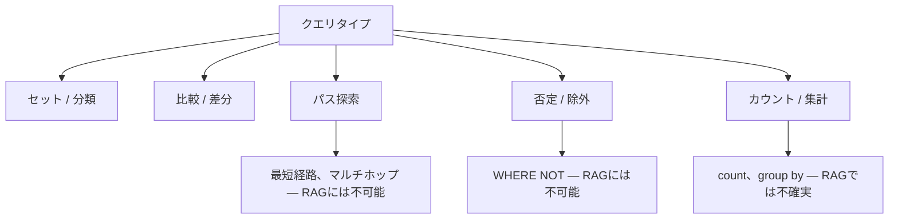
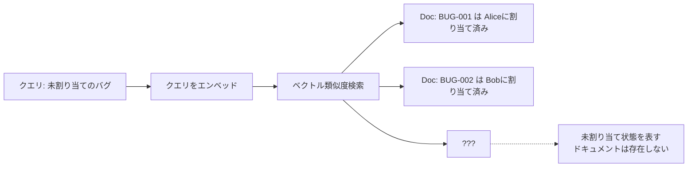
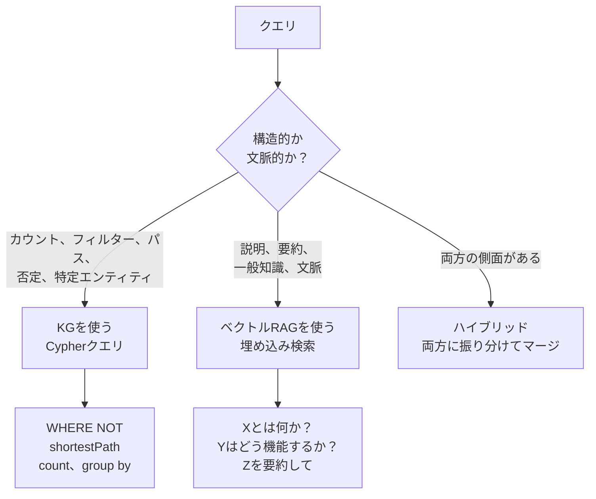

# 転換点：KGはGraphRAGだけではない


> "否定クエリはRAGに原理的に不可能。KGのWHERE NOTで構造的に解決できる"

## 問題

パイプラインが動いている。今ここで一歩引いて、KGが本当に何者なのか、そしてこれまで使ってきた検索アプローチをどこで構造的に上回るのかを理解しよう。

s05ではテキストから自動的にグラフを抽出した。s06ではスキーマ注入とFew-shotでText-to-Cypherの精度を上げた。どちらのセッションもKGをRAGのアップグレードとして位置づけていた。その見方は有用だが、KGの本当の力を過小評価している。

これまでGraphRAGを構築してきた。KGを使って検索をより精確にするアプローチだ。それは有用だ。でも、KGをRAGのアップグレード版として捉えているなら、それは視点が狭い。

違いを具体化するクエリタイプがある。否定クエリだ。「まだ割り当てられていないバグを見せて」「アップグレードしていない顧客を探して」「criticalなバグがないエンジニアを一覧にして」。

これらの質問はCypherでは当たり前に書ける。RAGでは**構造的に不可能**だ。

RAGは自分のクエリに類似したドキュメントを探す仕組みだ。一致するものを見つけることはできる。存在しないもの、つまり「不在」によってものを探すことはできない。不在はエンベッドして検索できるテキストを持たないからだ。

## 解決策

否定だけがKGがRAGに勝る唯一のケースではない。KGが構造的に優れている5つのクエリタイプがある。これらを理解すると、テクノロジーに対する考え方が変わる。

核心にある洞察：**RAGは類似度で検索する。KGは構造を辿る。** これらは異なる操作だ。特定のクエリ形状に対しては、どちらか一方しか機能しない。

## 仕組み

### KGネイティブな5つのクエリタイプ



**1. セット / 分類**
「criticalバグを持つバックエンドチームのエンジニアを全員見せて」

```cypher
MATCH (e:Engineer)-[:BELONGS_TO]->(:Team {name: "Backend"})
MATCH (b:Bug)-[:ASSIGNED_TO]->(e)
WHERE b.severity = "critical"
RETURN e.name, collect(b.title)
```

RAGはテキストの段落を返す。Cypherは構造化されたテーブルを返す。業務利用では圧倒的にテーブルが有用だ。

**2. 比較 / 差分**
「Q1とQ2のバグを深刻度別に比較して」

```cypher
MATCH (b:Bug)
RETURN b.quarter, b.severity, count(b) AS total
ORDER BY b.quarter, b.severity
```

RAGは期間をまたいで集計することを確実にはできない。KGは正確な件数を返す。

**3. パス探索**
「Aliceと部長の間の最短のエスカレーションルートを見つけて」

```cypher
MATCH path = shortestPath(
    (a:Engineer {name: "Alice"})-[:REPORTS_TO*]->(m:Manager {title: "部長"})
)
RETURN [n IN nodes(path) | n.name]
```

RAGにはグラフの距離という概念がない。RAGでのマルチホップ推論はコストが高く信頼性も低い。

**4. 否定 / 除外 — 転換点**

これが決定的なケースだ。「どのエンジニアにも割り当てられていないバグを見せて」

```cypher
MATCH (b:Bug)
WHERE NOT (b)-[:ASSIGNED_TO]->(:Engineer)
RETURN b.id, b.title, b.severity
ORDER BY b.severity
```

RAGにはこれは答えられない。割り当てられていないバグのドキュメントには「このバグにはエンジニアがいない」とは書かれていない。リレーションの不在は埋め込み検索には見えない。「プロパティを持たないこと」のベクトル表現は存在しない。

**5. カウント / 集計**
「チームごとのオープンバグ件数は？」

```cypher
MATCH (b:Bug)-[:ASSIGNED_TO]->(e:Engineer)-[:BELONGS_TO]->(t:Team)
WHERE b.status = "open"
RETURN t.name, count(b) AS open_bugs
ORDER BY open_bugs DESC
```

RAGはドキュメントの内容から数値を推測するかもしれない。KGは正確に数える。

### RAGが否定を扱えない理由 — 構造的な説明



RAGは存在するドキュメントを検索する。「割り当てがない」という概念は、検索するドキュメントを生まない。その情報は単純にベクトルインデックスに存在しない。

KGはリレーショングラフを保存している。`ASSIGNED_TO` エッジが存在しないことは、`WHERE NOT` で直接クエリできる構造的な事実だ。

### ルーティングの判断基準

これで全体像が見えた。どのクエリにどのツールを使うべきか。



**KGを使うべき場面：**
- 正確な値のカウント、フィルタリング、比較が必要なとき
- 特定エンティティ間のリレーションが関係するとき
- 不在や除外が関係するとき
- 再現可能な答えが必要なとき（同じクエリ、同じデータ、同じ答え）

**RAGを使うべき場面：**
- 理解や説明に関するクエリのとき
- 答えが非構造化の文章の中にあるとき
- ソース資料の正確な文言が重要なとき

**ハイブリッドを使うべき場面：**
- 「認証を担当しているのは誰で、そのサービスの一般的なセキュリティポリシーはどうなっている？」前半は構造的（KG）、後半は文脈的（RAG）

### 具体的なハイブリッド実装

```python
ROUTING_PROMPT = """
クエリを 'graph'、'vector'、'hybrid' のいずれかに分類してください。

graph: カウント、否定（ない/なし/未割り当て/不足）、エンティティ間のパス、
       正確な値でのフィルタリング、カウントやリストの比較
vector: 説明、要約、「Xはどのように機能するか」、ドキュメント検索
hybrid: 正確なエンティティデータと文脈的な説明の両方が必要

クエリ: {query}
1単語だけで答えてください: graph、vector、または hybrid
"""

def route_and_answer(query: str, graph_chain, vector_chain, llm) -> str:
    route = llm.invoke(ROUTING_PROMPT.format(query=query)).content.strip().lower()

    if route == "graph":
        return graph_chain.invoke({"query": query})["result"]
    elif route == "vector":
        return vector_chain.invoke(query)
    else:  # hybrid
        graph_answer = graph_chain.invoke({"query": query})["result"]
        vector_answer = vector_chain.invoke(query)
        return f"構造データ: {graph_answer}\n\nコンテキスト: {vector_answer}"
```

## このセッションで変わること

**Before：**
- KGはRAG検索を改善するためのものだと思っている
- ドキュメントを増やせばRAGはどんな質問にも答えられると思っている
- 否定クエリは回避できるエッジケースだと思っている

**After：**
- KGが構造的にRAGを凌駕する5つのクエリタイプを挙げられる
- なぜ否定がRAGに原理的に不可能か説明できる（不在を表すドキュメントは存在しない）
- クエリの形状に応じてKG / RAG / ハイブリッドにルーティングできる
- `WHERE NOT` が自分のツールボックスに加わった

## 試してみる

s04/s05のNeo4jインスタンスに対してこれらのクエリを実行し、RAGが何を返すかと比べてみよう：

```cypher
// 否定：まだ割り当てられていないバグ（RAGには答えられない — 不在はエンベッドできない）
MATCH (b:Bug)
WHERE NOT (b)-[:ASSIGNED_TO]->(:Engineer)
RETURN b.id, b.title, b.severity

// 集計：チームごとのバグ件数
MATCH (b:Bug)-[:ASSIGNED_TO]->(e:Engineer)-[:BELONGS_TO]->(t:Team)
RETURN t.name, count(b) AS total,
       sum(CASE WHEN b.severity = "critical" THEN 1 ELSE 0 END) AS critical_count

// パス探索：2人のエンジニア間の接続
MATCH path = shortestPath(
    (a:Engineer {name: "Alice"})-[*]-(b:Engineer {name: "Bob"})
)
RETURN [n IN nodes(path) | n.name] AS path_names, length(path) AS hops
```

各クエリについて「これをベクトル検索で答えることはできるか？」を自問してみよう。否定クエリだけは、答えが明確に「ノー」だ。

次のセッションでは、各業界の企業がKGをどう本番規模で展開してきたか、そして実際に何が必要だったかを見ていく。
