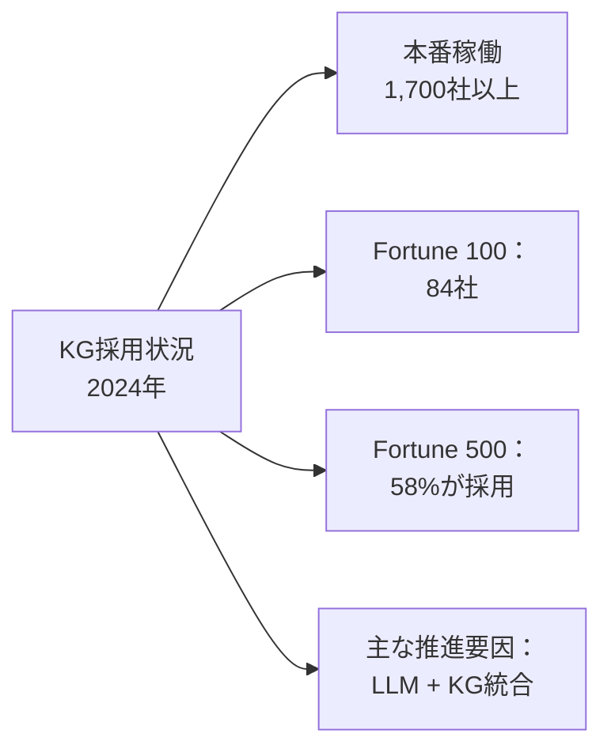
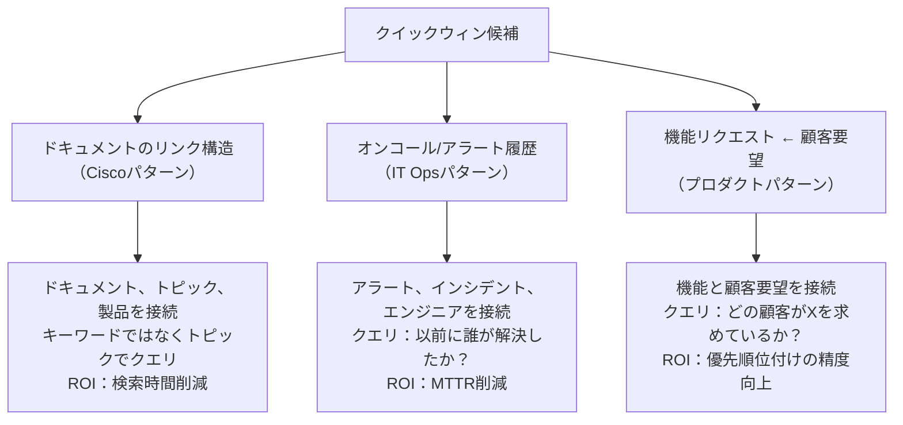

# s08: 世界のKG活用事例に学ぶ

`[ s08 ] ← s07 転換点：KGはGraphRAGだけではない | s09 エンタープライズKGアーキテクチャ設計 →`

> "業界別の実績データと事例パターンを参照し、自社プロジェクトへのKG導入を判断できる"

## 問題

KGが技術的に何をできるかは理解した。でもこれを意思決定者に持ち込むと、最初の質問は「他にどこがやっているの？本当に効果があるという証拠は？」だ。

KGに関するコンテンツの多くは学術的な理論かベンダーのマーケティングだ。必要なのは、具体的な採用データ、業界別のパターン、そして信頼できるビジネスケースを構築できる実績数値だ。

## 解決策

KGはニッチな研究技術じゃない。Neo4jの2024年業界データによれば、**1,700社以上**がKGを本番稼働させている。Fortune 100企業では**84社**がNeo4jを使用し、Fortune 500では**58%**が採用している。

LLMはKGを代替しなかった。むしろKGをより使いやすくした。自然言語からCypherへの変換がエキスパートの壁を取り除いた。グラフの専門家がいなくても、グラフにクエリをかけられるようになった。

このセッションの実績データとパターンが、「他にどこがやっているのか」という質問に答える材料になる。

## 仕組み

### 採用状況の概要



LLMの普及がKG採用を大幅に加速させた。2022年以前はグラフのクエリにCypherの専門知識が必要だった。`GraphCypherQAChain` によって、技術者でないユーザーが平易な言葉で質問できるようになった。最大の採用障壁が取り除かれた。

### 金融：BNP Paribasの不正検知

**課題：** 不正ネットワークは複数の口座、取引、エンティティにまたがっている。トランザクション単位の視点では組織的な不正を見逃す。

**KGのアプローチ：** 口座、取引、デバイス、住所、人物を接続されたグラフとしてモデル化する。不正パターンはサブグラフ構造（リング、ファンアウト、共有デバイス）として浮かび上がる。

**実績：** 不正損失を**20%削減**。グラフ探索が、リレーショナルクエリでは見落とす接続を発見する。

**クエリパターン：**

```cypher
-- フラグが立てられた口座から2ホップ以内の口座を探す
MATCH (flagged:Account {status: "flagged"})-[*1..2]-(suspect:Account)
WHERE suspect.status <> "flagged"
RETURN suspect.id, suspect.owner, count(*) AS connection_count
ORDER BY connection_count DESC
```

これはパス探索クエリ。s07で紹介した5つのKGネイティブクエリタイプのひとつだ。

### ヘルスケア：BenchSciの創薬研究

**課題：** バイオメディカル文献には遺伝子、タンパク質、化合物の相互作用に関する数百万の論文がある。関連する組み合わせを見つけるには専門知識が必要だ。

**KGのアプローチ：** 文献からエンティティ（遺伝子、タンパク質、化合物、疾患）とリレーションを抽出する。研究者は公開されたエビデンスをまたいで候補薬剤標的をグラフで探索できる。

**実績：** 創薬の仮説生成が高速化。数週間の手動文献調査が数秒で完了する接続の発見が可能になった。

**クエリパターン：**

```cypher
-- 標的疾患に関連するタンパク質と相互作用する化合物を探す
MATCH (c:Compound)-[:INHIBITS]->(p:Protein)-[:ASSOCIATED_WITH]->(d:Disease {name: "Target"})
RETURN c.name, p.name, count(*) AS evidence_count
ORDER BY evidence_count DESC
LIMIT 20
```

### IT：Ciscoのドキュメント検索

**課題：** Ciscoの社内ドキュメントは数百万ページに及ぶ。エンジニアはどこかにある答えを探すために膨大な時間を費やしていた。

**KGのアプローチ：** ドキュメント、トピック、製品、リレーションのKGを構築する。自然言語クエリはフリーテキスト検索ではなくグラフに向けられる。

**実績：** 組織全体で年間**400万時間**のドキュメント検索時間を削減。これがKGの業務効率化ケースだ。

**パターン：** ドキュメントのリンク構造をグラフとして表現。`(Doc)-[:REFERENCES]->(Doc)`、`(Doc)-[:COVERS_TOPIC]->(Topic)`、`(Topic)-[:RELATED_TO]->(Topic)`。ユーザーはキーワードではなくトピックでクエリする。

### 製造：BASFのサプライチェーン

**課題：** サプライチェーンの混乱は連鎖するまで見えない。3層上流のサプライヤー障害が数週間後に生産問題を引き起こす。

**KGのアプローチ：** サプライヤー、部品、工場、依存関係を接続されたグラフとしてモデル化する。ノードが障害を受けると、影響分析をグラフ上で伝播させる。

**実績：** 生産影響が発生する前に、上流の混乱を予防的に把握できるようになった。

**クエリパターン：**

```cypher
-- サプライヤーXが停止した場合に影響を受ける製品を全て探す
MATCH (s:Supplier {id: "SUP-001"})-[:PROVIDES]->(c:Component)-[:USED_IN*1..3]->(p:Product)
RETURN DISTINCT p.name, p.production_line
```

マルチホップのパス探索。これもKGネイティブなクエリタイプだ。

### 日本企業の事例

**富士通 — 因果KG：** システム障害分析のため原因と結果のリレーションをKGとして構築する。インシデントが発生すると、グラフが症状ではなく原因を辿る。根本原因分析の時間が数時間から数分に短縮される。

**Stockmark — 特許KG：** 特許文書からエンティティを抽出する。技術領域、企業、発明者ネットワークをマップ化する。公開データから戦略的な技術インテリジェンスを得られる。

**NEC — データ統合：** 異種エンタープライズシステムを共有KGを通じて接続する。顧客データ、契約データ、サポート履歴が共通のエンティティIDを通じて繋がる。ある顧客に関するクエリが契約状況とサポート履歴を自動で引き込む。

### 3つのクイックウィン起点

これらの事例を踏まえると、3〜6ヶ月以内にROIを出しやすい起点が3つある：



**パターン1：ドキュメントのリンク構造**
既存のドキュメントをグラフとしてモデル化する。ドキュメントをトピックに、トピックを製品に、製品をチームに接続する。ユーザーが「機能Xはどう動くの？」と聞いたとき、キーワードマッチではなくトラバーサルベースの答えが得られる。

**パターン2：オンコールとアラート履歴**
システムが発するすべてのアラートはノードだ。アラートをサービスに、インシデントをエンジニアに、インシデントを解決策に接続する。「このタイプのアラートを最後に解決したのは誰か？」がSlack検索ではなくグラフクエリになる。

**パターン3：機能から顧客要望へ**
機能リクエストを顧客アカウントに、顧客アカウントをARR階層に接続する。「エンタープライズ顧客が最も求めている機能は？」がスプレッドシート分析ではなくトラバーサルクエリになる。

### ビジネスケースの構築

意思決定者が求める3つの数字：

1. **現在の問題コスト** — 週ごとの手動検索/分析に費やす時間 × エンジニア単価
2. **参照実績** — CiscoやBNP Paribasのデータをベンチマークとして使う
3. **実装見積もり** — Phase 1（ローカル概念実証）は2〜3人週。s11で構築する

```
ビジネスケーステンプレート：
- 課題：[X]人のエンジニアが週[Y]時間を[Z]に費やしている
- 年間コスト：[X × Y × 52 × 単価]
- KGアプローチ：[上記のどのパターンを使うか]
- 参照実績：[Ciscoが400万時間削減；BNPが不正20%削減]
- Phase 1コスト：2〜3人週
- 目標ROI：[時間の50%を取り戻した場合のコスト削減]
```

## このセッションで変わること

**Before：**
- KGを技術的に構築できるが、意思決定者に正当化できない
- KGが本番利用に成熟しているかどうかわからない
- どの業界パターンが自分のコンテキストに関連するかわからない

**After：**
- 具体的な採用数字を持っている（1,700社以上、Fortune 100の84社）
- 自社のユースケースを実績のある5つの業界パターンにマッピングできる
- 上記のテンプレートを使ってシンプルなビジネスケースを構築できる
- 早期ROIを出しやすい3つのクイックウィン起点を知っている

## 試してみる

自分の組織の状況を3つのクイックウィンパターンにマッピングしてみよう：

```
クイックウィン選択ワークシート：

パターン1（ドキュメント検索）：
- エンジニアが週2時間以上、社内ドキュメント検索に費やしているか？
- 社内ドキュメントが500件以上あるか？
→ はいなら：ここから始める

パターン2（オンコール/アラート履歴）：
- チームが繰り返し発生するインシデントに対応しているか？
- 誰が何を解決したかの履歴はあるが、Slackやチケットに散在しているか？
→ はいなら：ここから始める

パターン3（製品機能マッピング）：
- チームが顧客セグメント別に機能を優先付けする必要があるか？
- 顧客フィードバックがJira、Salesforce、メールなど複数のツールに散在しているか？
→ はいなら：ここから始める
```

1つのパターンを選ぶ。s11でそのPhase 1概念実証を構築する。

次のセッションでは、フォーマルレイヤー原則を中心とした本番グレードのアーキテクチャを設計する。LLM推論をどう封じ込め、決定論的処理を決定論的に保つか。
