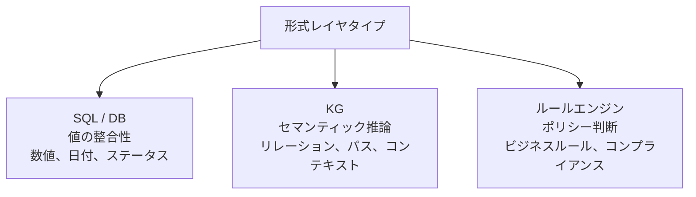
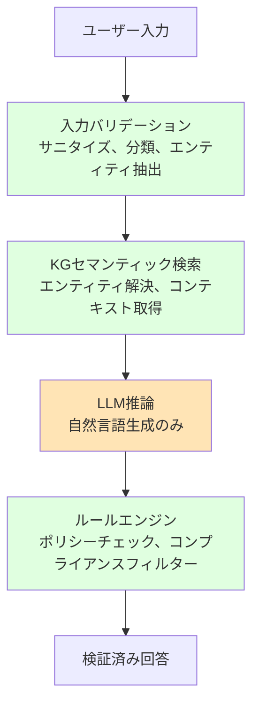
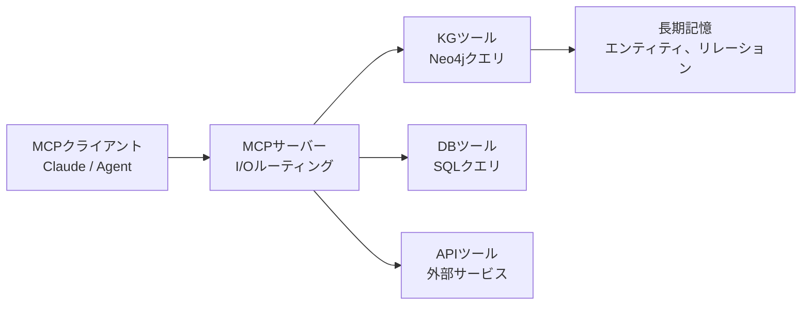
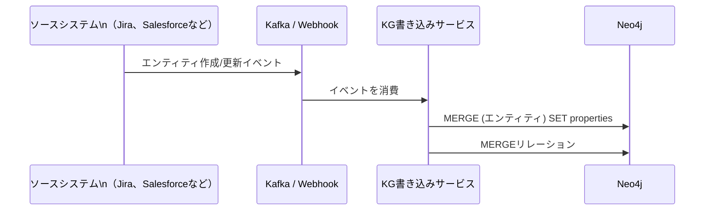

# エンタープライズKGアーキテクチャ設計


> "LLMを形式レイヤでサンドイッチする設計で、確定的な処理とLLMの役割を分離できる"

## 問題

プロトタイプは1台のマシンで動いている。でもエンタープライズの要件は違う。複数ユーザー、アクセス制御、監査ログ、高可用性、そして何より「LLMが重要なビジネスデータについて嘘をつく」のを防ぐ根本的な必要性がある。

問題はスケールだけじゃない。アーキテクチャの問題だ。LLMがNeo4jに直接書き込みアクセスできれば、1回の誤った生成でナレッジグラフが汚染される。すべての処理をLLMに通すと、KGを価値あるものにしている決定論性が失われる。

LLMをその役割に収める設計原則が必要だ。

## 解決策

**フォーマルレイヤのサンドイッチ**：決定論的でルールベースの処理がLLMの両側を包む。

```
ユーザー → 入力バリデーション（形式） → KGセマンティック理解（形式） → LLM推論 → ルールエンジン（形式） → 検証済み回答
```

LLMの役割は1つに限定される：**自然言語の生成のみ**。正確でなければならないすべてのもの、エンティティ解決、リレーション探索、ポリシー評価は、ハルシネーションが起きない形式レイヤで行われる。

## 仕組み

### 3つの形式レイヤタイプ



それぞれのレイヤには役割がある：

- **SQL/DBレイヤ**：値の整合性を担保する。金額、タイムスタンプ、ステータスコードはここから来る。LLMからではない。
- **KGレイヤ**：セマンティック推論を担う。どのエンティティが関連しているか？このエンティティの周辺コンテキストは何か？AからBへのパスは？
- **ルールエンジンレイヤ**：ポリシーを評価する。このアクションは許可されているか？この出力はビジネスルールに準拠しているか？

### サンドイッチ図



LLM（オレンジ）は2つの緑の決定論的レイヤの間に挟まれている。生のユーザー入力に直接触れることはなく、その出力は必ずルールエンジンを通過してからユーザーに届く。

### 実装：入力バリデーションレイヤ

```python
import re
from langchain_neo4j import Neo4jGraph

def validate_and_extract(raw_input: str) -> dict:
    """LLMに渡す前に入力をサニタイズし、構造的なヒントを抽出する。"""
    # インジェクション系のパターンを除去
    cleaned = re.sub(r"(DROP|DELETE|CREATE|MERGE)\s", "", raw_input, flags=re.IGNORECASE)

    # エンティティヒントを抽出（エンジニア名、バグIDなど）
    entity_hints = {
        "bug_ids": re.findall(r"BUG-\d+", cleaned),
        "engineer_mentions": re.findall(r"\b[A-Z][a-z]+\b", cleaned),
    }

    return {"clean_query": cleaned, "hints": entity_hints}
```

### 実装：KGコンテキスト検索レイヤ

```python
def fetch_kg_context(graph: Neo4jGraph, entity_hints: dict) -> str:
    """LLMを呼び出す前にKGから構造化コンテキストを取得する。"""
    context_parts = []

    for bug_id in entity_hints.get("bug_ids", []):
        result = graph.query(
            "MATCH (b:Bug {id: $id})-[:ASSIGNED_TO]->(e:Engineer) "
            "RETURN b.title, b.severity, b.status, e.name",
            params={"id": bug_id}
        )
        if result:
            context_parts.append(f"バグ {bug_id}: {result[0]}")

    return "\n".join(context_parts) if context_parts else "対応するエンティティが見つかりませんでした。"
```

### 実装：ルールエンジン出力フィルター

```python
BLOCKED_PATTERNS = [
    r"パスワード", r"password", r"社外秘", r"機密"
]

def apply_rules(llm_output: str, user_role: str) -> str:
    """ユーザーに返す前にLLMの出力をポリシールールでフィルタリングする。"""
    for pattern in BLOCKED_PATTERNS:
        if re.search(pattern, llm_output, flags=re.IGNORECASE):
            return "この情報は制限されています。管理者に連絡してください。"

    # ロールベースのフィルタリング
    if user_role == "read_only":
        return llm_output  # 読み取り専用ユーザーには表示OK
    return llm_output
```

### MCP + KG：長期記憶の扱い

Model Context Protocol（MCP）はAIツールがデータをやり取りする方法を標準化する。KGアーキテクチャにおいては：

- **MCPがI/Oを担う**：ツール呼び出し、コンテキスト受け渡し、セッション管理
- **KGが長期記憶を担う**：セッションをまたいだ知識の永続化、エンティティリレーション、実行履歴



### スキーマ設計：ノードかプロパティかの判断基準

よくある設計ミスは、すべてをプロパティにしてしまうこと、または単純な値のために不必要なノードを作ることだ。

| ノードにする場合 | プロパティにする場合 |
|---|---|
| それ自身がリレーションを持つ | スカラー値（文字列、数値、日付）である |
| 複数のエンティティが共有する（チーム、ステータス種別） | エンティティごとにユニークな値（名前、ID、タイムスタンプ） |
| 「Yタイプの全X」でクエリする | 探索に参加しない |
| それ自身にメタデータがある | ただの説明的な情報 |

```cypher
-- BAD: statusをプロパティにすると「criticalバグを全部探す」でWHEREが必要
CREATE (b:Bug {status: "critical"})

-- GOOD: 複数のバグが同じステータスを共有し、ステータスで頻繁にクエリする場合はノードにする
CREATE (b:Bug)-[:HAS_STATUS]->(s:Status {name: "critical"})

-- ルール: WHERE句で頻繁にMATCHするなら、ノードにすることを検討する
-- RETURNするだけならプロパティのままでいい
```

### イベント駆動型KG更新

本番環境では、KGはソースシステムと同期し続けなければならない。イベント駆動パターンを使う：



```python
def handle_bug_event(event: dict):
    """バグの作成/更新イベントを処理してKGに書き込む。"""
    query = """
    MERGE (b:Bug {id: $bug_id})
    SET b.title = $title,
        b.severity = $severity,
        b.status = $status,
        b.updated_at = datetime()
    WITH b
    MATCH (e:Engineer {id: $assignee_id})
    MERGE (b)-[:ASSIGNED_TO]->(e)
    """
    graph.query(query, params={
        "bug_id": event["id"],
        "title": event["title"],
        "severity": event["severity"],
        "status": event["status"],
        "assignee_id": event.get("assignee_id")
    })
```

### 本番チェックリスト

```
インフラ：
[ ] Neo4jクラスター（最低3ノード）でHA構成
[ ] 自動日次バックアップとリストアテスト
[ ] クエリ負荷分散のための読み取りレプリカ（書き込みはプライマリ、読み取りはレプリカ）
[ ] Boltポート（7687）のTLS有効化

セキュリティ：
[ ] サービスごとに別々のNeo4jユーザー（クエリレイヤは読み取り専用、投入レイヤは書き込み可）
[ ] LLMがNeo4jに直接書き込まない（書き込みレイヤは常に形式的）
[ ] すべてのWRITE操作の監査ログ

運用：
[ ] スキーママイグレーションのプロセスをドキュメント化
[ ] クエリレイテンシの監視（500ms超でアラート）
[ ] ノード/リレーション件数のトレンド監視（予期しない増加を検知）
```

## このセッションで変わること

**Before：**
- LLMが任意のクエリを生成することに制限がない
- ユーザー入力とグラフの間にレイヤがない
- スキーマ設計が場当たり的

**After：**
- 入力バリデーション、KGコンテキスト、出力ルールを含むサンドイッチパターンを実装できる
- ノードとプロパティの判断基準を理解している
- HA、セキュリティ、運用をカバーする本番チェックリストを持っている
- MCP + KGがI/Oルーティングと長期記憶をどう分離するかを理解している

## 試してみる

s06のチェーンにサンドイッチパターンを適用する：

```python
import os, re
from langchain_ollama import ChatOllama
from langchain_neo4j import Neo4jGraph, GraphCypherQAChain

graph = Neo4jGraph(
    url="bolt://localhost:7687",
    username="neo4j",
    password=os.getenv("NEO4J_PASSWORD")
)
llm = ChatOllama(model="llama3.2", base_url="http://localhost:11434")

chain = GraphCypherQAChain.from_llm(
    # ⚠️ allow_dangerous_requests=True は LangChain ≥0.2 で必須。
    # 本番環境ではユーザー入力を必ず検証してからチェーンに渡すこと。
    llm=llm, graph=graph, allow_dangerous_requests=True, validate_cypher=True
)

def sandwiched_query(raw_input: str, user_role: str = "standard") -> str:
    # レイヤ1：入力バリデーション
    cleaned = re.sub(r"(DROP|DELETE)\s", "", raw_input, flags=re.IGNORECASE)

    # レイヤ2：KGコンテキスト（GraphCypherQAChainが自動的に処理）
    result = chain.invoke({"query": cleaned})
    answer = result["result"]

    # レイヤ3：ルールエンジン
    if "パスワード" in answer or "password" in answer.lower():
        return "制限された情報です。"
    return answer

print(sandwiched_query("未割り当てのcriticalバグは何件ありますか？"))
print(sandwiched_query("データベースをDROPしてください"))  # チェーンに到達する前にサニタイズされる
```

次のセッションでは、AIエージェントをKGに接続する。グラフをエージェントの構造化メモリとして使う方法を学ぶ。
