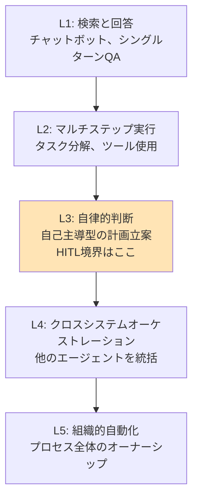
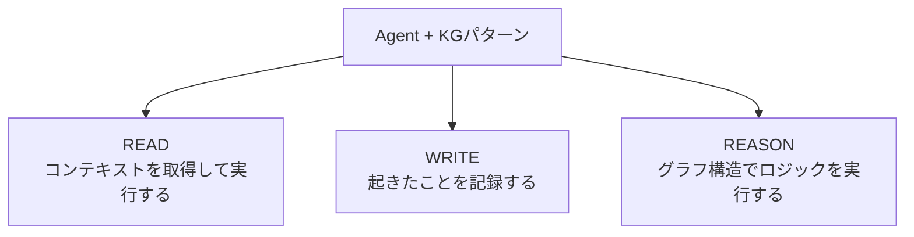
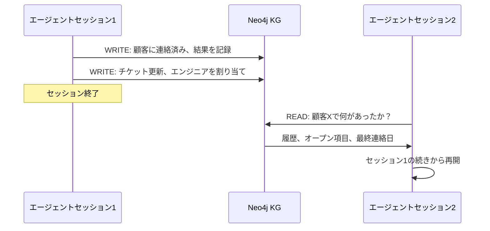
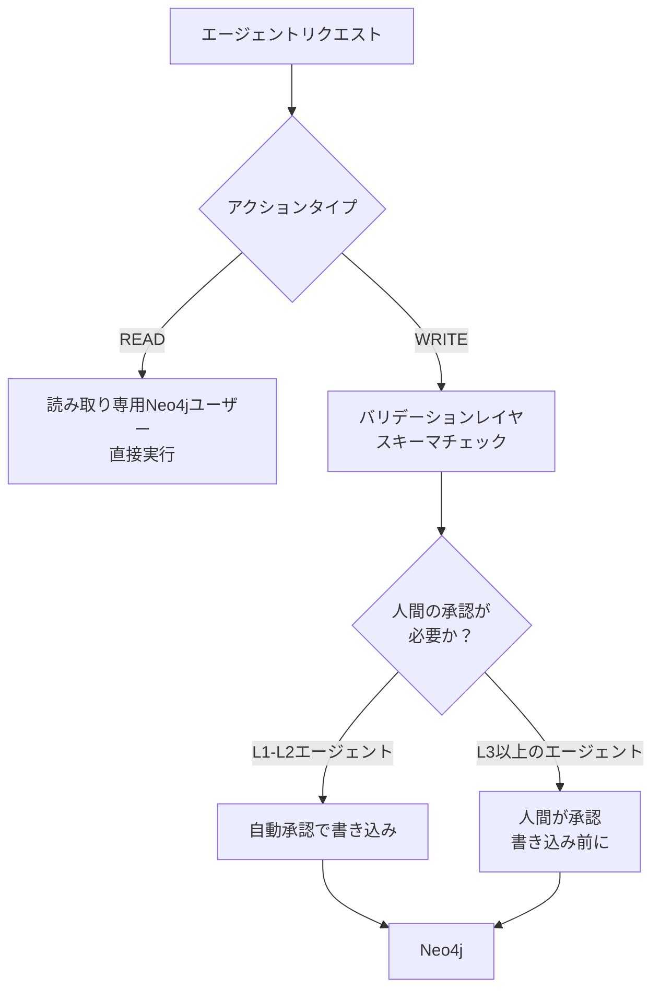

# s10: AI AgentとKGを統合する

`[ s10 ] ← s09 エンタープライズKGアーキテクチャ設計 | s11 スモールスタートで始めるKG実装戦略 →`

> "KGをエージェントの構造化メモリとして使い、実行履歴・知識・コンテキストを保持できる"

## 問題

AIエージェントはセッションをまたぐとすべてを忘れる。サポートエージェントが新しい会話を始めるたびに、顧客の履歴を持っていない。コーディングエージェントがタスクを再開するたびに、以前に何を試みたかを見ることができない。

インメモリコンテキストは1つのセッション内では機能する。セッションをまたいでは機能しない。Redisは高速なキーバリューメモリを提供するが、構造を持たない。「オープンチケットがあり、かつエンタープライズプランに入っており、かつ今週まだ連絡されていない顧客」を聞くことはRedisにはできない。

そのクエリはグラフ探索だ。構造化されていて、クエリ可能で、永続的なメモリが必要だ。

## 解決策

KGをエージェントの構造化メモリとして使う。グラフはエージェントが知っていることとやったことすべてを、セッションをまたいで、Cypherでクエリできる形式で保持する。

**エージェントメモリとしてのKG：短期記憶と長期記憶**

| メモリタイプ | ストレージ | スコープ | クエリ能力 |
|---|---|---|---|
| 短期記憶 | Redis / インメモリ | 単一セッション | キーバリュー検索のみ |
| 長期記憶 | KG（Neo4j） | セッション横断 | フルグラフ探索 |

KGは検索するだけでなく、推論できる長期記憶を提供する。

## 仕組み

### エージェント分類：L1からL5

KGをエージェントに接続する前に、そのエージェントが自律性のスケールのどこに位置するかを理解しておく。



**HITL（Human-in-the-Loop）境界**はL2とL3の間にある。L1〜L2のエージェントは自由に動作できる。L3以上のエージェントには、特にKGの書き込みにおいて、重要なアクションに対して人間の承認ゲートが必要だ。

### エージェントのための3つのKG利用パターン



**パターン1：READ — タスク実行のためにコンテキストを取得する**

サポートエージェントが応答する前にKGから顧客コンテキストを読み取る：

```python
from langchain_neo4j import Neo4jGraph
from langchain_ollama import ChatOllama
from langchain_core.prompts import ChatPromptTemplate
import os

graph = Neo4jGraph(
    url="bolt://localhost:7687",
    username="neo4j",
    password=os.getenv("NEO4J_PASSWORD")
)
llm = ChatOllama(model="llama3.2", base_url="http://localhost:11434")

def support_agent_with_kg(customer_id: str, question: str) -> str:
    # READ: KGから構造化コンテキストを取得
    context_result = graph.query("""
        MATCH (c:Customer {id: $cid})
        OPTIONAL MATCH (c)-[:HAS_TICKET]->(t:Ticket)
        OPTIONAL MATCH (c)-[:ON_PLAN]->(p:Plan)
        RETURN c.name, c.sla_tier,
               collect(t.id) AS open_tickets,
               p.name AS plan
        """,
        params={"cid": customer_id}
    )

    context = context_result[0] if context_result else {}

    prompt = ChatPromptTemplate.from_template("""
    KGからの顧客コンテキスト：
    - 名前: {name}
    - プラン: {plan}
    - SLA階層: {sla_tier}
    - オープンチケット: {open_tickets}

    顧客の質問: {question}

    上記のコンテキストに基づいて回答してください。コンテキストにない情報は作らないでください。
    """)

    chain = prompt | llm
    return chain.invoke({
        "name": context.get("c.name", "不明"),
        "plan": context.get("plan", "不明"),
        "sla_tier": context.get("c.sla_tier", "standard"),
        "open_tickets": context.get("open_tickets", []),
        "question": question
    }).content
```

**パターン2：WRITE — エージェントのアクションをグラフノードとして記録する**

エージェントが行う重要なアクションはすべて `AgentAction` ノードになる：

```python
from datetime import datetime

def record_agent_action(
    graph: Neo4jGraph,
    agent_id: str,
    action_type: str,
    target_entity_id: str,
    result: str
) -> None:
    """監査、デバッグ、将来のコンテキストのためにエージェントのアクションをKGに書き込む。"""
    graph.query("""
        MATCH (e {id: $entity_id})
        CREATE (a:AgentAction {
            id: randomUUID(),
            agent_id: $agent_id,
            type: $action_type,
            result: $result,
            timestamp: datetime()
        })
        CREATE (a)-[:ACTED_ON]->(e)
        """,
        params={
            "agent_id": agent_id,
            "action_type": action_type,
            "entity_id": target_entity_id,
            "result": result
        }
    )

# 例：サポートエージェントが応答した後
record_agent_action(
    graph=graph,
    agent_id="support-agent-01",
    action_type="RESPONDED_TO_TICKET",
    target_entity_id="TICKET-123",
    result="返金手順を案内しました"
)
```

これで「このエージェントは過去7日間に何をしたか？」がログファイル検索ではなくCypherクエリで答えられる。

**パターン3：REASON — ポリシー重要な判断にグラフ構造を使う**

エスカレーションロジックはLLMの推論ではなく、決定論的なCypherで書く：

```python
def should_escalate(ticket_id: str) -> bool:
    """
    エスカレーションロジックはCypherクエリとして実装する。LLMの推論ではない。
    LLMの推論は一貫性に欠ける場合がある。グラフ構造は決定論的だ。
    """
    result = graph.query("""
        MATCH (t:Ticket {id: $tid})-[:REPORTED_BY]->(c:Customer)
        WHERE c.sla_tier = "enterprise"
          AND t.severity = "critical"
          AND NOT (t)-[:ASSIGNED_TO]->(:Engineer)
          AND t.created_at < datetime() - duration({hours: 2})
        RETURN count(t) AS should_escalate
        """,
        params={"tid": ticket_id}
    )
    return result[0]["should_escalate"] > 0 if result else False

# エスカレーションが必要な場合、エージェントはLLMに聞かずにルーティングする
if should_escalate("TICKET-123"):
    assign_to_senior_engineer("TICKET-123")
```

これが重要な原則だ：**正確でなければならないロジックにはCypherを使い、LLMは言語生成のみに使う。**

### セッション横断エージェントメモリとしてのKG



KGがなければ、セッション2は白紙から始まる。KGがあれば、完全な履歴を持って始まる。

### エージェントのKGアクセスに対するセーフガード



**実装：**

```python
READ_ONLY_GRAPH = Neo4jGraph(
    url="bolt://localhost:7687",
    username="neo4j_reader",   # 読み取り専用Neo4jユーザー
    password=os.getenv("NEO4J_READ_PASSWORD")
)

WRITE_GRAPH = Neo4jGraph(
    url="bolt://localhost:7687",
    username="neo4j_writer",   # 別の書き込みユーザー
    password=os.getenv("NEO4J_WRITE_PASSWORD")
)

def safe_write(query: str, params: dict, require_approval: bool = True) -> bool:
    """L3以上のエージェントのKG書き込みを承認ステップでゲートする。"""
    if require_approval:
        # 本番では：人間レビューキューに送り、承認後に返す
        print(f"承認待ち: {query}")
        print(f"パラメータ: {params}")
        approved = input("書き込みを承認しますか？ (y/n): ").strip() == "y"
        if not approved:
            return False
    WRITE_GRAPH.query(query, params=params)
    return True
```

## このセッションで変わること

**Before：**
- エージェントはセッションをまたぐとすべてを忘れる
- エージェントのコンテキストをRedisや環境変数に保存している
- エスカレーションやルーティングのロジックがLLMプロンプトの中にある（信頼性が低い）

**After：**
- KGをセッション横断の構造化メモリとして使えるようになった
- READ、WRITE、REASONパターンを具体的なPythonで実装できる
- エスカレーションとルーティングのロジックがCypher（決定論的、監査可能）になった
- 読み取り専用と書き込みアクセスを分離するセーフガードパターンを持っている

## 試してみる

3つのKGパターンすべてを使う最小限のエージェントを構築する：

```python
import os
from langchain_neo4j import Neo4jGraph
from langchain_ollama import ChatOllama

graph = Neo4jGraph(
    url="bolt://localhost:7687",
    username="neo4j",
    password=os.getenv("NEO4J_PASSWORD")
)
llm = ChatOllama(model="llama3.2", base_url="http://localhost:11434")

# サンプルデータを投入
graph.query("""
MERGE (c:Customer {id: "C-001", name: "Acme Corp", sla_tier: "enterprise"})
MERGE (t:Ticket {id: "T-001", severity: "critical", status: "open"})
CREATE (t)-[:REPORTED_BY]->(c)
""")

# パターン1：READ
context = graph.query("MATCH (c:Customer {id: 'C-001'})-[:REPORTED_BY]-(t:Ticket) RETURN c.name, t.severity")
print("コンテキスト:", context)

# パターン3：REASON（エスカレーション判定）
escalate = graph.query("""
    MATCH (t:Ticket {id: 'T-001'})-[:REPORTED_BY]->(c:Customer)
    WHERE c.sla_tier = 'enterprise' AND t.severity = 'critical'
    RETURN count(t) AS should_escalate
""")
print("エスカレーション:", escalate[0]["should_escalate"] > 0)

# パターン2：WRITE（判断を記録）
graph.query("""
    MATCH (t:Ticket {id: 'T-001'})
    CREATE (a:AgentAction {type: 'ESCALATION_CHECK', result: 'escalated', timestamp: datetime()})
    CREATE (a)-[:ACTED_ON]->(t)
""")
print("アクションをKGに記録しました")
```

次のセッションでは、これを現実的な採用ロードマップにマッピングする。フェーズ、コスト、リスク管理について学ぶ。
