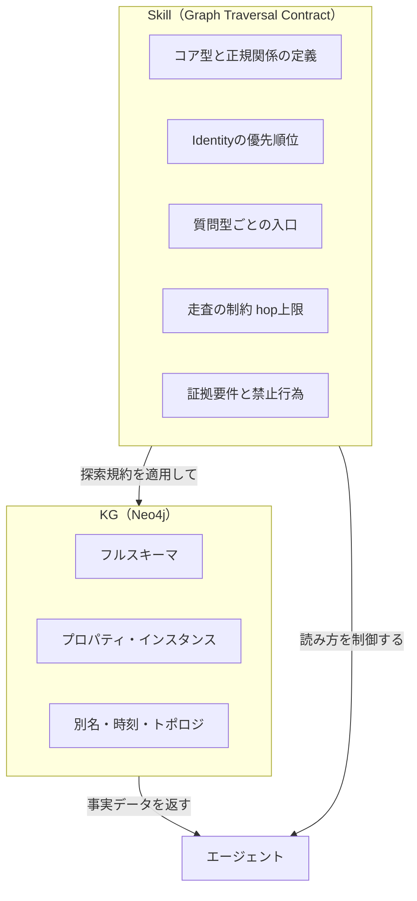
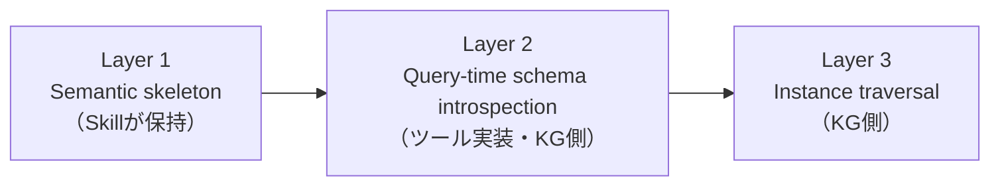

# KGをエージェントに読ませる規約

> "エージェントがKGを幻覚なく正確に読むためには、探索規約（Traversal Contract）を Skill に明示することで再現性を確保できる"

## このセッションで学ぶこと

s10ではKGをエージェントの構造化メモリとして使うパターンを学んだ。エージェントはKGを読み（READ）、書き（WRITE）、推論（REASON）できる。しかし実際に動かしてみると、ある問題に気づく。同じ質問をしても、クエリの生成結果が毎回微妙に変わる。関係の向きを間違える。探索が意図しないところまで広がる。根拠のない回答が混じる。

原因はKGそのものではなく、エージェントに「グラフをどう読むか」が伝わっていないことだ。この問題を解決するのが **Graph Traversal Contract（グラフ探索規約）** だ。Skillに探索の規約を明示することで、エージェントのKG読み取りを再現可能にする。

## なぜエージェントはKGを正確に読めないのか

接続はできていても、エージェント側に探索仕様がなければ、Cypherの生成は安定しない。代表的な問題パターンは次の通りだ。

| 問題 | 起きること |
|------|----------|
| 関係の向きの揺れ | `OWNS` や `DEPENDS_ON` の向きを推測し、生成クエリが実行ごとに変わる |
| エンティティ解決の揺れ | `alias` / `display_name` / `slug` など複数候補から、探索の開始点がブレる |
| 深さの暴走 | hop 無制限・無関係な拡張・意図しない結合が起きる |
| 証拠なし回答 | 走査が空振りしてもLLMが穴埋めし、決定的な正答が成立しない |
| スキーマドリフト | ラベルや関係が増えるほど、解釈が追従できなくなる |

KGは事実の置き場（truth source）であり、「どう辿るか」の仕様は別レイヤに置く必要がある。

## Graph Traversal Contract とは

Graph Traversal Contract は、エージェントがKGを読む際の探索規約をSkillに宣言したものだ。KGが「何を知っているか」を記述するのではなく、「**どう読むか**」を制御する。

SkillとKGの責務はこのように分離される：



エージェントの典型的なフローはこうなる：

1. Skill を読んで Contract を取得する
2. 必要なら KG からスキーマを取得する
3. エンティティ候補を列挙し、解決規則を適用する
4. 制約付きで走査を実行する
5. 証拠サブグラフを組み立てる
6. 証拠に基づいて自然文または構造化出力を生成する

## Contract に書く5つの要素

### 1. コア型と正規関係（向き付き）

Skillには安定した型と関係の向きだけを書く。インスタンス知識や全プロパティ一覧は含めない。

```
Entity types: Service, System, Team, Incident, Document

Canonical relations（向き固定）:
  Team    -[OWNS]->      Service
  Service -[DEPENDS_ON]-> System
  Incident -[IMPACTS]->  Service
  Document -[DESCRIBES]-> Service
```

「向きの固定」はSkillに明文化する。エージェントが向きを推測する余地をなくす。

### 2. Identity の優先順位

同じエンティティを指す複数の識別子がある場合、どれを優先するかを明示する。

```
Service:  service_id  >  canonical_name  >  alias
Team:     team_id     >  slug            >  display_name
Document: doc_id      >  title
```

これにより、探索の開始点が毎回同じエンティティに解決される。

### 3. 質問型ごとの入口（Entry points）

質問の種類によって探索を始めるノードの型を固定する。

```
所有・担当の質問 → Team または Service から始める
依存関係の質問   → Service から始める
障害・影響の質問 → Incident から始める
ドキュメントの質問 → Document から始める
```

入口を固定することで、エージェントが探索の起点を誤る問題を防ぐ。

### 4. 走査の制約（hop上限）

無制限の探索は意図しない結合を引き起こす。Contractで上限を宣言する。

```
最大 hop 数: 3
許可する拡張順序:
  1-hop: 正規関係のみ（OWNS, DEPENDS_ON, IMPACTS, DESCRIBES）
  2-hop: 依存チェーンの追跡
  3-hop: 影響伝播の確認
```

### 5. 証拠要件と禁止行為

回答の根拠を明示し、推測による補完を禁止する。

```
証拠要件:
  回答には サポートするノードID・関係型・辿った経路 を含める。
  欠ける場合は unknown を返す。複数マッチ時は候補一覧を返し、勝手に1件に絞らない。

禁止行為:
  - 欠損エッジの推論
  - 関係の向きの当て推量
  - 存在しないエンティティの合成
  - 走査証拠のない断定回答
```

## Contract の例

実際のSkillファイルはこのような形式になる。

```yaml
# graph-traversal-contract.md
# このファイルをSkill（またはProject Rules）として配置する

## Graph Traversal Contract

### コア型と正規関係
Entity types: Service, System, Team, Incident, Document

Canonical relations (direction fixed — do not reverse):
  Team    -[OWNS]->       Service   # Team が Service を所有する
  Service -[DEPENDS_ON]-> System    # Service が System に依存する
  Incident -[IMPACTS]->  Service   # Incident が Service に影響する
  Document -[DESCRIBES]-> Service  # Document が Service を説明する

### Identity の優先順位
Service:  service_id  > canonical_name > alias
Team:     team_id     > slug           > display_name
Document: doc_id      > title

### Entry points（質問型 → 探索の起点）
所有・担当: Team または Service から
依存関係:   Service から
障害・影響: Incident から
ドキュメント: Document から

### 走査の制約
最大 hop 数: 3
1-hop は正規関係のみ。推測や派生関係での拡張は禁止。

### 証拠要件
回答にはノードID・関係型・経路を含める。
証拠がない場合は unknown を返す。複数候補は一覧で返す。

### 禁止行為
- 欠損エッジの推論
- 関係の向きの当て推量
- 存在しないエンティティの合成
- 走査証拠のない断定回答
```

このファイルをリポジトリで版管理することで、スキーマが変わっても「正規部分だけ追従する」運用が可能になる。

## 設計原則4つ

### 原則1: Skillはオントロジーの「薄い骨格」だけ

Skillに含めるもの：正規型・正規関係・向き・ID優先順位・入口・解釈規則・証拠制約。

Skillに含めないもの：全プロパティ一覧、インスタンス知識、都合よい派生関係、都度変わるラベル設計の丸ごと載せ。

モデルは長いスキーマを一貫して解釈しきれない。Skillを厚くするほど「またスキーマのように読みづらくなる」逆効果が出る。

### 原則2: Skillは知識ストアではなく推論コントローラ

「何を知っているか」ではなく「どう読むか」を制御する。事実の保存はKGが担う。SkillはKGを読む際のルールブックだ。

### 原則3: 安定語彙だけを保持

ownership / dependency / impact / containment / description のような、意味が長期安定する軸に寄せる。一時ラベルやインデックス専用プロパティの意味は載せない。スキーマが変わっても「正規部分」が変わらなければContractは保守不要になる。

### 原則4: 層を3つに分け、SkillはLayer 1のみ



実行時のスキーマ内省（Layer 2）や実データの走査（Layer 3）はSkillの外で行う。Skillはセマンティックな骨格のみを保持し、実行時の詳細には関与しない。この分離が、スキーマ変更に対する解釈の耐性を生む。

## このセッションで変わること

**Before：**
- エージェントがKGに接続できても、クエリ生成が毎回ブレる
- 関係の向きや探索の深さをエージェントが推測し、幻覚が混じる
- スキーマが増えるたびにプロンプトが膨らんで収拾がつかない

**After：**
- Graph Traversal ContractをSkillに書くことで、探索の再現性が確保できる
- 向き・入口・hop上限・証拠要件を宣言し、エージェントの推測を排除できる
- Contractをリポジトリで版管理し、スキーマ変更に対して「正規部分だけ追従する」運用ができる

## 試してみる

自分のKGプロジェクトの最小限のContractを書いてみよう。

```yaml
# my-traversal-contract.md

## コア型と正規関係
Entity types: [自分のプロジェクトの主要な型を3〜5個]

Canonical relations:
  [型A] -[関係名]-> [型B]  # 向きを必ず明記する

## Identity の優先順位
[型A]: [ID候補1] > [ID候補2] > [ID候補3]

## Entry points
[質問カテゴリ1]: [起点となる型] から始める
[質問カテゴリ2]: [起点となる型] から始める

## 走査の制約
最大 hop 数: 3

## 証拠要件
証拠がない場合は unknown を返す。
```

次のセッションでは、このContractを実際に持つKGを、どう段階的に組織に導入するかを学ぶ。採用戦略のフェーズ設計、ユースケース選定、コスト管理について扱う。
