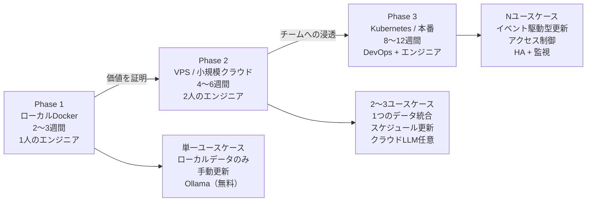

# スモールスタートで始めるKG実装戦略


> "Phase1（ローカル実験）からPhase3（本番）への段階的移行で、KG導入リスクを最小化できる"

## 問題

自分の組織にKGを導入したい。でも「完全なナレッジグラフを構築する」というプロジェクトは、現実的なOSS見積もりで6〜10人月かかる。価値を証明する前に正当化するには大きすぎる。

典型的な失敗パターン：すべてに対して完璧なスキーマを設計し、数ヶ月かけて構築し、ユーザーに届く前に止まる。

導入を妨げる現実的な4つの課題もある：

1. **データ統合**：データが5つの異なるシステムに、一貫性のないIDで散在している
2. **アクセス制御**：ユーザーによって見えるべきサブグラフが異なる
3. **継続的な更新**：更新を止めた瞬間からグラフは古くなっていく
4. **AIエージェントとの統合**：書き込みアクセスリスクを生まずにエージェントをグラフに接続する

## 解決策

「スモールスタートで育てる」は「最初から完璧なKGを設計する」に毎回勝る。

最小構成は前のセッションから既に持っているものだ：
- **Neo4j** をDockerで動かす（s04）
- **Ollama** でローカルLLM（s04）
- **LangChain GraphCypherQAChain** で自然言語クエリ（s04、s06）

この起点から3つのフェーズで移行する。各フェーズは単独で価値を提供し、ユースケースが成立しなければそこで止めることもできる。

## 仕組み

### 3フェーズロードマップ



**Phase 1：ローカルDocker概念実証**

目標：チームリソースをコミットする前に、ユースケースが価値を提供することを証明する。

```yaml
# docker-compose.yml（s04から — 既に用意できている）
version: "3.9"
services:
  neo4j:
    image: neo4j:5.13-community
    ports: ["7474:7474", "7687:7687"]
    environment:
      - NEO4J_AUTH=neo4j/${NEO4J_PASSWORD}
    volumes:
      - neo4j_data:/data
  ollama:
    image: ollama/ollama:latest
    ports: ["11434:11434"]
    volumes:
      - ollama_data:/root/.ollama
volumes:
  neo4j_data:
  ollama_data:
```

Phase 1の成果物：実データから5つの具体的な質問に答えられる動作するデモ。社内ステークホルダー2人に見せる。説得できなければここで止める。技術ではなくユースケースが間違っている。

**Phase 2：VPS / 共有環境**

目標：ラップトップからチームが使える共有サーバーへ移行する。

```bash
# VPS上で（vCPU 2、RAM 8GBでPhase 2には十分 — 2024年時点でDigitalOcean/Hetzner/Linodeで月$20〜40程度）
git clone your-kg-repo
cp .env.example .env
# NEO4J_PASSWORD、OPENAI_API_KEY（任意）を設定
docker compose up -d

# 夜間データ更新のcronを設定
0 2 * * * /opt/kg/scripts/refresh_data.sh >> /var/log/kg-refresh.log 2>&1
```

Phase 2の成果物：3〜5人のチームメンバーが日常的に使用する状態。フィードバックを収集する。失敗するクエリを特定する。それらをFew-shotの例として追加する（s06のテクニック）。

**Phase 3：本番**

目標：複数チームが依存する、信頼性が高く、安全で、監視されたシステム。

```yaml
# Kubernetesマニフェスト（簡略版）
apiVersion: apps/v1
kind: StatefulSet
metadata:
  name: neo4j
spec:
  replicas: 3   # HAクラスター
  template:
    spec:
      containers:
      - name: neo4j
        image: neo4j:5.13-enterprise   # クラスタリングのためにEnterpriseが必要
        resources:
          requests:
            memory: "4Gi"
            cpu: "2"
```

### ユースケース選定基準

すべての問題がKGから恩恵を受けるわけじゃない。次の基準で最初のユースケースを選ぶ：

```
ユースケーススコアリングマトリクス（各項目を1〜3点で評価）：

1. 誤答コスト
   1 = 低（誤答は不便）
   2 = 中（誤答は修正に時間がかかる）
   3 = 高（誤答がビジネスまたは法的リスクになる）
   目標：スコア2。スコア3はKGが本番に入る前にさらなるセーフガードが必要。

2. データの利用可能性
   1 = データが散在していて所有者も不明
   2 = データはあるが整理が必要
   3 = データが整理されてアクセス可能
   目標：スコア2または3。

3. クエリパターンの明確さ
   1 = 曖昧（「検索を改善する」）
   2 = 3〜5つの具体的な質問と既知の期待される回答
   3 = テストケース付きの完全なクエリカタログ
   目標：スコア2または3。

4. ステークホルダーの明確さ
   1 = 結果の責任者が不明
   2 = 1人のオーナーが特定されている
   3 = オーナーと成功基準が定義されている
   目標：スコア2または3。
```

誤答コスト=2で、他の基準が最も高いユースケースを選ぶ。

### Neo4j Community vs Enterprise

```
Neo4j Community（無料）：
- 単一インスタンスのみ
- クラスタリングなし
- ロールベースのアクセス制御なし
- 適切な場面：Phase 1、小規模チームのPhase 2
- 判断基準：HAやマルチユーザーのアクセス制御が不要なら使う

Neo4j Enterprise（有償）：
- クラスタリング（HA）
- ロールベースのアクセス制御
- オンラインバックアップ
- 必要な場面：複数チームが使うPhase 3の本番
```

### OllamaからクラウドLLMへの切り替え

LangChainなら、これは1行の変更だ。パイプラインの残りはそのまま：

```python
# Phase 1: Ollama（無料、ローカル）
from langchain_ollama import ChatOllama
llm = ChatOllama(model="llama3.2", base_url="http://localhost:11434")

# Phase 2/3: クラウドに切り替え（品質向上、API費用あり）
from langchain_openai import ChatOpenAI
llm = ChatOpenAI(model="gpt-4o", api_key=os.getenv("OPENAI_API_KEY"))

# 他は何も変わらない。GraphCypherQAChain、LLMGraphTransformer — 同じコード。
```

### 4つの課題とフェーズによる対処

**課題1：データ統合**

Phase 1：単一データソースから手動エクスポートを使う。Phase 1で統合を試みない。
Phase 2：1つのソースシステム用の統合スクリプトを1本書く。
Phase 3：全ソースシステムに対してイベント駆動型更新（s09 Kafkaパターン）。

**課題2：アクセス制御**

Phase 1：ユーザーが1人、アクセス制御は不要。
Phase 2：読み取り専用と書き込みのNeo4jユーザーを分ける（s09パターン）。
Phase 3：ノードラベルまたはNeo4j Enterprise RBACシステムを使った行レベルアクセス。

```cypher
// Phase 3: グラフレベルで読み取り権限を付与（Neo4j Enterprise RBAC）
GRANT MATCH (*) ON GRAPH kg TO read_only_user

// 注意：Neo4j 5.xのRBACはWHERE句による行レベルフィルタリングをサポートしていない。
// 上記のDENY構文はイメージを伝えるための疑似コードである。
// 行レベルアクセス制御（例：自分のチームのデータだけ見せる）は
// アプリケーション層で実装する。各CypherクエリにWHERE e.team = $user_teamを
// 追加してからNeo4jに渡す方法が現実的。
```

**課題3：継続的な更新**

Phase 1：週1回、手動エクスポートとインポート。
Phase 2：MERGEを使ったスケジュールcronジョブ（冪等な書き込み）。
Phase 3：WebhookまたはKafkaコンシューマーによるイベント駆動型。

```python
# Phase 2: 夜間の冪等更新
def refresh_engineers_from_hr_system():
    engineers = fetch_from_hr_api()
    for eng in engineers:
        graph.query("""
            MERGE (e:Engineer {id: $id})
            SET e.name = $name,
                e.team = $team,
                e.updated_at = datetime()
            """,
            params=eng
        )
```

**課題4：AIエージェントとの統合**

Phase 1：エージェントなし、チェーンクエリのみ。
Phase 2：読み取り専用エージェント（s10のREADパターン）。
Phase 3：WRITEとREASONパターンを持つL2エージェント、L3以上にはHITL。

## このセッションで変わること

**Before：**
- KG導入は不明確なROIを持つ大規模な先行投資のように見える
- どこから始めるか、ユースケースをどう評価するかわからない
- ローカルからクラウドへの切り替えが全面的な再構築に見える

**After：**
- フェーズごとの具体的な成果物を持つ3フェーズロードマップを持っている
- 4つの基準で最初のプロジェクトを選べるようになった
- OllamaからクラウドLLMへの切り替えが1行の変更だとわかった
- 4つの一般的な採用課題に対する具体的な答えを持っている

## 試してみる

上位2つのユースケース候補をスコアリングしてみよう：

```
ユースケース1: _______________
  誤答コスト（1〜3）: ___
  データの利用可能性（1〜3）: ___
  クエリパターンの明確さ（1〜3）: ___
  ステークホルダーの明確さ（1〜3）: ___
  合計: ___

ユースケース2: _______________
  誤答コスト（1〜3）: ___
  データの利用可能性（1〜3）: ___
  クエリパターンの明確さ（1〜3）: ___
  ステークホルダーの明確さ（1〜3）: ___
  合計: ___
```

スコアの高いユースケースについて、以下を書き出してみよう：

1. KGに答えさせたい5つの具体的な質問
2. Phase 1でエクスポートするデータソース（1つのソース、1つのCSVまたはJSONエクスポート）
3. Phase 1終了時にデモを見せる2人のステークホルダー

Phase 1のタイムライン：1人のエンジニアで2〜3週間。このコースを進んでいれば、s04からNeo4j + Ollama環境があり、s05から抽出パイプラインがある。Phase 1に必要なものはもうほとんど手元にある。

最後のセッションでは、KGプロジェクトが実際に機能しているかを測定する方法と、体系的に改善するサイクルを学ぶ。
