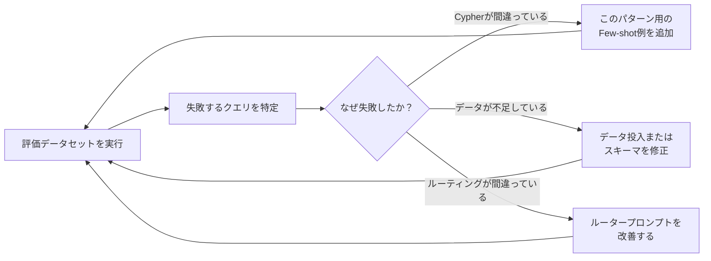

# KGプロジェクトの評価と継続改善


> "評価データセットと自動評価スクリプトで定量的に測定するサイクルを確立できる"

## 問題

KGシステムをデプロイした。ユーザーがクエリを実行している。でも、以前より本当に改善されているかどうかわからない。回答は精確に感じるが、「感じる」はステークホルダーが受け入れる指標じゃない。

測定なしには体系的に改善できない。スキーマ変更が助けになったのか悪化させたのかも判断できない。プロジェクトに資金を出したチームにROIを示すこともできない。

## 解決策

何かを変える前に評価データセットを構築する。正しい答えが既知の質問と回答のペアを20〜30件書く。それに対してシステムを実行する。精度とレイテンシをスコアリングする。スキーマ変更のたびにこれを実行する。

重要な点：**KGは検索ステップで正確なクエリ結果を返す。忠実度は100%だ。** 変動するのはText-to-Cypherの生成品質だ。それを測定して改善する。

## 仕組み

### ステップ1：実装前にKPIを設計する

メトリクスは構築前に定義する。後からではなく。正しいメトリクスはユースケースによって変わる。

| ユースケース | 主要KPI | 副次KPI |
|---|---|---|
| サポートKG | 初回応答時間（FRT） | CSAT スコア |
| 依存関係KG | 影響分析時間 | カバレッジ（マッピング済みシステムの% ）|
| オンボーディングKG | 初回PRまでの時間 | 質問エスカレーション率 |
| インシデントKG | MTTR | 誤検知アラート率 |

各ユースケースについて、KGデプロイ前にベースライン測定を確立しておく。ベースラインなしに「改善した」と主張することはできない。

### ステップ2：評価データセットを構築する

```python
# eval_dataset.py
# 形式：質問、期待される回答、期待されるCypher（任意）

EVAL_DATASET = [
    {
        "question": "criticalなオープンバグは何件ありますか？",
        "expected_answer": "3",   # s04からシードしたテストデータ前提（criticalバグ3件）
        "category": "count"
    },
    {
        "question": "どのバグがまだエンジニアに割り当てられていませんか？",
        "expected_contains": ["BUG-007", "BUG-012"],  # 回答に含まれていなければならない
        "category": "negation"
    },
    {
        "question": "criticalバグを最も多く担当しているのは誰ですか？",
        "expected_answer": "山田太郎",
        "category": "aggregation"
    },
    {
        "question": "バックエンドチームのエンジニアを表示してください",
        "expected_contains": ["山田太郎", "鈴木花子"],
        "category": "filter"
    },
]
```

s07で紹介した5つのKGネイティブクエリタイプをすべてカバーする：セット/分類、比較、パス探索、否定、カウント/集計。

### ステップ3：自動評価スクリプト

```python
import time
import json
from langchain_neo4j import Neo4jGraph, GraphCypherQAChain
from langchain_ollama import ChatOllama
import os

def benchmark_qa(chain, dataset: list[dict]) -> dict:
    """評価データセットをチェーンに対して実行し、メトリクスを返す。"""
    results = []

    for item in dataset:
        start = time.time()
        try:
            response = chain.invoke({"query": item["question"]})
            answer = response["result"].lower()
            latency_ms = (time.time() - start) * 1000

            # 回答をスコアリング
            if "expected_answer" in item:
                correct = item["expected_answer"].lower() in answer
            elif "expected_contains" in item:
                correct = all(
                    entity.lower() in answer
                    for entity in item["expected_contains"]
                )
            else:
                correct = None  # 手動レビューが必要

            results.append({
                "question": item["question"],
                "category": item["category"],
                "correct": correct,
                "latency_ms": round(latency_ms, 1),
                "answer": response["result"]
            })

        except Exception as e:
            results.append({
                "question": item["question"],
                "category": item["category"],
                "correct": False,
                "latency_ms": None,
                "error": str(e)
            })

    # サマリーメトリクスの計算
    scored = [r for r in results if r["correct"] is not None]
    accuracy = sum(r["correct"] for r in scored) / len(scored) if scored else 0
    latencies = [r["latency_ms"] for r in results if r["latency_ms"] is not None]
    avg_latency = sum(latencies) / len(latencies) if latencies else 0

    return {
        "accuracy": round(accuracy, 3),
        "avg_latency_ms": round(avg_latency, 1),
        "total": len(results),
        "scored": len(scored),
        "results": results
    }

# 実行
graph = Neo4jGraph(url="bolt://localhost:7687", username="neo4j", password=os.getenv("NEO4J_PASSWORD"))
llm = ChatOllama(model="llama3.2", base_url="http://localhost:11434")
# ⚠️ allow_dangerous_requests=True は LangChain ≥0.2 で必須。
# 本番環境ではユーザー入力を必ず検証してからチェーンに渡すこと。
chain = GraphCypherQAChain.from_llm(llm=llm, graph=graph, allow_dangerous_requests=True)

metrics = benchmark_qa(chain, EVAL_DATASET)
print(json.dumps(metrics, indent=2, ensure_ascii=False))
```

### ステップ4：レイテンシベンチマーク

アーキテクチャ別の典型的なパフォーマンス目標：

| アーキテクチャ | P50レイテンシ | P95レイテンシ | 備考 |
|---|---|---|---|
| KG（Cypherのみ） | 10〜50ms | 100ms | 直接クエリ、LLMなし |
| KG + LLM（GraphRAG） | 100〜500ms | 1秒 | LLMがテキスト生成を追加 |
| GraphRAG（フル） | 2〜10秒 | 15秒 | 埋め込み検索 + LLM |
| RAGのみ | 100〜500ms | 1秒 | GraphRAGと同等 |

`GraphCypherQAChain` が一貫して3秒以上かかる場合、問題はたいていグラフクエリではなくCypher生成ステップにある。確認事項：
1. スキーマが大きすぎないか？使わないラベルを削除する。
2. Cypher生成に3Bモデルを使っているか？`llama3.1`（8B）を試す。
3. `validate_cypher=True` になっているか？各バリデーションが往復追加になる。

### ステップ5：忠実度 — KGが無料で提供するもの

忠実度はシステムの回答がソースデータに基づいているかを測定する。

```
RAGの忠実度: 70〜85%
（LLMは取得したパッセージから言い換え、推論、ハルシネーションをするかもしれない）

KGの忠実度（検索ステップ）: 100%
（Neo4jはCypherクエリが指定したものを正確に返す。それ以上でも以下でもない）

KG + LLMの組み合わせ忠実度: 約95%
（残りの5%はLLMが正確なクエリ結果を言い換えること）
```

これがs01のUnsafe Zoneユースケースにおいてなぜ重要かだ。回答が正確でなければならない場合、100%忠実な検索が必要だ。RAGはこれを保証できない。

### ステップ6：データ品質モニタリング

KGはその中のデータと同程度の品質しかない。次を自動で監視する：

```cypher
// 1. 孤立したノード（リレーションなし — 投入エラーの可能性が高い）
MATCH (n)
WHERE NOT (n)--()
RETURN labels(n)[0] AS type, count(n) AS isolated_count
ORDER BY isolated_count DESC

// 2. 必須プロパティの欠損
MATCH (e:Engineer)
WHERE e.name IS NULL OR e.team IS NULL
RETURN count(e) AS engineers_missing_properties

// 3. 重複の検出（同じ名前、異なるID）
MATCH (e1:Engineer), (e2:Engineer)
WHERE e1.name = e2.name AND e1.id < e2.id
RETURN e1.name, e1.id, e2.id

// 4. 陳腐化したノード（30日以上更新されていない）
MATCH (n)
WHERE n.updated_at < datetime() - duration({days: 30})
RETURN labels(n)[0] AS type, count(n) AS stale_count
```

これらを週次cronジョブとして実行し、孤立ノードがノード総数の5%を超えたらアラートを出す。

### 改善サイクル



このループの各イテレーションで、精度が2〜5パーセントポイント向上するはずだ。3〜4回のイテレーションを経ると、評価データセットで85〜90%に達することが多い。

## このセッションで変わること

**Before：**
- KGをデプロイしたが、何かが改善されたかを定量化できない
- スキーマ変更が良かったのか悪かったのかわからない
- データ品質の問題はユーザーが間違った回答を報告するまで見えない

**After：**
- 変更のたびに実行できる `benchmark_qa()` スクリプトを持っている
- KGの忠実度の優位性を理解している（100% vs RAGの70〜85%）
- Cypherヘルスチェックでデータ品質の問題を自動検知できる
- 完全な改善サイクルを持っている：測定、失敗を見つける、例を追加、繰り返す

## 試してみる

Phase 1ユースケースの測定ベースラインを設定する：

```python
# 1. 最小限の評価データセットを作成（10件あれば十分）
MY_EVAL_DATASET = [
    {"question": "...", "expected_answer": "...", "category": "count"},
    # 自分のクエリパターンをカバーする9件を追加
]

# 2. ベンチマークを実行
metrics = benchmark_qa(chain, MY_EVAL_DATASET)
print(f"ベースライン精度: {metrics['accuracy'] * 100:.0f}%")
print(f"ベースラインレイテンシ: {metrics['avg_latency_ms']:.0f}ms")

# 3. ベースラインをファイルに保存
import json
with open("eval_baseline.json", "w", encoding="utf-8") as f:
    json.dump(metrics, f, indent=2, ensure_ascii=False)
print("ベースラインを保存しました。次のスキーマ変更後に再実行して差分を測定してください。")
```

週次で実行する。精度とレイテンシを時系列で追跡する。スキーマ変更後に精度が下がれば、次の実行で捕捉できる。ユーザーが気づく前に。

---

KG + LLMは「一度作れば終わり」の技術じゃない。スキーマは組織が自分のデータを理解するにつれて成長する。グラフが何に答えられるかをチームが発見するにつれてユースケースが積み重なっていく。測定サイクルが、これを継続可能にするものだ。

ここから先の繰り返しパターン：
1. 1つのユースケースから始める（s11）
2. サンドイッチアーキテクチャで構築する（s09）
3. 評価データセットで測定する（このセッション）
4. 失敗するパターンにFew-shot例を追加する（s06）
5. 次のユースケースに拡張する

本番で動いているKGはすべて、誰かのラップトップでの概念実証として始まった。生き残ったのは、最初から測定の習慣を持っていたチームだ。

これでゼロから本番まで必要なすべてのものが揃った：理論（s01〜s03）、ハンズオンセットアップ（s04〜s05）、本番テクニック（s06〜s07）、ビジネスコンテキスト（s08）、アーキテクチャ（s09）、エージェント統合（s10）、採用戦略（s11）、測定サイクル（s12）。

あとは実践だ。
